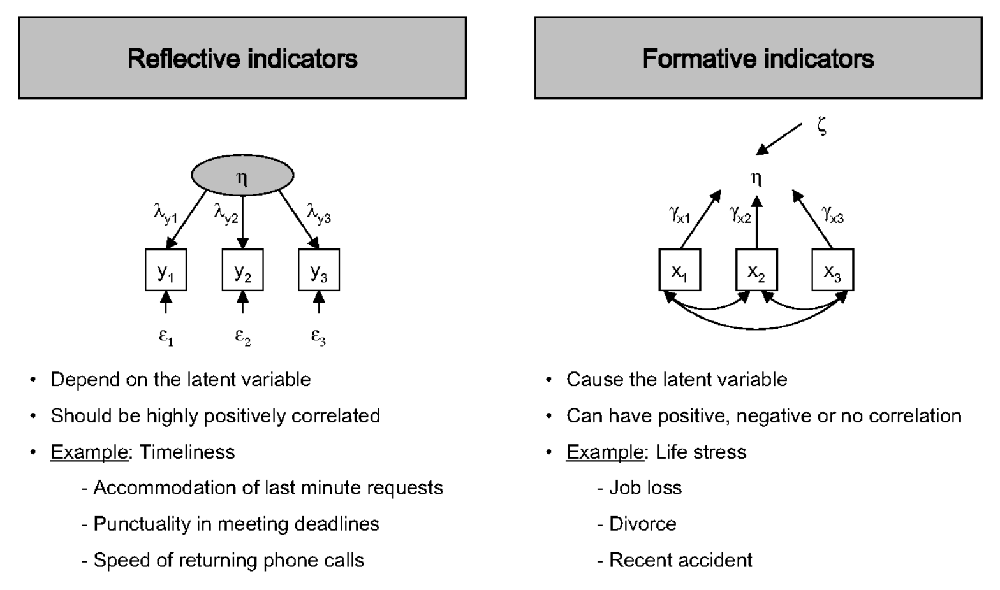
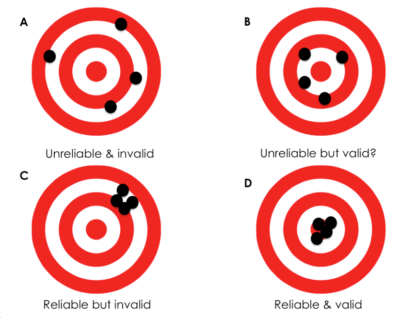
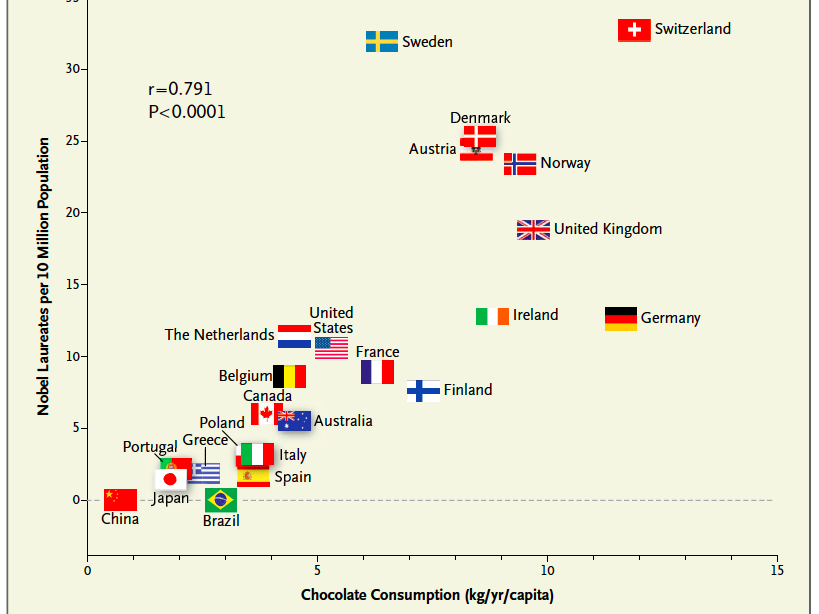

```{r setup, include = FALSE}

# global setting
knitr::opts_chunk$set(echo = FALSE, warning = FALSE, message = FALSE, fig.height = 3, fig.width = 5)
options(digits = 2)

# load packages
suppressMessages(library(ggplot2))
suppressMessages(library(magrittr))
suppressMessages(library(stargazer))

# set seeds
set.seed(1234)

```

# 结构方程模型：原理及应用

## 结构方程模型案例

考虑以下典型的\textcolor{red}{结构方程模型}（SEM）案例。

{width="80%"}

请思考：（1）各个变量是什么含义？（2）X-->Y的箭头指向，依据是什么？

## 结构方程模型案例（续）

以上SEM可以使用\textcolor{red}{LISEREL、AMOS、SmartPLS、Mplus、R:lavaan、R:sem}等软件包估计，得到\textcolor{red}{路径系数}：

{width="60%"}


## 理论构念

管理学的理论或假设在于讨论变量或概念间的关系。但绝大多数管理学概念都\textcolor{red}{无法直接观察}，它们是为了更好地理解现象而被创造出来，这些概念通常称为“\textcolor{red}{构念}”（construct）。

测量的目的在于根据研究者对这些理论构念（theoretical construct）的理解和定义，把抽象的概念具体化，找到合适的\textcolor{red}{测量指标}（measurement items），这个过程称为“\textcolor{red}{操作化}”（operationalization）。能否准确地测量相关的构念在很大程度上决定着研究结论的可靠程度。

Q: 管理与卫生领域的概念及测量有什么区别？

## 反应型 vs 构成型构念

在管理学研究中，有两种不同的指标可以用来测量理论构念：

- \textcolor{red}{反映型指标}（reflective indicator）：测量指标被认为是理论构念\textcolor{red}{外在的表现形式}。虽然从理论上讲，这些测量指标之间是高度一致的，任何两个指标在内容上都可以互换，但多项指标有利于消除各自的误差，使得测量结果更加接近客观现实，亦即“有益的重复”（useful redundancy）。
- \textcolor{red}{构成型指标}（formative indicator）：测量指标说明了理论构念的不同方面，构念的意义存在于对这些指标的\textcolor{red}{整合}基础之上。如果测量缺少了某个指标，则我们对构念的理解和测量就是不完整的。例如，学习成绩——GPA、经济地位。

## 反应型 vs 构成型构念：案例

二者的区别如下：

{width="75%"}


## 单维构念：古典测量模型

效果指标（effect indicator），或称反映指标（reflective indicator），是由\textcolor{red}{不可观测的构念}引起的。从定义上看，效果指标之间应该是\textcolor{red}{高度相关}的。

\textcolor{red}{古典测量模型}（classical measurement model）假定每个指标 $x_{i}$ 都反映了同一个构念的真实值 $\theta$，但每个指标的\textcolor{red}{随机误差}不同：

$$
x_{i} = \theta + \epsilon_{i}, \epsilon_{i} \sim N(0, \sigma^{2}).
$$

## 单维构念：同属测量模型

\textcolor{red}{同属测量模型}（congeneric measurement model）与古典测量模型相似，但假定每个指标 $x_{i}$ 都\textcolor{red}{不同程度地}反映了构念的真实值 $\theta$：

$$
x_{i} = \lambda_{i} \theta + \epsilon_{i}, \epsilon_{i} \sim N(0, \sigma^{2}),
$$

指标权重 $\lambda_{i} \in (0, 1)$ 代表了该指标在测量构念时的效度。因此，古典测量模型是同属测量模型的特例。后者是结构方程模型中的\textcolor{red}{默认测量模型}。根据同属测量模型，测量同一个构念所用的两个指标是不可以相互替代的，因为一个指标可能比另一个指标更能够代表构念本身（即 $\lambda$ 更高）。

若采用古典测量模型，构念的真实值为所有效果指标的平均值：$\theta = \sum_{i}^{k} x_{i} / k$。若采用同属测量模型，构念的真实值 $\theta$ 则为所有效果指标背后\textcolor{red}{潜在因子}的\textcolor{red}{因子得分}。如果构念至少由三个效果指标来测量，验证性因子分析模型一般都是可识别的。在估计构念真实值 $\theta$ 时，两种方法在传统上都是可以接受的。

## 构成指标的测量模型

原因指标（causal indicator），或称\textcolor{red}{构成指标}（formative indicator），构成了被测量的不可观测的构念。所有的构成指标都必须出现，共同来估计所表示的构念。构成指标的测量模型为：

$$
\theta = \sum_{i}^{k} \gamma_{i} x_{i} + \xi, \xi \sim N(0, \sigma^{2}).
$$

单独的构成指标模型是\textcolor{red}{不可识别}的。为了使模型可识别，模型中就至少需要包括两条从该构念出发的结构路径。

## 反映型 vs 构成型测量模型？

反映型测量模型更加接近实证主义的认识论传统，而构成型测量模型在使用中存在诸多问题，很有可能影响我们的测量质量。

Edwards(2011)建议我们避免使用构成型指标。如果研究确实需要这类指标，可以考虑将异质性的指标分解成不同的维度，化单维构念为\textcolor{red}{多维构念}（multidimensional construct），使用反映型指标测量每个维度，从而准确测量构念。

因而，一阶构念（i.e., 单维）通常是反映型的，而二阶构念则可能是反映型或构成型的。

## 量表质量：信度与效度

通常使用\textcolor{red}{信度}（reliability）和\textcolor{red}{效度}（validity）来衡量量表（scales）质量。

{width="60%"}


## 构念效度

在测量中，\textcolor{red}{构念效度}（construct validity）衡量理论构念与其测量量表之间的一致程度。

通常三种情况会影响量表的构念效度：研究者的操作性定义出现了偏差、测量内容没有充分反映目标概念、量表缺乏信度。

因此，量表开发应坚持三条原则：

- 详细地定义目标构念，使量表内容最大限度包含构念中的各个成分；
- 发展出清楚的测量指标，最大限度地降低其他相关构念的影响；
- 控制各种随机因素对测量过程的影响，如测量当时的物理环境、受试者的心情等。

## 量表开发

为保证量表的构念效度，需要注意在量表开发过程中的每一个操作步骤：

- 构念定义及操作化：包括构念说明、产生测量题项。
- 检验量表的内部结构：包括评价内部效度、检验内部结构、评价内部稳定及一致性。
- 检验整个测量模型：包括评价聚合效度与区分效度、建立逻辑关系网络、量表开发取向。


## 量表开发步骤：构念定义及操作化

- **构念说明**：量表开发的首要任务是准确地定义目标构念，清楚地说明构念的理论边界。构念说明（construct explication）应定义目标构念的性质、解释目标构念与其他相近构念的差异、确认理论构念的层次、确认理论构念包含的内部成分、说明与目标构念密切相关的前因变量及后果变量。
- **产生测量题项**：通常可以采用演绎法（deductive approach）和归纳法（inductive approach）发展测量指标。演绎法模式中，研究者通过整合已有的文献，就可以对构念进行清晰的定义，确认测量指标应该涵盖的范围。归纳法模式中，研究者需要通过定性方法去了解构念的内容与结构，结合现有文献，产生测量指标。

为确保测量指标涵盖构念的理论边界，Clark & Watson (1995)提出两条原则：（1）测量指标应该比目标构念涵盖的范围更广；（2）在没有充分把握时，测量指标可以包含一些最后被证明是无关紧要，或者甚至于目标构念不相关的内容。

## 量表开发步骤：检验量表的内部结构

- **评价内容效度**：内容效度（content validity）衡量了量表内容在多大程度上反映或代表了研究者所要测量的构念。可以通过定性或定量的角度评价量表的内容效度。
- **检验内部结构**：测量指标的单一维度性质（uni-dimensionality）是测量理论中最为基本和关键的假设。量表开发的初期应使用探索性因子分析；我们对测验与构念之间的关系有了清楚的预期之后，则应使用验证性因子分析。
- **评价内部一致性与稳定性**：信度（reliability）衡量了测验结果的一致性、稳定性与可靠性。最常用的是针对Likert量表开发的Cronbach's $\alpha$。Nunnally (1978)认为，信度要求应该与测验使用目的相一致。探索性研究中应大于0.7；通常的基础研究或应用研究中，应大于0.8。

需要注意的是，内部一致性系数\textcolor{red}{不是越高越好}。过于重复的测量指标虽然保证了量表的信度系数，但也往往意味着研究者在发展量表时并没有充分选取目标构念的内容。在发展量表时，研究者应该权衡内部一致性和内容完整性。

## 量表开发步骤：检验整个测量模型

- **评价聚合效度与区分效度**：聚合效度（convergent validity）指在使用不同方式测量同一构念时，所得到的测量分数之间由于反映同一构念而应该高度相关；区分效度（discriminant validity）指在使用不同方法测量不同构念时，所观测到的数值之间应该能够加以区分。Fornell & Larcker (1981) 提出通过计算抽取变异量（variance extracted）来估计聚合和区分效度。抽取变异量AVE衡量了由潜变量解释观测变异量的大小。聚合效度良好时，抽取变异量不能低于0.5；区分效度良好时，抽取变异量应大于潜变量之间相关系数的平方。
- **建立逻辑关系网络**：逻辑关系网络（nomological network）的建立侧重于从变量间的因果联系中推论构念效度的高低，而非单纯地评价测验指标的质量。
- **量表开发取向**：根据测验的来源（使用或修改已有的测验 vs 发展新的测验）和对文化特殊性的预期（文化适用性 vs 文化特殊性）的判断，量表开发包含直接翻译、修改、去情境化和情境化四类取向。

## SEM原理

结构方程是基于假设模型，通过拟合协方差矩阵与样本协方差矩阵相比较，当二者的差距很小时，则说明假设模型与原始数据接近，即假设模型所基于的理论得到支持。

结构方程模型分为：

- \textcolor{red}{测量模型}（measurement model）：测量模型的主要用途是可以通过验证性因子分析来检验假设。
- \textcolor{red}{路径模型}（path model）：路径分析的主要作用是了解各变量之间的关系，包括直接关系和间接关系。
- 全模型（full model）：全模型同时包含了测量模型和路径模型，即同时包含了外源变量和内生变量，也称为完整模型（complete model）。

在计算因子时，可采取两种方法：（1）\textcolor{red}{固定负荷法}，即任取一个观察变量 $X_{1}$ 为参照指标，同时设定其截距 $\tau_{1} = 0$，因子负荷 $\lambda_{11} = 1$；（2）\textcolor{red}{固定因子方差法}，即将潜变量标准化，设定其方差 $\phi_{11} = 1$。两种方法殊途同归。但在进行跨组别比较研究时，必须采用固定负荷法来完成对潜变量单位标准化这一步骤。因为在固定方差法中，两组构念的方差假设为相等，而这个假设在跨组别比较研究中是不恰当的。

## 模型评价

通过诸如LISREL等软件程序运行之后，将得到待测模型的输出结果。结果分析通常可从如下方面着手：

- 假设模型与实验数据的拟合程度。拟合指数一般包括Chi-square、RMSEA、SRMR、TLI、CFI。
- 参数估计是否显著。
- $R^{2}$。

注：LISREL和smartPLS使用的估计方法不同，因而报告的拟合度指数也有所不同。

## 模型拟合度

估计SEM时，软件会尝试改变各参数值的大小，从而使\textcolor{red}{拟合协方差矩阵}更接近\textcolor{red}{样本协方差矩阵}，即 $\Delta_{est}$ 更小。

相对于每个 $\chi^{2}$ 以及自由度 $df$ 值， 即可计算对应的 $p$-value。$\chi^{2}$ 越小，$p$-value 越大，则说明拟合方差矩阵与样本方差矩阵的差距越不明显；反之，最初假设的模型就要被拒绝。然而由于整体模型拟合的最基本测量指标 $\chi^{2} = (N-1) F$ 对样本数量相当敏感。样本越大，$\chi^{2}$ 值也就越容易变成显著，从而使假设模型越容易遭到拒绝。此外，过去常用的诸如goodness of fit index (GFI)和adjusted goodness of fit index (AGFI)，由于存在对样本大小依赖度高等特性，也已经很少再被使用。因此，研究者转而报告更适合的一些拟合指数。

Relative chi-square，即 $\chi^{2} / df$。由于 $\chi^{2}$ 与自由度之间是非线性关系，两者相除之后则变成线性关系。一般规律是2:1或3:1是可接受拟合度的标志。

## 模型拟合度（续）

Estimated RMSEA (Root Mean Error of Approximation)，即 $\sqrt{\chi^{2} / [(N-1)(df-1)]}$。当RMSEA等于或小于0.05时，代表假设模型拟合程度好；0.05到0.08区间时，代表拟合程度可以接受；0.08到0.10之间时，代表拟合程度一般；当超过0.1时，则代表了模型与数据较差的拟合度。总体来讲，RMSEA越小，代表拟合程度越高。

RMR (Root Mean Square Residual) 为拟合残差方差的平均值的平方根。RMR值越小，说明拟合程度越好。由于其易受到单位的影响，故通常使用Standardized RMR。

## 模型拟合度（续）

TLI (Tucker-Lewis Non-normed fit index) 和 CFI (Comparative fit index) 的共同特征是比较基准（baseline）模型的 $\chi^{2}$ 和假设模型的 $\chi^{2}$。基准模型是只包含观察变量和误差项，忽略了潜变量和因子负荷间所有关系的一种模型。

$$
\text{TLI} = \rho_{2} = \frac{\chi^{2}_{b}/df_{b} - \chi^{2}/df}{\chi^{2}_{b}/df_{b} - 1}, \text{CFI} = 1 - \frac{\text{max}(\chi^{2} - df, 0)}{\text{max}(\chi^{2}_{b} - df_{b}, 0)}.
$$

TLI和CFI得到的值越大，代表拟合程度越好。一般的规律是：取值大于0.9即可；若大于0.95，则代表假设模型与数据的拟合度非常好。


## 调节变量和中介变量

调节变量的主要作用是为现有的理论划出\textcolor{red}{限制条件和适用范围}，关注一个关系在不同条件下是否会有所改变。中介作用的目的是在我们一直某些关系的基础上，探索这个关系产生的\textcolor{red}{内部作用机制}。

中介变量与调节变量都是在原有的\textcolor{red}{两个变量关系基础}上的进一步研究，只有两个变量间的关系已经存在时，我们才需要用中介变量讨论这个关系中间的机制，或者使用调节变量界定该关系变化的条件。

## 调节变量：原理及检验

当研究中有调节变量的时候，在研究假设中一定要清晰表明调节变量的作用方式以及具体如何影响变量的关系，如“当$Z$高的时候，$X$会对$Y$有正面影响；当$Z$低的时候，$X$会对$Y$有负面的影响”。

调节作用与交互作用十分类似。交互作用是指，两个变量（$X_{1}$和$X_{2}$）共同作用时对$Y$的影响不等于两者分别影响$Y$时的简单数学和。调节作用是指，一个变量（$X_{1}$）影响了另一个变量（$X_{2}$）对$Y$的影响。在交互作用分析中，两个自变量的地位可以是\textcolor{red}{对称的}。但在调节作用中，哪个是自变量、哪个是调节变量是很明确的，是由理论基础所决定的，在一个确定的模型中两者\textcolor{red}{不能互换}。

调节作用和交互作用在统计上的检验方法是一样的。通常检验完调节作用之后，研究者会直观地表示调节变量是如何作用的。当调节变量时连续变量时，可以按照调节变量的中位数或者均值为界划分样本，然后直观展示调节变量在不同水平上的时候，自变量和因变量之间呈现何种关系。

## 中介变量：原理及检验

按照加入中介变量之后自变量与因变量之间的关系，可以将中介作用分为完全中介（full mediation）和部分中介（partial mediation）。在检验中介作用之前，需要\textcolor{red}{建立因果关系}。中介作用意味着存在\textcolor{red}{因果链}：中介变量由自变量引起，并影响了因变量。因果关系是建立中介作用中最重要却又常常在研究中被忽视的环节。

最传统的中介变量检验方法包含三个步骤 (Baron & Kenny, 1986)：

- 自变量影响因变量；
- 自变量影响中介变量；
- 控制中介变量后，自变量对因变量的作用消失了，或是明显地减小了。

目前则建议使用更成熟的方法，如MacKinnon et al. (2007)。

## 中介变量：原理及检验（续）

在Baron & Kenny (1986)提出的方法中，只要$M$和$Y$的相关系数比$X$和$Y$的相关系数大，我们就很容易得到中介作用成立的检验结果。实际上，不同的建构模型可以产生完全一样的相关矩阵，因而产生完全一样的分析结果。因为存在**等同模型**，所以假如仅仅从数据的统计关系上就推导出中介作用的模型，我们就会很容易被数据蒙骗。

\textcolor{red}{建立因果关系}是排除其他等同模型的唯一方法。如果在研究中难以实现用严格的实验方法来验证因果关系，首先就一定要有理论基础，\textcolor{red}{成熟理论}的作用是帮助我们建立可信的因果关系，这比根据逻辑推理随意建立的因果关系要更加可靠。

## lavaan

除了LISREL、Mplus等商业软件外，R软件包
[lavaan](http://lavaan.ugent.be/tutorial/index.html)提供了一系列的潜变量模型分析工具。[其他辅助资源](http://lavaan.ugent.be/resources/related.html)诸如`semPlot`和`semTools`则提供了信度分析、图像展示等功能。

formula type | operator | nmemonic |
------------ | -------- | -------- |
latent variable definition | ``=~`` | is measured by |
regression | `~` | is regressed on |
(residual) (co)variance | `~~` | is correlated with |
intercept | `~1` | intercept |

Table: The current set of formula types

## lavaan示例

使用lavaan估计sem模型的例子如下所示。

```{r}

rm(list = ls())
library(lavaan)
library(semPlot)

# specify the model
model <- '
    
    # measurement model
    ind60 =~ x1 + x2 + x3
    dem60 =~ y1 + y2 + y3 + y4
    dem65 =~ y5 + y6 + y7 + y8
    
    # regression model
    dem60 ~ ind60
    dem65 ~ ind60 + dem60

    # covariance model
    y1 ~~ y5
    y2 ~~ y4 + y6
    y3 ~~ y8
    y4 ~~ y8
    y6 ~~ y8

'

# estimate the sem model
fit <- sem(model, data = PoliticalDemocracy)

semPaths(fit, "std", "est")

```


## lavaan示例(续)

模型的拟合度如下：

```{r}

# display the output
# summary(fit, standardized = TRUE, fit.measures = TRUE)
fitmeasures(fit, fit.measures = c("chisq", "df", "cfi", "tli", "rmsea", "srmr"))

```


## lavaan示例(续)

lavaan还可以处理中介效应。

```{r}

rm(list = ls())
library(lavaan)

# generate a dataset
set.seed(1234)
X <- rnorm(500)
M <- 0.5 * X + rnorm(500)
Y <- 0.7 * M + rnorm(500)
sim.data <- data.frame(X = X, Y = Y, M = M)

# specify the model
model <- '
    
    # direct effect
    Y ~ c * X
    
    # mediator
    M ~ a * X
    Y ~ b * M

    # indirect effect
    ab := a * b

    # total effect
    total := a * b + c
    
'

# fit the model and display the output
fit <- sem(model, data = sim.data)
summary(fit, header = FALSE, fit.measures = FALSE, standardized = TRUE)


```

## 路径分析评注

Pearl (2018)非常推崇\textcolor{red}{路径分析}  ，并给出了如下评注：

    路径分析在经济学和社会学中有着不同的命运轨迹，但两者最终
    都走向了对Sewall Wright思想的背叛。社会学家将路径分析
    改名为结构方程建模（structural equation modeling, 简称
    SEM），他们接纳了其中的图形表示法，并将其广泛应用于各类
    研究——直到1970年，LISREL程序包被开发出来，用于自动计算
    路径系数。Sewall Wright很可能预测到了接下来发生的事：
    路径分析变成了生搬硬套的方法，研究者则变成了软件使用者，
    对后台发生的事情全无兴趣。

Pearl则由路径分析发展出了\textcolor{red}{因果图}（causal diagrams）。

<!-- ## 巧克力消费水平与诺贝尔奖得主数量 -->

<!-- 以地区为基本分析单元，探讨人均巧克力消费水平X与诺贝尔奖得主数量Y之间的关系。 -->

<!-- {width=60%} -->

<!-- ## Messerli (2012)介绍 -->

<!-- Messerli (2012)在Introduction部分的思路如下： -->

<!-- 存在于巧克力中的**膳食类黄酮**已被证明可以改善**认知功能**。因而，假设巧克力消费可以改善个体的认知功能，同时进一步假设巧克力消费可以改善整个人群的认知功能。因而，作者想知道国家层面的巧克力消费水平是否与其人口的认知功能相关。据作者所知，并无关于整体国家认知功能的公开数据，然而可以想象人均**诺贝尔获得者数量**可以作为反映国家层面的卓越认知功能。因此，本文旨在研究巧克力消费水平与诺贝尔奖得主数量之间的关系。 -->

<!-- 来源：Kornrich, S. Messerli, Franz. Chocolate Consumption, Cognitive Function, and Nobel Laureates. The New England Journal of Medicine 2012; 367: 1562-1564, October 18 (http://www.nejm.org/doi/full/10.1056/NEJMon1211064). -->

<!-- **讨论**：如何看待以上研究动机及研究设计？ -->

## 为什么需要结构模型？

案例讨论：张三硕士毕业后，在医院工作了5年，年薪为27万。如果当时念完博士再进入职场，那么其期望年薪是多少？

假设使用数百份随机样本来探讨这一问题，估计如下模型：

$$
Income_{i} = \alpha + \beta_{1} \cdot Educ_{i} + \beta_{2} \cdot Exper_{i} + \epsilon_{i}
$$ 得到$\hat{\alpha} = 20$，$\hat{\beta_{1}} = 3$，$\hat{\beta_{2}} = 1$。那么，如上问题的答案是？请给出理由。

要点：结构模型（structural model） vs 简约模型（reduced model）

## 辛普森悖论

{width="80%"}

-   不论男性患者还是女性患者，处理组（服药）的痊愈率更高
-   就整体人群而言，处理组（服药）的痊愈率更低
-   该药物到底是否能够提高痊愈率？

## 性别歧视？

{width="80%"}

-   就整个大学来看，女性的录取率低于男性
-   就各专业来看，女性的录取率均高于男性
-   该大学是否在招生时存在性别歧视？

## 直接效应 vs 间接效应

在招生性别歧视的案例中，估计了中介模型之后，应当使用如下哪个效应：

- 直接效应
- 间接效应
- 总效应

提示：从“歧视”的含义理解。

## 研究评注

卫生管理、卫生信息管理和图书情报研究中应当注意的事项：

-   问题导向而非数据驱动：研究过程始于研究情境和研究问题，进而是有研究理论推演研究假设，然后才是数据搜集和分析。
-   克服对因果推断的\textcolor{red}{偏见}："相关不等于因果"众所周知，然而因果是什么？除了作为金标准的RCT，如何探讨其它情形下的因果问题，例如吸烟与肺癌？
-   注重\textcolor{red}{数据生成过程}：研究模型分析应当先于数据分析。单纯的数据分析有误导性，例如探寻冰淇淋销售量X与犯罪率Y之间的关系。
-   使用\textcolor{red}{常识、理论和逻辑}：用于推演研究假设，或者图示化的研究模型。
-   使用精确的、数学化的统计模型：清晰表述数据是什么，统计分析在做什么。


# 因果推断概述


## 三国史论

-   **官渡之战**："昔许子远舍袁就曹，规画计较，应见纳受，遂破袁军，以定曹业。向使曹氏不信子远，怀疑犹豫，不决於心，则今天下袁氏有也。" --《三国志·是仪胡综传》
-   **赤壁之战**：后太祖征荆州还，於巴丘遇疾疫，烧船，叹曰："郭奉孝在，不使孤至此。" --《三国志·郭嘉传》
-   **夷陵之战**：先主既即尊号，将东征孙权以复关羽之耻，群臣多谏，一不从。章武二年，大军败绩，还住白帝。亮叹曰："法孝直若在，则能制主上，令不东行；就复东行，必不倾危矣。" --《三国志·法正传》

请思考并讨论，（1）以上《三国志》各段，阐明了什么观点？其**逻辑**是什么？（2）赤壁之战前夕，谁游说了孙权联刘抗曹？

## 赤壁东风

                      杜牧《赤壁》

              折戟沉沙铁未销，自将磨洗认前朝。
              东风不与周郎便，铜雀春深锁二乔。

**讨论**：诗中阐述了哪两个变量之间的关系？其逻辑是如何的？

## 大运河

                  皮日休《汴河怀古二首》

              万艘龙舸绿丝间，载到扬州尽不还。
              应是天教开汴水，一千余里地无山。

              尽道隋亡为此河，至今千里赖通波。
              若无水殿龙舟事，共禹论功不较多。

**讨论**：诗中阐述了哪几个变量之间的关系？其逻辑是如何的？

## 真伪难辨

                 白居易《放言五首·其三》

              赠君一法决狐疑，不用钻龟与祝蓍。
              试玉要烧三日满，辨材须待七年期。
              周公恐惧流言日，王莽谦恭未篡时。
              向使当初身便死，一生真伪复谁知？

**讨论**：诗中阐述了哪几个变量之间的关系？其逻辑是如何的？

## 如何评估因果效应？

{width="80%"}

## The Road Not Taken

    The Road Not Taken -- By ROBERT FROST

    Two roads diverged in a yellow wood,
    And sorry I could not travel both
    And be one traveler, long I stood
    And looked down one as far as I could
    To where it bent in the undergrowth;
    Then took the other, as just as fair,
    ...
    I shall be telling this with a sigh
    Somewhere ages and ages hence:
    Two roads diverged in a wood, and I-
    I took the one less traveled by,
    And that has made all the difference.

## 因果推断主要学术流派

因果推断主要存在三大流派：

-   \textcolor{red}{统计学流派}：代表人物为Donald Rubin、Guido Imbens（2021年诺奖得主）、Paul Rosenbaum等。提出的Rubin Causal Model更加精确，且符合流行病学的传统思路，易于卫生管理领域的学者理解。
-   \textcolor{red}{人工智能流派}：代表人物为Judea Pearl（2011图灵奖得主，贝叶斯网络之父）。在路径模型基础上提出的Causal Diagrams，更加直观、容易理解。do算子则相对困难。
-   \textcolor{red}{计量经济学流派}：代表人物为James Heckman（2000年诺奖得主）、Joshua Angrist（2021年诺奖得主）等。

## 参考教材

因果推断领域在近几十年内有重大进展，诸多专著均成书于过去10年内。请参阅：

-   Imbens, G. W., & Rubin, D. B. (2015). Causal inference in statistics, social, and biomedical sciences. Cambridge University Press.
-   Pearl, J., Glymour, M., & Jewell, N. P. (2016). Causal inference in statistics: A primer. John Wiley & Sons.
-   Pearl, J., & Mackenzie, D. (2018). The book of why: the new science of cause and effect. Basic books.
-   Angrist, J. D., & Pischke, J. S. (2008). Mostly harmless econometrics. Princeton university press.
-   Angrist, J. D., & Pischke, J. S. (2014). Mastering'metrics: The path from cause to effect. Princeton university press.

# 因果推断的反事实框架

## Rubin因果模型

\textcolor{red}{Rubin因果模型}（Rubin Causal Model, RCM），包括三个核心概念：

-   潜在结果（potential outcomes）
-   个体处理效应稳定性假设SUTVA
-   处理分配机制（assignment mechanism）

## 潜在结果

Rubin (1975)认为"\textcolor{red}{没有操纵就没有因果关系}"（no causation without manipulation）。此处的操纵，可以源于处理、干预，以及\textcolor{red}{想象}。操纵作用于单元（unit）之上，为了简化，后续均以个体代表单元，以二值处理代表操纵。

设$D_{i}$表示个体$i$是否接受处理或干预，$D_{i}=1$代表处理，$D_{i}=0$代表对照，而$Y_{i}^{obs}$代表观察到的结果变量。每个操纵都对应一个\textcolor{red}{潜在结果}（potential outcomes）$Y_{i}(D_{i})$，这些潜在结果是\textcolor{red}{先验可观察的}（priori observable），即一旦给定具体的处理水平，就可以观察到。

同时，从\textcolor{red}{后验}（posteriori）意义上，一旦应用于具体的处理水平，\textcolor{red}{最多}可以观察到一个潜在结果。

## 因果效应定义

$\{Y_{i}(1), Y_{i}(0)\}$代表个体$i$接受处理或者对照的潜在结果，因而个体$i$接受处理的\textcolor{red}{因果效应}（causal effect）为： $$
CE_{i} = Y_{i}(1)-Y_{i}(0).
$$ 可以看到，\textcolor{red}{因果效应涉及潜在结果的比较}。

总体的\textcolor{red}{平均因果效应}（average causal effect, ACE）如下： $$
ACE(D \rightarrow Y) = E[Y_{i}(1)-Y_{i}(0)].
$$

## 因果效应定义（续）

如果结果变量取值为二值时，可以使用风险差、风险比及比数比来定义因果效应。

风险差（risk difference, RD）衡量的因果效应为： $$
CRD(D \rightarrow Y) = P(Y(1)=1) - P(Y(0)=1).
$$

比数比（odds ratio, OR）衡量的因果效应为： $$
COR(D \rightarrow Y) = \frac{P(Y(1)=1)/P(Y(1)=0)}{P(Y(0)=1)/P(Y(0)=0)}.
$$

## 因果效应定义（续）

因果效应的定义，有两个重要之处：

-   因果效应的定义取决于潜在结果，但并不取决于实际观察到的结果。从数学上来看，个体层面的因果效应$\pi_{i} = Y_{i}(1) - Y_{i}(0)$，并不涉及实际观察到的结果$Y_{i}^{obs}$。
-   因果效应是处理后同一时间、同一个体的潜在结果的比较。特别需要强调的是，因果效应不是不同时间的结果比较，例如服用阿司匹林前后个体头痛情况的比较。

因果效应的定义，与侵权法和刑法中but-for测试的逻辑一致，but-for测试问道："要不是X的存在，Y会发生吗？"（but for the existence of X, would Y have occurred?）

## 因果效应估计

在定义因果效应时，我们考虑了单一个体（单元）。估计因果效应时，我们需要比较潜在结果。由于任一个体都最多只有一个实现了的潜在结果，因此在估计因果效应时需要考虑多个个体。更确切地说，我们必须观察\textcolor{red}{多个}个体，有些接受了处理，而有些接受了对照。

为了使用多个个体估计因果效应，我们面临两个潜在风险：

-   存在个体相互干扰的可能性。
-   处理水平应用于多个个体，这些处理水平可能存在形式或版本差异。

因此，我们引入额外的假设：个体处理效应稳定性假设。

## SUTVA

\textcolor{red}{个体处理效应稳定性假设}（the stable unit treatment value assumption, SUTVA）：

    SUTVA假设：任何个体（或称单元）的潜在结果，不会随着分配给
    其他个体的处理而变化。并且对于每个个体，每个处理水平没有
    不同的形式或版本，使得不同的潜在结果产生。

## SUTVA（续）

SUTVA包含两个部分：

-   无干扰部分（no-interference component）：即假设应用于个体的处理不会影响其他个体的潜在结果。这一假设通常是合理的。但在传染病疫苗接种等情形下，并不成立。此时，可以重新界定分析单元，例如分析单元为个体能够交互的社区，但社区之间是隔离的。
-   无隐藏的处理变化（no hidden variations of treatments）：即每个处理水平没有不同的形式或版本，使得不同的潜在结果产生。这一假设要求明确定义处理和潜在结果是什么。

## 因果效应估计（续）

在SUTVA假定下，个体$i (1 \leq i \leq N)$，要么接受处理（此时$D_{i} = 1$），要么接受对照（此时$D_{i} = 0$）。两个潜在结果只能实现一个，因而最多也就能观察到一个。此时，实现并且观察到（realized and observed）的结果： $$
Y_{i}^{obs} = Y_{i}(D_{i}) = D_{i} \cdot Y_{i}(1) + (1 - D_{i}) \cdot Y_{i}(0) =
\begin{cases}
Y_{i}(1),\text{ if } D_{i} = 1;\\
Y_{i}(0), \text{ if } D_{i} = 0.
\end{cases}
$$

与此同时，另一潜在结果则无法观察到，因而在数据上是\textcolor{red}{缺失}的： $$
Y_{i}^{mis} = Y_{i}(1 - D_{i}) = D_{i} \cdot Y_{i}(0) + (1 - D_{i}) \cdot Y_{i}(1) =
\begin{cases}
Y_{i}(0),\text{ if } D_{i} = 1;\\
Y_{i}(1), \text{ if } D_{i} = 0.
\end{cases}
$$

## 分配机制

由于因果效应是通过比较潜在结果来定义的，因而无论采取什么处理，它都可以良好地被定义。然而，我们最多观察到所有潜在结果的一半，并且没有观察到任何个体层面的因果效应，因此存在因果效应的推断或估计问题。

从这一意义上而言，\textcolor{red}{因果推断的问题，本质上是缺失数据问题}（Rubin, 1974）：给定分配给个体的任何处理，那么与替代处理相关的潜在结果就缺失了。因此，缺失数据机制或者说\textcolor{red}{分配机制}（assignment mechanism）发挥了关键作用。如何确定哪些个体得到了处理，或者换言之，哪些潜在结果可以实现，而哪些不能？这一机制对于因果推断问题非常重要。

## 因果效应估计案例

考虑患者可能接受两个处理：手术治疗（$D = 1$）和药物治疗（$D = 0$）。潜在结果为患者治疗后的生存年数$Y$。

-   在给定潜在结果的情形下，请计算因果效应。
-   考虑给定的观察结果，思考其可能的分配机制是什么。

## 因果效应估计（续）

{width="80%"}

## 因果效应估计（续）

{width="80%"}

## 因果效应估计（续）

问题在于，真实的平均因果效应$E[Y_{i}(1)-Y_{i}(0)]$与观察到的组间（处理组 vs 对照组）差异$E(Y_{i}^{obs}|D_{i}=1) - E(Y_{i}^{obs}|D_{i}=0)$是什么关系？

## 因果效应估计（续）

观察到的处理组与对照组在结果变量$Y$上的平均差异，可以分解为两部分： $$
\begin{aligned}
& E(Y_{i}^{obs}|D_{i} = 1 - Y_{i}^{obs}|D_{i}=0) \\
= & E[Y_{i}(1)|D_{i}=1 - Y_{i}(0)|D_{i}=0] \\
= & \underbrace{E[Y_{i}(1)|D_{i}=1 - Y_{i}(0)|D_{i}=1]}_{\text{average causal effect}} + \underbrace{E[Y_{i}(0)|D_{i}=1 - Y_{i}(0)|D_{i}=0]}_{\text{selection bias}}
\end{aligned}
$$

如果第二项选择性偏误等于零，则观察到的处理组与对照组在结果变量上的平均差异，就等于平均因果效应。此时要求，处理$D$独立于潜在结果$\{Y_{0}, Y_{1}\}$： $$
D \perp \{Y_{0}, Y_{1}\}.
$$

## 随机对照实验

如何满足$D \perp \{Y_{0}, Y_{1}\}$？\textcolor{red}{随机化！}

因此，估计因果效应时，可以直接比较处理组和对照组在结果上的差异。此时可以推导： $$
ACE(D \rightarrow Y) = E[Y(1) - Y(0)] = E[Y(1)|D=1] - E[Y(0)|D=0].
$$

**讨论**：（1）为什么RCT满足如上假设；（2）观察研究中，如何估计因果效应？

## 可忽略性

更一般地，如果给定协变量$Z$后，处理的分配机制可以做到随机化，例如有区组的随机化实验，那么分配机制就是可忽略的。

    可忽略处理分配（ignorable treatment assignment）假设

$$
D \perp \{Y_{0}, Y_{1}\} | Z.
$$

在满足\textcolor{red}{可忽略处理分配假设}时，\textcolor{red}{观察研究}也可以做因果推断。这一假设也称为selection on observables。

## 可忽略性（续）

当$D \perp \{Y_{0}, Y_{1}\} | Z$时，平均因果效应：

$$
\begin{aligned}
& ACE(D \rightarrow Y) = E[Y(1) - Y(0)] \\
= & E\{E[Y(1)|Z]\} - E\{E[Y(0)|Z]\} \\
= & E\{E[Y(1)|Z,D=1]\} - E\{E[Y(0)|Z,D=0]\} \\
= & E\{E[Y^{obs}|Z,D=1]\} - E\{E[Y^{obs}|Z,D=0]\}.
\end{aligned}
$$

因而，此时$ACE(D \rightarrow Y)$可以直接使用观察数据来估计。

## 可忽略性（续）：辛普森悖论

请重新考虑辛普森悖论，并估计药物对痊愈的因果效应。

{width="80%"}

## 可忽略性（续）：辛普森悖论估计案例

在给定性别$Z$的条件下，服药与否$D$独立于是否痊愈这一潜在结果$\{Y(0), Y(1)\}$。女性（$Z = 1$）占比为(87+270)/700=0.51；男性（$Z = 0$）占比为(263+80)/700=0.49。因此， $$
\begin{aligned}
& ACE(D \rightarrow Y) \\
= & E\{E[Y^{obs}|Z,D=1]\} - E\{E[Y^{obs}|Z,D=0]\} \\
= & (93\% \times 0.51 + 73\% \times 0.49) - (87\% \times 0.51 + 69\% \times 0.49) \\
= & 83.2\% - 78.2\% = 5\%.
\end{aligned}
$$

## 可忽略性（续）

Q: 如果协变量$Z$较多时，则难以直接使用以上公式来计算。此时该如何处理？

A：可以计算\textcolor{red}{倾向得分}，使用倾向得分来做统计调整，或者匹配。匹配方法的思路是，找到类似的样本，可以填补缺失的潜在结果。此时的处理方法，可以参阅Imbens & Rubin (2015)关于倾向得分的表述，以及Guo & Fraser (2014)的倾向得分匹配方法。

## 可忽略性（续）

Q: 如果不满足可忽略处理分配（ignorable treatment assignment）假设，应当如何处理？

A：此时称为\textcolor{red}{selection on unobservables}，处理上需要更多假设或者工具，Rubin在此处的阐述不及另两个因果推断流派。因而，处理方法可以参阅Pearl的因果图+do算子，以及Heckman的样本选择模型。

# 路径模型与因果图

## Monty Hall悖论

美国电视娱乐节目Let's Make a Deal的主持人Monty Hall:

-   你面前有三扇关闭着的门，其中一扇门后是汽车，其余两扇门后是山羊，选中后面有车的那扇门就可以赢得该汽车。假设你选定了A门，主持人开启了另外两扇门中的一个，露出一只山羊，例如此时主持人打开的是C门。那么，你是否要更换选择，选B门？

在流行病领域，类似的问题称为\textcolor{red}{博克森悖论}：两种疾病即使在一般人群中彼此不存在实际联系，在医院的病人中也会形成某种似是而非的关联。

## 讨论：如何抉择？

{width="80%"}

## 三种基本结构

{width="60%"}

## 链结构案例

**开放讨论**：

-   UC Berkeley招生案例中，大学层面的女学生录取率更低，而各个专业的女学生录取率更高。请问，是否存在性别歧视？
-   如何理解中介模型？

提示：总效应 vs 直接效应

## 分叉结构案例

**讨论**：

-   有哪些常见的分叉结构的例子？
-   如何绘制和分析巧克力--\>诺贝尔奖数量这一研究设计？

## 对撞结构：Monty Hall悖论分析

{width="80%"}

**讨论**：如果改变游戏规则，主持人Monty Hall随机打开另外两扇门，即可能打开有汽车的那扇门。那么，你是否会选择换门？

## Monty Hall悖论分析（续）

{width="80%"}

## Monty Hall悖论分析（续）

{width="60%"}

## 案例分析与讨论

{width="36%"}

在以上路径图（或因果图）中，如何估计（即应当控制哪些变量）：

-   X对Y的效应
-   Z对Y的效应

## 案例分析与讨论（续）

请使用因果图方法，考虑如下案例，应当如何估计水的纯净度（X）与霍乱（Y）之间的关系。

{width="60%"}
