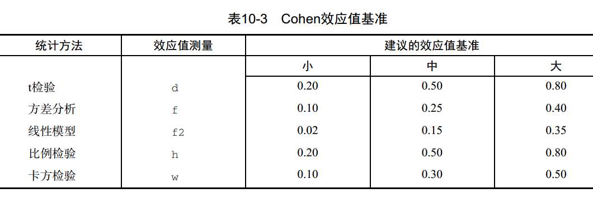

```{r setup, include = FALSE}

knitr::opts_chunk$set(echo = FALSE, warning = FALSE, message = FALSE)
options(digits = 2)

```

# 实验设计概述

## 研究设计中的实验方法

研究者几乎在所有研究领域都会做实验，以探究特定的过程或系统。实验是科学及工程方法的重要组成部分，

-   \textcolor{red}{机理模型}（mechanistic
    model）：对科学现象理解得比较透彻时，可以使用直接由诸如物理原理等科学原理得到的模型，诸如欧姆定律、传染病模型等。
-   \textcolor{red}{经验模型}（empirical
    model）：大多数问题要求对系统运行进行\textcolor{red}{观察}（observation）或\textcolor{red}{实验}（experiment），从而阐明系统运行的原因和方式。设计良好的观察或实验，可以导出系统运行的模型，从而使这些经验模型可以像机理模型一样被人类使用。

观察和实验如何阐明系统运行的原因和方式，其逻辑均可在\textcolor{red}{因果推断框架}下得以理解。

## 实验的目的

我们可以定义一次\textcolor{red}{实验}（experiment）是一次试验或一系列试验（test），在实验中有目的地改变某一过程或系统的输入变量，以便能够观测到和识别出输出响应变化的缘由。\textcolor{red}{试验}在不同情形下，表现形式有所不同。例如，伯努利试验（trial），工业设计中的试验（test），或计算机模拟中的试验（run）。实验往往包括多个因子。实验者的目的就是确定这些因子对系统的输出响应的影响。设计和实施实验的一般方法称为实验策略。

{width="36%"}

## 实验的统计设计

\textcolor{red}{实验的统计设计}（statistical design of
experiments）即是设计试验的过程，以便收集适合于使用统计方法分析的数据，从而得出有效且客观的结论。

因此，任何实验问题都存在两个方面：

-   实验的设计
-   数据的统计分析

这两个部分是\textcolor{red}{紧密相连}的，因为分析方法直接依赖于所使用的设计。

## 实验设计的基本原理

-   \textcolor{red}{随机化}（randomization）：即实验材料的分配和实验中各次试验进行的顺序都是随机确定的。随机化是实验设计中使用统计方法的基石。统计方法要求观测值或误差是独立分布的随机变量，随机化通常能使这一假定有效。实验的随机化也有助于"平均掉"可能出来的外来因子的效应。
-   \textcolor{red}{重复}（replication）：即每个因子水平组合的独立重复。重复有两条重要的性质。其一，它允许试验者得到实验误差估计，这个误差估计用以评估数据之间的观测差值是否具有\textcolor{red}{统计意义}；其二，如果用样本均值估计实验中某一因子水平组合的相应均值的真值，则重复能够使实验者得到更精确的参数估计。需要注意，重复和重复测量是有很大区别的。
-   \textcolor{red}{区组化}（blocking）：是用来提高实验精度的设计技术，常用于减少或消除\textcolor{red}{讨厌因子}带来的变异。讨厌因子是指可能影响实验响应而我们不直接感兴趣的因子。一般来说，区组是一组相对类似的实验条件。

## 实验设计指南

-   **问题的识别与表述**：明确地陈述问题通常有助于更好地理解正在研究的现象以及问题的最终解决方案。提出问题时必须认识到一个大的综合性实验不可能满意地回答所有的关键性问题。因此，采用\textcolor{red}{序贯}的方法是较好的策略。
-   **响应变量的选择**。
-   **因子、水平和范围的选择**。
-   **实验设计的选择**。
-   **进行实验**：需要仔细监控实验的过程以确保每件事情都按计划做完。这个阶段，实验程序中的错误通常会破坏实验的有效性。
-   **数据的统计分析**：如果实验设计正确且按设计执行了，统计分析通常是很简单的。
-   **结论和建议**。

## 现代统计实验设计发展史

-   Ronald
    Fisher引领的**农业时期**：1920\~1930年代初期，Fisher在英国伦敦附近的洛桑试验站提出的\textcolor{red}{实验设计基本原理}（随机化、重复和区组化），以及\textcolor{red}{方差分析}。
-   Box &
    Wilson引领的**工业时期**：1950年代提出的\textcolor{red}{响应曲面方法}（RSM）以及后续发展。1950\~1970年代末的三十年间，RSM和其他设计技术在化工领域被广泛应用。但在工厂或制造过程生产方面的应用还不普遍。部分原因是工程师在基本的统计概念和方法上的培训不够，而且缺少计算资源和用户友好的统计软件的支持。与此同时，**行为主义**建立的\textcolor{red}{心理实验技术}也趋于完善。
-   山口玄一引领的**工业质量改进时期**：由1970年代末提出的\textcolor{red}{稳健参数设计}等方法，直至1980年代末。这标志着实验设计可以广泛地运用在零部件工业，包括汽车、航天航空制造、电子和半导体等工业领域。
-   第四时期：1990年代以来的发展。此时统计实验设计的正规教育成为大学和研究生工程课程的一部分。良好的实验设计经验与工程学、科学的成功结合，成为未来工业竞争的关键因素。

## 讨论

请思考并讨论如下问题：

-   实验设计与所处的历史时期有什么关系？

-   请从内部效度和**外部效度**两个维度，评价药物临床实验（试验）结论。

-   作为当代的卫生管理或卫生信息管理研究者，应主要参照哪些学科的实验范式？

-   回忆阅读的文献，请列举1\~2与自己研究兴趣接近的实验研究例子。

## 参考教材

-   Douglas Montgomery. Design and analysis of experiments （10ed）.
    John Wiley & Sons, 2020.

说明：

-   课程所述实验设计，是指\textcolor{red}{管理科学}领域的实验设计，而非医学领域实验设计。

-   管理科学领域实验设计，主要受到工业质量管理（e.g.,
    运营管理）和心理学（e.g.,
    消费者及员工行为研究）实验范式的影响。社会学及教育学实验（e.g.,
    兰德健康保险实验）值得更多关注，但是实施上更加困难。

## Donald Fisher与洛桑试验站

英国\textcolor{red}{洛桑试验站}（Rothamsted Experimental
Station），现为洛桑研究所（Rothamsted
Research），在漫长的历史中（1843-1919）积累了大量的"实验数据"和其它记录，包括：

-   降水量和温度的每日精确记录。
-   施肥量与土壤检测数据的每周记录。
-   农作物收成的每年记录。
-   人造肥料和不同农作物（小麦、黑麦、大麦、马铃薯等）的组合实验方案。

## 洛桑试验站的农作物

研究问题：如何评估肥料使用对马铃薯产量的影响？

{width="75%"}

## 洛桑试验站的早期方案

-   洛桑试验站的\textcolor{red}{早期方案}：在不同片田地上，针对不同马铃薯品种，使用不同化肥，并记录其产量。
-   潜在问题
    -   \textcolor{red}{田地}相关的混淆因素，例如土壤肥力、排水方式、营养物质、杂草等。
    -   \textcolor{red}{年份}相关的混淆因素，例如气候变化（降雨量）、土壤肥力等。

{width="75%"}

## 理想设定

从因果图上来看，理想的设定如下：

{width="75%"}

## Fisher开创的统计方法

-   \textcolor{red}{随机对照实验}
    -   每片田地分块之后，进一步把每块田地分为若干排
    -   采用随机化方案，对每块地的每一排实施不同的处理
-   \textcolor{red}{方差分析}

{width="75%"}

## Rubin因果模型

为什么随机对照实验能够奏效？

我们可以回顾\textcolor{red}{Rubin因果模型}（Rubin Causal Model,
RCM），它包括三个核心概念：

-   潜在结果（potential outcomes）
-   个体处理效应稳定性假设SUTVA
-   处理分配机制（assignment mechanism）

## 因果效应定义

$\{Y_{i}(1), Y_{i}(0)\}$代表个体$i$接受处理或者对照的潜在结果，因而个体$i$接受处理的\textcolor{red}{因果效应}（causal
effect）为： $$
CE_{i} = Y_{i}(1)-Y_{i}(0).
$$ 可以看到，\textcolor{red}{因果效应涉及潜在结果的比较}。

总体的\textcolor{red}{平均因果效应}（average causal effect, ACE）如下：
$$
ACE(D \rightarrow Y) = E[Y_{i}(1)-Y_{i}(0)].
$$

观察到的处理组与对照组在结果变量$Y$上的平均差异，可以分解为两部分： $$
\begin{aligned}
& E(Y_{i}^{obs}|D_{i} = 1 - Y_{i}^{obs}|D_{i}=0) \\
= & E[Y_{i}(1)|D_{i}=1 - Y_{i}(0)|D_{i}=0] \\
= & \underbrace{E[Y_{i}(1)|D_{i}=1 - Y_{i}(0)|D_{i}=1]}_{\text{average causal effect}} + \underbrace{E[Y_{i}(0)|D_{i}=1 - Y_{i}(0)|D_{i}=0]}_{\text{selection bias}}
\end{aligned}
$$

## 随机对照实验

如果第二项选择性偏误等于零，则观察到的处理组与对照组在结果变量上的平均差异，就等于平均因果效应。此时要求，处理$D$独立于潜在结果$\{Y_{0}, Y_{1}\}$：
$$
D \perp \{Y_{0}, Y_{1}\}.
$$

如何满足$D \perp \{Y_{0}, Y_{1}\}$？\textcolor{red}{随机化！}

因此，估计因果效应时，可以直接比较处理组和对照组在结果上的差异。此时可以推导：
$$
ACE(D \rightarrow Y) = E[Y(1) - Y(0)] = E[Y(1)|D=1] - E[Y(0)|D=0].
$$

## 可忽略性

更一般地，如果给定协变量$Z$后，处理的分配机制可以做到随机化，例如有区组的随机化实验，那么分配机制就是可忽略的。

    可忽略处理分配（ignorable treatment assignment）假设

$$
D \perp \{Y_{0}, Y_{1}\} | Z.
$$

在满足\textcolor{red}{可忽略处理分配假设}时，\textcolor{red}{观察研究}也可以做因果推断。这一假设也称为selection
on observables。

## 可忽略性（续）

当$D \perp \{Y_{0}, Y_{1}\} | Z$时，平均因果效应：

$$
\begin{aligned}
& ACE(D \rightarrow Y) = E[Y(1) - Y(0)] \\
= & E\{E[Y(1)|Z]\} - E\{E[Y(0)|Z]\} \\
= & E\{E[Y(1)|Z,D=1]\} - E\{E[Y(0)|Z,D=0]\} \\
= & E\{E[Y^{obs}|Z,D=1]\} - E\{E[Y^{obs}|Z,D=0]\}.
\end{aligned}
$$

因而，此时$ACE(D \rightarrow Y)$可以直接使用观察数据来估计。

# 简单比较实验

## 辛普森悖论

{width="80%"}

-   不论男性患者还是女性患者，处理组（服药）的痊愈率更高
-   就整体人群而言，处理组（服药）的痊愈率更低
-   该药物到底是否能够提高痊愈率？

## 辛普森悖论（续）

{width="80%"}

-   不论哪个年龄段，运动都与胆固醇水平负相关
-   就整体人群而言，运动与胆固醇水平正相关
-   运动到底是否能够降低胆固醇水平？

## 实验设计案例

本次课程，我们综合以上两个案例：

-   药物效果案例：研究目的在于，评估药物对患者健康水平的效应。健康水平的度量可能包括，疾病痊愈与否，生存年限，自报告或其它方式测量的健康水平等。混杂因子是性别。
-   运动效果案例：研究目的在于，评估运动对患者胆固醇水平的效应。混杂因子是年龄。

归并为一个案例：\textcolor{red}{药物效果案例}，混杂因子是**年龄**和**性别**。

## 药物效果案例：数据生成过程

```{r}

rm(list = ls())
set.seed(123)

```

```{r, echo = TRUE}

# generate age, and age levels
age_c <- runif(n = 300, min = 30, max = 80)
age_f <- ifelse(age_c <= 45, "30 ~ 45", ifelse(age_c <= 65,
                "45 ~ 65", "65 ~ 80")) |>
  factor(levels = c("30 ~ 45", "45 ~ 65", "65 ~ 80"))
# generate gender levels
gender <- sample(x = c("male", "female"), size = 300,
                replace = TRUE, prob = c(0.5, 0.5)) |>
  factor(levels = c("male", "female"))
# generate health status
y <- 40 - 0.5 * (age_c - 55) + 5 * (gender == "female") +
    rnorm(n = 300, mean = 0, sd = 10)
# combine as a data frame
dat <- data.frame(y = y, age_c = age_c, age_f = age_f,
                  gender = gender)

```

## 健康状态分布

由此得到没有药物干预下，健康状态的\textcolor{red}{潜在结果（potential outcomes）}的分布。

```{r, fig.height = 4.5}

# display the health status
suppressMessages(library(ggplot2))
ggplot(dat, aes(x = y)) + geom_histogram(color = "black", fill = "white") +
  labs(x = "health status: potential outcome $Y_{0}$", y = "count") + theme_bw()

```

## 药物干预：单因素实验

先探讨最简单的情形。随机分配患者进入处理组（服药）或者对照组。假定处理的实际效应是$\beta = 12$。

```{r, echo = TRUE}

# treatment assignment
x_twolevel <- sample(x = c("treatment", "control"),
                     size = nrow(dat), replace = TRUE,
                     prob = c(0.5, 0.5)) |>
  factor(levels = c("control", "treatment"))
# generate health status after experiment
dat <- cbind(dat, x_twolevel)
dat$y_twolevel <- dat$y + rnorm(300, 12, 4) *
    (dat$x_twolevel == "treatment")

```

## 健康状态分布：处理组 vs 对照组

```{r, echo = TRUE, fig.height=2.5, fig.width=4}

# boxplot
ggplot(dat, aes(y = y_twolevel, x = x_twolevel)) + geom_boxplot() + theme_bw()

```

## 两样本t检验

假定处理组和对照组的均值分别为$\{\mu_{t}, \mu_{c}\}$，误差项均服从均值为0的正态分布，即
$$
\epsilon_{ij} \sim \text{NID}(0, \sigma^{2})
$$ 此处涉及三个假设：独立性、正态性、方差齐性。

在如上完全随机化设计中，比较两组均值的恰当统计量是 $$
t_{0} = \frac{\bar{y}_{t} - \bar{y}_{c}}{S_{p}\sqrt{\frac{1}{n_{t}}+ \frac{1}{n_{c}}}}.
$$ 其中$S_{p}^{2}$是公共方差$\sigma^{2}$的估计量，其计算式为 $$
S_{p}^{2} = \frac{(n_{t}-1)S^{2}_{t} + (n_{c}-1)S^{2}_{c}}{n_{t} + n_{c} - 2}.
$$

## t检验计算过程

```{r}

# sample size
nt <- which(dat$x_twolevel == "treatment")
nc <- which(dat$x_twolevel == "control")
# sample mean
ytmean <- dat$y_twolevel[nt] |> mean()
ycmean <- dat$y_twolevel[nc] |> mean()
# sample variance
ytvar <- dat$y_twolevel[nt] |> var()
ycvar <- dat$y_twolevel[nc] |> var()
# estimated variance
sp2 <- ((length(nt) - 1)*ytvar + (length(nc) - 1)*ycvar)/(length(nt) + length(nc) - 2)
sp <- sqrt(sp2)
# t statistic
t.stat <- (ytmean - ycmean)/(sp * sqrt(1 / length(nt) + 1 / length(nc)))

```

在如上例子中，处理组和对照组的样本量分别为$n_{t} = `r length(nt)`$和$n_{c} = `r length(nc)`$，样本均值分别为$\bar{y}_{t} = `r ytmean`$和$\bar{y}_{c} = `r ycmean`$，样本方差分别为$S^{2}_{t} = `r ytvar`$和$S^{2}_{c} = `r ycvar`$。

由此得到公共方差的估计值为 $$
S_{p}^{2} = \frac{(n_{t}-1)S^{2}_{t} + (n_{c}-1)S^{2}_{c}}{n_{t} + n_{c} - 2} = `r sp2`, S_{p} = `r sp`.
$$ 因而，t检验统计量为 $$
t_{0} = \frac{\bar{y}_{t} - \bar{y}_{c}}{S_{p}\sqrt{\frac{1}{n_{t}}+ \frac{1}{n_{c}}}} = `r t.stat`.
$$

## t检验的R语言实现

类似地，使用R语言报告的结果如下：

```{r}

# t test
yt <- dat$y_twolevel[nt]
yc <- dat$y_twolevel[nc]
t.test(yt, yc, var.equal = TRUE)

```

# 单因子实验

## 处理分配方案

进一步考虑单因子实验，考虑药物干预因子包含三个水平：药物A、药物B和安慰剂。两个药物的真实效应分别为$\beta_{A} = 12$和$\beta_{B} = 5$。

类似地，采用\textcolor{red}{完全随机化}方式分配处理水平。

```{r, echo = TRUE}

# treatment assignment
x_threelevel <- sample(x = c("drug A", "drug B", "control"),
                     size = nrow(dat), replace = TRUE,
                     prob = c(1/3, 1/3, 1/3)) |>
  factor(levels = c("control", "drug A", "drug B"))
# generate health status after experiment
dat <- cbind(dat, x_threelevel)
dat$y_threelevel <- dat$y + rnorm(300, 12, 4) *
    (dat$x_threelevel == "drug A") + 
    rnorm(300, 5, 4) * (dat$x_threelevel == "drug B")

```

## 健康状态分布：药物A vs 药物B vs 对照组

```{r, echo = TRUE, fig.height=4.5}

ggplot(dat, aes(y = y_threelevel, x = x_threelevel)) + geom_boxplot() + theme_bw()

```

## 统计模型

以上实验设计的\textcolor{red}{效应模型}（effects model）是， $$
y_{ij} = \mu + \tau_{i} + \epsilon_{ij}
$$ 其中$\mu$是\textcolor{red}{总均值}（overall
mean），$\tau_{i}$是第$i$个\textcolor{red}{处理效应}（treatment
effect），误差项则假定服从正态随机分布$\epsilon_{ij} \sim NID(0, \sigma^{2})$。

因而，观测值服从如下正态分布 $$
y_{ij} \sim N(\mu + \tau_{i}, \sigma^{2}).
$$

## 方差分析表

方差分析表和F统计检验量为： $$
F_{0} = \frac{MS_{treatment}}{MSE} = \frac{SS_{treatment}/(a-1)}{SS_{error}/(N-a)} \sim F_{a-1, N-a}.
$$

{width="80%"}

## 方差分析的R语言实现

```{r, echo = TRUE}

# analysis of variance
fit <- aov(y_threelevel ~ x_threelevel, data = dat)
fit |> summary()

```

## 多重比较

在单因素方差分析中，如果我们拒绝了零假设，有时就会有进一步的问题：哪些均值不同？因此，进一步比较处理均值的组间差异是有用的。这类比较方法称为\textcolor{red}{多重比较法}（multiple
comparison method）。

```{r, echo = TRUE}

# multiple comparisons of means
TukeyHSD(fit)$x_threelevel

```

## 效应模型估计

使用方差分析和直接估计效应模型是\textcolor{red}{等价}的。

```{r, echo = TRUE}

# estimate effects model
fit <- lm(y_threelevel ~ x_threelevel, data = dat)
summary(fit)$coefficients

```

# 区组化设计

## 区组化设计

在Fisher的农田实验中，田埂可以划分为若干土壤性质相近的地块，即是\textcolor{red}{区组}（block）。地块内部的土壤性质差异较小，而地块之间的差异则较大。

进一步，把地块分为更小的块，作为试验单元。在每个地块内部，做随机化处理。这一方法称为\textcolor{red}{随机化完全区组设计}（randomized
complete block design, RCBD）。

从统计角度来看，将区组变异从组内变异中分离出来，减少了均方误差，从而使处理组间的$p$值更容易达到显著性水平。

## 数据分组

考虑单因子实验的设计，已知性别和年龄均会影响健康状态。

```{r, echo = TRUE}

# contingency table
xtabs(~ gender + age_f, dat) |>
  addmargins()

```

## 区组化：性别

先以性别作为区组（block）做设计。此时，在每个区组内，处理分配是随机的。

```{r, echo = TRUE}

# blocking by gender
block.male <- which(dat$gender == "male")
block.female <- which(dat$gender == "female")
# random assignment in each block
male.t <- sample(x = c("drug A", "drug B", "control"),
                 size = length(block.male),
                 replace = TRUE,
                 prob = c(1/3, 1/3, 1/3))
female.t <- sample(x = c("drug A", "drug B", "control"),
                   size = length(block.female),
                   replace = TRUE,
                   prob = c(1/3, 1/3, 1/3))

```

## 区组化：性别（续）

在各个分组内随机分配后，即可模拟各个实验单元的响应。

```{r, echo = TRUE}

# treatment assignment
x_tlgb <- rep(NA, times = nrow(dat))
x_tlgb[block.male] <- male.t
x_tlgb[block.female] <- female.t
dat$x_tlgb <- factor(x = x_tlgb,
                     levels = c("control", "drug A", "drug B"))
dat$y_tlgb <- dat$y + rnorm(300, 12, 4) * 
    (dat$x_tlgb == "drug A") + rnorm(300, 5, 4) *
    (dat$x_tlgb == "drug B")

```

## 统计模型

以上实验设计的\textcolor{red}{效应模型}（effects model）是， $$
y_{ij} = \mu + \tau_{i} + \beta_{j} + \epsilon_{ijk}
$$ 其中$\mu$是\textcolor{red}{总均值}（overall
mean），$\tau_{i}$是第$i$个\textcolor{red}{处理效应}（treatment
effect），$\beta_{j}$是第$j$个区组的效应，误差项则假定服从正态随机分布$\epsilon_{ijk} \sim NID(0, \sigma^{2})$。

因而，观测值服从如下正态分布 $$
y_{ijk} \sim N(\mu + \tau_{i} + \beta_{j}, \sigma^{2}).
$$

## 方差分析

以上实验设计的方差分析类似，方差可以分为三个部分，处理、区组和误差。类似地，可以做多重比较。

```{r}

# analysis of variance
fit.tlgb <- aov(y_tlgb ~ gender + x_tlgb, data = dat)
fit.tlgb |> summary()
# multiple comparisons of means
TukeyHSD(fit.tlgb)$x_tlgb

```

## 区组化：性别和年龄

也可以同时以性别和年龄作为区组（block）做设计。此时，存在6个区组。在每个区组内，处理分配是随机的。

```{r, echo = TRUE}

# treatment assignment
x_tlb <- rep(NA, times = nrow(dat))
# blocking by gender and age levels
for (i in levels(dat$gender)) {
  for (j in levels(dat$age_f)) {
    # sample id of each block
    block.index <- which(dat$gender == i) |>
      intersect(which(dat$age_f == j))
    # random assignment in each block
    block.t <- sample(x = c("drug A", "drug B", "control"),
                 size = length(block.index),
                 replace = TRUE,
                 prob = c(1/3, 1/3, 1/3))
    # record these assignment
    x_tlb[block.index] <- block.t
  }
}

```

## 区组化：性别和年龄（续）

在各个分组内随机分配后，即可模拟各个实验单元的响应。

```{r, echo = TRUE}

# treatment assignment and response
dat$x_tlb <- factor(x = x_tlb,
                     levels = c("control", "drug A", "drug B"))
dat$y_tlb <- dat$y + 
    rnorm(300, 12, 4) * (dat$x_tlb == "drug A") + 
    rnorm(300, 5, 4) * (dat$x_tlb == "drug B")

```

## 方差分析

方差分析与上一个实验设计类似。我们在此给出回归分析的结果。可以看到，二者是一致的。

```{r}

# regression model
fit.tlb.lm <- lm(y_tlb ~ gender + age_f + x_tlb, data = dat) 
summary(fit.tlb.lm)$coefficients

```

## 多重比较

类似地，可以做多重比较。

```{r}

# analysis of variance
fit.tlb <- aov(y_tlb ~ gender + age_f + x_tlb, data = dat)
# multiple comparisons of means
TukeyHSD(fit.tlb)$x_tlb

```

## 偏误（bias）

遗漏变量导致因果效应估计出现偏误（bias）。

```{r}

# regression model
fit.tlb.bias <- lm(y_tlb ~ gender + x_tlb, data = dat)
summary(fit.tlb.bias)$coefficients

```

模型$R^{2}$ = `r summary(fit.tlb.bias)$adj.r.squared`。

## 真实效应

因此，实验分析时，还应纳入新的协变量。

```{r}

fit.tlb.lm <- lm(y_tlb ~ gender + age_f + x_tlb, data = dat)
summary(fit.tlb.lm)$coefficients

```

模型$R^{2}$ = `r summary(fit.tlb.lm)$adj.r.squared`。

## 协方差分析

处理讨厌因子时，除了区组化以外，我们还可以测量它们，同时做\textcolor{red}{协方差分析}。二者在统计分析上是一致的。

```{r}

# analysis of variance
fit <- aov(y_threelevel ~ gender + age_f + x_threelevel, data = dat)
fit |> summary()
# multiple comparisons of means
TukeyHSD(fit)$x_threelevel

```

## 如何处理讨厌因子

很多实验中，由\textcolor{red}{讨厌因子}（nuisance
factor）产生的变异可能会影响结果。但是，我们通常对讨厌因子的效应不感兴趣。按照讨厌因子的类型，我们会采用相应的方案：

-   讨厌因子是未知且不可控的：采用\textcolor{red}{随机化}的方法来抵制这些"潜伏"的讨厌因子。
-   讨厌因子是已知且不可控的：如果至少我们可以观测到这些因子，通常可以采用\textcolor{red}{协方差分析}在统计分析中加以控制。
-   讨厌因子是已知且可控的：可以使用\textcolor{red}{区组化设计}技术来系统消除其影响。

## 功效分析

\textcolor{red}{统计假设}（statistical
hypothesis）是关于概率分布参数或模型参数的命题。通常涉及零假设H0和备择假设H1。研究者在假设检验以及研究过程中，通常关注4个量：

-   \textcolor{red}{样本大小}：即实验设计中每种条件下观测的数量。
-   \textcolor{red}{显著性水平}（也称为$\alpha$）：也就是I型错误的概率。$\alpha = \text{P(Type I error)}$定义为$H_{0}$为真却错误拒绝了$H_{0}$的概率。
-   \textcolor{red}{功效}：定义为1减去II型错误的概率。我们可以把功效视作真实效应发生的概率，即$H_{0}$为假同时正确拒绝了$H_{0}$的概率。
-   \textcolor{red}{效应值}：在备择或研究假设下效应的量，其表达式依赖于假设检验中使用的统计方法。例如，t检验中效应值为$d = (\mu_{1} - \mu_{2})/\sigma$。

## 功效分析（续）

通常来说，研究目标是\textcolor{red}{维持一个可接受的显著性水平，尽量使用较少的样本，然后最大化统计检验的功效}。也就是说，最小化发现错误效应的几率，把研究成本控制在合理范围之内，同时最大化发现真实效应的几率。

样本大小、显著性水平、功效和效应值这四个量，给定其中任意三个，就能够计算第四个。

## 功效分析（续）

\textcolor{red}{效应值}是最难确定的，需要依据经验和研究目的判断。Cohen曾经给出了一些参考：

{width="80%"}

## 确定样本量

在如上的方差分析中，因子水平$k = 3$，要检验出中等程度的效应值（$f = 0.25$），可以确定相应的样本量为：$N = 52 \times 3 = 156$。

```{r, echo = TRUE}

# calculate sample size
suppressMessages(library(pwr))
pwr.anova.test(k = 3, f = .25,
               sig.level = .05, power = .8)

```

## 课程作业

请考虑自己的研究方向，4-6人一组（约8组），参照如下几份期刊：

-   Journal of Consumer Research (UTD-24)

-   Journal of Applied Psychology (FT-50)

-   Journal of Consumer Psychology (FT-50)

-   Organizational Behavior and Human Decision Processes (FT-50)

选择一份与自己研究方向接近或感兴趣的论文，仔细阅读其理论框架、实验设计方案和结果分析部分。

最后一次课程，分组报告实验设计及研究讨论撰写。
