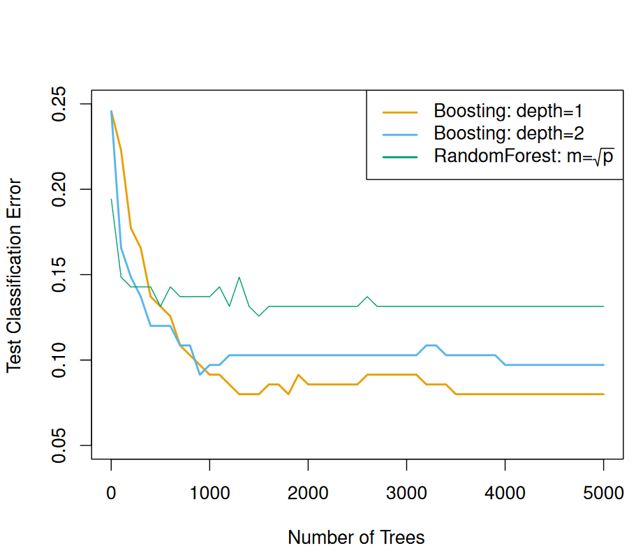

```{r setup, include = FALSE}

knitr::opts_chunk$set(echo = FALSE, warning = FALSE, message = FALSE)
options(digits = 2)

```

# 统计学习概述

## 医疗健康领域中的统计学习

{width="70%"}

## 通用模型

因变量（响应变量，response variable）记为$y$，自变量（预测变量，predictors）集合记作向量$\textbf{x} = c(x_{1}, x_{2}, ..., x_{p})$，则通用模型可以写成：

$$
y = \underbrace{f(\textbf{x})}_{\text{Prediction}} + \underbrace{\epsilon}_{\text{Error}}.
$$

从而由

$$
\hat{y} = \hat{f}(\textbf{x})
$$

得到预测值。研究者可以选择不同的建模方法，从而得到对$f(\cdot)$的不同估计$\hat{f}(\cdot)$。

## 理解视角

将观测值$y$分为结构部分$f(\textbf{x})$和随机部分$\epsilon$，可以从**三个视角**来理解：

-   **因果性**（计量经济领域）：观测项 = 机制项 + 干扰项
-   **预测性**（\textcolor{red}{统计学习领域}）：观测项 = 预测项 + 误差项
-   **描述性**（统计领域）：观测项 = 概括项 + 残差项

**课堂讨论：（1）三个视角在研究目的上有何区别？（2）在建模思路和模型选取上有何差异？**

## 模型误差

本质上，统计学习指一套估计$f(\cdot)$的方法。为此，我们需要了解在估计$f(\cdot)$中涉及的\textcolor{red}{关键理论概念}，以及\textcolor{red}{评估准则}。

给定$\hat{f}(\textbf{x})$和$\textbf{x}$，那么： $$
E(y - \hat{y})^{2} = E[f(\textbf{x}) + \epsilon - \hat{f}(\textbf{x})]^{2} = \underbrace{[f(\textbf{x}) - \hat{f}(\textbf{x})]^{2}}_{\text{Reducible}} + \underbrace{\text{Var}(\epsilon)}_{\text{Irreducible}}.
$$

第一项是\textcolor{red}{可约误差}（reducible error），若使用更适当的方式估计$f(\cdot)$，则可以减少可约误差；第二项是\textcolor{red}{不可约误差}（irreducible error），它是由未被测量的因素导致的，因而不可消除。

## 自由度

模型\textcolor{red}{自由度}，表征了模型的\textcolor{red}{复杂程度}，是研究者在估计$f(\cdot)$时的重要考量因素。

在统计学习中，尤其需要理解模型的自由度。 \vspace{12pt}

> The number of \textcolor{red}{degrees of freedom} is the number of values in the final calculation of a statistic that are free to vary.
>
> `r tufte::quote_footer('--- In Statistics')`

\vspace{12pt}

> The \textcolor{red}{degrees of freedom} are an accounting of how many parameters are estimated by the model and, by extension, a measure of complexity for linear regression models.
>
> `r tufte::quote_footer('--- In Statistical Learning')`

## 自由度分解

假定多元线性模型$y = \beta X + \epsilon$中，假定$X$包括一列常数和$(p - 1)$列变量，那么待估计的参数个数为$p$，方差和自由度的分解如下：

-   SST: 自由度为$n - 1$
-   SSE: 自由度为$n - p$
-   SSR：自由度为$p - 1$

因而，自由度的分解为： $$
n - 1 = (n - p) + (p - 1)
$$

线性回归模型中，模型的自由度等于预测变量的个数。

**课堂思考: 假设模型有两个解释变量，其中**$x_{1}$是连续变量，$x_{2}$是包含5个分类的分类变量，SSR的自由度为多少？

## 方差分析表

| 变异来源 | 平方和 | 自由度  | 均方              |
|----------|--------|---------|-------------------|
| 回归模型 | SSR    | $p - 1$ | MSR = SSR/$(p-1)$ |
| 误差     | SSE    | $n - p$ | MSE = SSE/$(n-p)$ |
| 总变异   | SST    | $n-1$   | MST = SST/$(n-1)$ |

假定在线性回归模型$A$的基础上，加了几个变量得到模型$B$，模型选择取决于构造的$F$检验： $$
F(\Delta \text{df}, \text{df}_{\text{SSE}}) = \frac{\Delta \text{SSR} / \Delta \text{df}}{\text{MSE}_{\text{B}}} ?> F_{\alpha}
$$

## 预测精度 vs 可解释性

Q1：如何选择函数$f(\cdot)$？

随着模型自由度（degree of freedom）增加，模型变得更加复杂。

-   预测精度（accuracy）：尽可能减少可约误差，因此要求自由度更大的模型。
-   可解释性（interpretability）：尽可能用少数变量来解释$\textbf{x}$如何影响$y$，因此要求自由度更小的模型。

统计学习中，大多数时候更加关注\textcolor{red}{预测精度}，因而可以将$f(\cdot)$视作\textcolor{red}{黑箱}。

## 权衡预测精度与模型可解释性

{width="70%"}

## 参数方法 vs 非参数方法

Q2：函数$f(\cdot)$的形式，是否有明确假设？或说，给定训练集（training set）数据，如何估计函数$f(\cdot)$？

参数方法（parametric methods）：

-   步骤：（1）设定具体的\textcolor{red}{函数形式}，包括线性或非线性函数；（2）使用训练集数据，拟合（fit）或说训练（train）模型，得到参数估计值。
-   优点：简化了$f(\cdot)$的估计问题，估计一组参数通常很方便。
-   缺点：一旦模型设定有误，则会导致较大误差。

\vspace{6pt}

非参数方法（non-parametric methods）

-   步骤：使用附近的观测值来估计给定$\textbf{x}$时的预测值。
-   优点：避免设定特定的函数形式，从而规避了模型设定错误。
-   缺点：无法将估计$f(\cdot)$这一问题变成少量参数的估计，因而远远超过参数方法需要的观测值才能获得$f(\cdot)$的准确估计。

## 监督学习 vs 无监督学习

Q3：有无已知的输出结果（即响应变量$y$）作为参考？

-   \textcolor{red}{监督学习}（supervised learning）：有已知的输出结果（当然也有输入结果）作为参考，即为训练集。
-   \textcolor{red}{无监督学习}（unsupervised learning）：无已知的输出结果（仅有输入结果）作为参考。例如，市场细分研究中的\textcolor{red}{聚类分析}，依据消费者特征将其分为不同的细分市场。

## 回归问题 vs 分类问题

Q4：响应变量$y$是离散还是连续的？

-   \textcolor{red}{回归问题}（regression），或说预测问题（prediction）：响应变量$y$是连续的。
-   \textcolor{red}{分类问题}（classification）：响应变量$y$是离散的。

因而，二者在本质上并无太大差异。

## 统计学习方法

\textcolor{red}{统计机器学习（statistical machine learning）}可分为：

-   监督学习（supervised learning） vs 无监督学习（unsupervised learning）：聚类分析即为典型的无监督学习
-   参数方法（parametric methods） vs 非参数方法（non-parametric methods）
-   回归（regression）问题 vs \textcolor{red}{分类（classification）问题}：分别针对连续变量和分类变量

## 测试均方误差的分解

\textcolor{red}{测试集}（test set）均方误差的期望值（**expected test MSE**）可以分解为如下三个部分： $$
E(y - \hat{f}(x))^{2} = \underbrace{\text{Var}(\hat{f}(x))}_{\text{Variance}} + \underbrace{[\text{Bias}(\hat{f}(x))]^{2}}_{\text{Bias}} + \underbrace{\text{Var}(\epsilon)}_{\text{Irreducible}}.
$$

-   模型方差（variance）：针对不同的训练数据，$\hat{f}$的变化程度。
-   模型偏误（bias）：通过相对简化的模型来**近似**真实世界的问题时所引入的误差。

## 模型复杂程度

{width="70%"}

## 权衡模型偏误与方差

{width="70%"}

## 如何选择统计模型？

-   传统统计模型的局限：线性回归模型等统计模型通常最小化训练数据的均方误差，但是其测试均方误差（\textcolor{red}{test MSE}）却较大。换言之，传统统计模型执着于寻求"真实规律"，以致于将一些随机因素\textcolor{red}{误判}为$f$的真实性质。
-   权衡模型偏误与方差（\textcolor{red}{bias-variance trade-off}）：随着模型灵活性（或自由度）的增加，模型方差随之增大，但模型偏误则相应减小（过度拟合问题）。通过交叉验证来权衡两者。
-   权衡预测精度与可解释性（\textcolor{red}{accuracy-interpretability trade-off}）：诸如bagging、boosting、support vector machines等非线性模型具有很高的预测精度，但不易解释；linear models等易于解释，但预测精度不高。两者的权衡取决于研究目的。

## 交叉验证

\textcolor{red}{交叉验证}（cross-validation）将原始数据集分为训练集（**training set**）和验证集（**validation set**），并以验证集的错误率选择最佳模型。

-   留一交叉验证法（leave-one-out cross validation, LOOCV）
-   $k$折交叉验证法（$k-$fold CV）：将观测集随机分为$k$个大小基本一致的组，或说折（fold）。每次选取其中一折作为验证集，而剩余$k-1$折作为训练集。通常，取$k=5$或$k=10$。

\textcolor{red}{分类模型}验证集错误率： $$
\text{CV}_{(k)} = \frac{1}{k} \sum_{i=1}^{k} \text{Err}_{k} = \frac{1}{k} \sum_{i=1}^{k} \frac{1}{m_{k}} \sum_{i=1}^{m_{k}} I(y_{i} \neq \hat{y}_{i}).
$$

## 分类模型概述

预测分类响应变量（categorical response variable）：

1.  基本分类模型（basic classifier）
2.  树模型（tree-based models）
3.  聚类模型（clustering models）

## 分类模型的评价

{width="90%"}

## 疾病筛查问题

采用乳房X光检查乳腺癌，得到以下混淆矩阵：

{width="75%"}

## 灵敏度

-   定义：\textcolor{red}{灵敏度}（sensitivity）也称为真阳性率、召回率（recall rate）。指实际为阳性的样本中，被正确判断为阳性的比例。
-   疾病筛查：在患病人群中，成功检出患者的概率。
-   适用情况：用以\textcolor{red}{避免假阴性}。例如HIV的筛查。
-   结果解读：由于真阳性率高，因而假阴性低。亦即，若得到结果是阴性，则有把握认为未患病。

以上筛查技术的灵敏度为：132 / 177 = 74.6%。

## 特异度

-   定义：\textcolor{red}{特异度}（specificity）也称为真阴性率。指实际为阴性的样本中，被正确判断为阴性的比例。
-   疾病筛查：在未患病人群中，成功给出阴性结果的概率。
-   适用情况：用以\textcolor{red}{避免假阳性}。例如，治疗风险较大的疾病。
-   结果解读：由于真阴性率高，因而假阳性率低。亦即，若得到结果是阳性，则有把握认为患病。

以上筛查技术的特异度为：63650 / 64633 = 98.5%。

联合筛查：先采用低成本、高灵敏度的筛查技术，排除未患病人群；再采用高成本、高特异度的筛查技术，确诊患病人群。

## 两类预测错误

{width="80%"}

## 误诊率与漏诊率

考虑两类预测错误，相应得到两个比率：

-   \textcolor{red}{误诊率}：也称为假阳性率。指实际为阴性的样本中，被错误判断为阳性的比例。
-   \textcolor{red}{漏诊率}：也称为假阴性率。指实际为阳性的样本中，被错误判断为阴性的比例。

以上筛查技术的误诊率为：983 / 64633 = 1.5%，漏诊率为：45 / 177 = 25.4%。

同时可以得知：

-   误诊率 = 1 - 特异度
-   漏诊率 = 1 - 灵敏度

## 机场安检问题

-   方案一：
    -   措施：针对所有可疑的危险物品，均触发报警。
    -   评价：高灵敏度、低特异度。
-   方案二：
    -   措施：更复杂、成本更高的技术，尽可能方便未携带危险物品的乘客。
    -   评价：高特异度。

如何设计安检方案？

实践中的权衡：灵敏度 vs 特异度

## 权衡灵敏度和特异度

{width="80%"}

## ROC曲线及AUC

以疾病筛查为例，即有监督的二分类模型，模型预测结果为概率值，我们需要从中选取一个阈值来判断样本是否患病。确定阈值之后，超过此阈值定义为患病，低于此阈值定义为健康，就可以得出混淆矩阵。

\textcolor{red}{接收者操作特征曲线}（receiver operating characteristic curve，ROC曲线）绘制：

-   不断改变阈值，以误诊率（FPR）为横轴，灵敏度（TPR）为纵轴绘制

ROC曲线下面积（area under the curve of ROC, AUC）常用于比较不同分类模型：

-   AUC = 1，是完美分类器，通常不存在。
-   AUC = 0.5，与随机猜测一样，模型没有预测价值。
-   0.5 \< AUC \< 1，即是通常情形。

## 分类器及阈值

{width="70%"}

## ROC曲线绘制

{width="70%"}

# 基本分类模型

## 基本分类模型（basic classifier）

1.  逻辑斯蒂回归（logistic regression）
2.  贝叶斯分类器（bayes classifier）
3.  线性判别分析（linear discriminant analysis, LDA）
4.  二次判别分析（quadratic discriminant analysis, QDA）
5.  $K$最近邻（$K-$nearest neighbor, KNN）

## logistic回归

给定$X$条件下事件$Y$发生的概率$p(X) = \text{Pr}(Y=1|X)$，据此可以将发生比（odd）的对数建模为$X$的线性函数 $$
\text{log}[\frac{p(X)}{1-p(X)}] = \beta X.
$$ 上式左侧称为对数发生比（log-odd）或分对数（logit），其取值范围在$(-\infty, \infty)$。

当类别$K \geq 2$时，则采用多类别logistic回归模型。

## 似然函数

可以通过\textcolor{red}{最大似然估计}（maximum likelihood estimation, MLE）得到logistic回归的参数值。

参数记为$\theta$，数据记为$D$。\textcolor{red}{似然函数}（likelihood function）是参数$\theta$的函数，且定义为给定参数$\theta$时，观测到数据$D$的概率： $$
l(\theta) = p(D|\theta).
$$

例如，logistic回归模型的似然函数 $$
l(\beta) = \prod_{i=1}^{n} p(X_{i})^{y_{i}} [1-p(X_{i})]^{1-y_{i}}.
$$

## 贝叶斯定理

贝叶斯定理阐述了随机变量$X$和$Y$的条件概率之间的关系： $$
p(Y|X) = \frac{p(X,Y)}{p(X)} = \frac{p(Y) \cdot p(X|Y)}{p(X)}.
$$

或从"数据-参数"的视角而言，参数$\theta$的\textcolor{red}{后验分布}$\pi({\theta}) = p(\theta|D)$正比于参数的\textcolor{red}{先验分布}$p(\theta)$和\textcolor{red}{似然函数}$l(\theta)$之积： $$
\pi(\theta) = \frac{p(\theta)p(D|\theta)}{p(D)} = \frac{p(\theta) l(\theta)}{p(D)}.
$$

**课堂板书：贝叶斯定理推导及概念解释**

## 贝叶斯定理与分类

对于分类（categorical）响应变量$Y$而言，运用贝叶斯定理： $$
p(Y = k|X = x) = \frac{p(Y = k) \cdot p(X = x|Y = k)}{p(X = x)}.
$$ 假定$x$是$m$维向量（即特征数量），简写为 $$
p(C_{k}|x) = \frac{p(C_{k}) \cdot p(x|C_{k})}{p(x)} \propto p(C_{k}) \prod_{i=1}^{m} p(x_{i}|C_{k})
$$

## 贝叶斯分类器

\textcolor{red}{贝叶斯分类器}（bayesian classifier）选择后验概率$p(C_{k}|x)$最大的类别，作为分类结果，即$\text{argmax } p(C_{k}|x)$。

可以证明，贝叶斯分类器将产生最低的测试错误率，亦即\textcolor{red}{贝叶斯错误率}。相应用于分类的边界，成为贝叶斯决策边界（bayes decision boundary）。

问题在于，如何推导出后验概率$p(C_{k}|x)$？我们需要更多\textcolor{red}{假设}。

## LDA

\textcolor{red}{线性判别分析}（linear discriminant analysis, LDA）假定$p(x|C_{k}) \sim N(\mu_{k}, \Sigma)$。LDA即是条件概率$p(x|C_{k})$为（多元）正态分布时的贝叶斯分类器，其判别函数$f(x)$为线性函数。

考虑$x$是一维的情况， $$
p(x|C_{k}) = \frac{1}{\sqrt{2\pi}\sigma} \text{exp}[-\frac{1}{2\sigma^{2}}(x-\mu_{k})^{2}],
$$ 由此根据后验概率$p(C_{k}|x)$的对数，得到如下判别函数 $$
f_{k}(x) = x \cdot \frac{\mu_{k}}{\sigma^{2}} - \frac{\mu_{k}^{2}}{2\sigma^{2}} + \text{log}[p(C_{k})].
$$

**课堂板书：推导判别函数**

## LDA示意图

{width="75%"}

## QDA

\textcolor{red}{二次判别分析}（quadratic discriminant analysis, QDA）假定$p(x|C_{k}) \sim N(\mu_{k}, \Sigma_{k})$。QDA即是条件概率$p(x|C_{k})$为（多元）正态分布时的贝叶斯分类器，其判别函数$f(x)$为二次函数。QDA与LDA的\textcolor{red}{差别}在于，协方差矩阵$\Sigma_{k}$是否假定相等。

$x$为多维向量时，LDA的判别函数为 $$
f_{k}(x) = x^{T} \Sigma^{-1} \mu_{k} - \frac{1}{2} \mu_{k}^{T} \Sigma^{-1} \mu_{k} + \text{log}[p(C_{k})].
$$ 相应地，QDA的判别函数为 $$
f_{k}(x) = - \frac{1}{2} x^{T} \Sigma_{k}^{-1} x + x^{T} \Sigma_{k}^{-1} \mu_{k} - \frac{1}{2} \mu_{k}^{T} \Sigma_{k}^{-1} \mu_{k} + \text{log}[p(C_{k})].
$$

## QDA示意图

-   左图：对于两个类别，均有$\rho(X_{1}, X_{2}) = 0.7$
-   右图：对于橙色类别，$\rho(X_{1}, X_{2}) = 0.7$；对于蓝色类别，$\rho(X_{1}, X_{2}) = -0.7$

{width="70%"}

## KNN

通常难以知道$p(C_{k}|X)$的分布。因而，可以设法估计条件分布$p(C_{k}|X)$。

对给定正整数$K$和测试观测值$x_{0}$，\textcolor{red}{$K$最近邻}（KNN）分类器首先识别训练集中$K$个最靠近$x_{0}$的点集$A$，继而以集合$A$中的点估计条件概率： $$
p(C_{j}|x_{0}) = = \frac{1}{K} \sum_{i \in A} I(y_{i} = j).
$$

最后，运用贝叶斯规则将测试观测值$x_{0}$分到后验概率$p(C_{j}|x_{0})$最大的类中。

-   KNN作为典型的\textcolor{red}{非参数方法}（non-parametric methods），能够产生一个近似于最优贝叶斯分类器的效果
-   $K$值的选择对KNN分类器的效果有根本影响

## KNN示意图

{width="70%"}

## 模型讨论

-   LDA中的判别函数与logistic回归中的对数发生比（log-odd）均是$x$的线性函数，因而二者都产生一个线性决策边界，且分类结果相近。若$p(x|C_{k}) \sim N(\mu_{k}, \Sigma)$近似成立，则LDA优于logistic回归；反之，logistic回归优于LDA。
-   KNN作为非参数方法，对决策边界的形状没有做出任何假设。因而当决策边界高度非线性时，KNN优于LDA和logistic回归。
-   QDA是线性决策边界（LDA和logistic回归）和非参数KNN方法的折衷方案，采用了二次函数形式的决策边界。

[\textcolor{blue}{案例：股票市场走势预测}](https://github.com/wuhsiang/Courses/blob/master/datamining/cases/case-stock.pdf)

# 聚类模型

## 聚类模型（clustering models）

聚类分析（clustering）试图从观测数据中寻找**同质子类**，属于**无监督学习**（unsupervised learning）的范畴。基本聚类模型包括：

1.  $K$均值聚类（$K-$means clustering）
2.  层次聚类（hierarchical clustering）

原理：将观测样本分割到不同的类（cluster）中，使每个类内的观测彼此相似，而不同类中的观测彼此差异很大。

**课堂讨论：比较聚类与PCA、FA、ANOVA、线性回归**

## $K$均值聚类

$k$均值聚类通过**最小化类内差异**而得到聚类结果： $$
\text{min} \sum_{k=1}^{K} W(C_{k}).
$$ $W(\cdot)$衡量类内差异，例如可以采用欧氏距离计算。

$k$均值聚类算法如下：

1.  为每个观测样本随机分配一个初始类$k (1 \leq k \leq K)$。

2.  重复以下操作，直至类的重分配停止为止：

    -   分别计算$K$个类的中心。第$k$个类中心是其类内$p$维观测样本的均值向量。
    -   将每个观测样本分配到距离其最近的类中心所在的类中。

**课堂讨论：是否存在其它思路？**

## $K$均值聚类示意图

{width="60%"}

## 层次聚类

层次聚类（hierarchical clustering）算法如下：

1.  每个观测样本自成一类，共有$n$个初始类。计算所有$n(n-1)/2$对观测样本（类）之间的相异度。

2.  令$i = n, n-1, ..., 2$：

    -   在$i$个类中，比较任意两类间的相异度，找到相异度最小的两类，将其合并起来。用两个类之间的相异度表示这两个类在谱系图中交汇的高度。
    -   计算剩下的$i-1$个新类中，每两个类间的相异度。

层次聚类采用逐步归并的方式，构建了谱系图（dendrogram），从而允许任意的类别数量。

## 距离测度

通常采用聚类来衡量相异度，常见距离形式包括：最长（complete）距离法、类平均法（average）、最短（single）距离法和重心法（centroid）。

{width="50%"}

## 层次聚类示意图

{width="70%"}

# 树模型

## 树模型（tree-based models）

1.  决策树（decision tree）
2.  装袋法（bagging）
3.  随机森林（random forest）
4.  提升法（boosting）

## 决策树

-   步骤：（1）根据分层（stratifying）或者分割（segmenting）的方式将预测变量空间划分为一系列的区域（area）；（2）给定观测样本的预测值，等于所属区域中训练集的平均值（连续变量）或者**众数**（分类变量）。
-   特征：划分预测变量空间的分割规则可以概括为一棵树。
-   适用范围：回归问题及分类问题。

**课堂板书：与回归模型预测值比较**

## 错误率的衡量

均方误差MSE适用于衡量回归问题的误差率。假定第$m$个区域第$k$个类别所占比例为$p_{mk}$，则分类问题的错误率衡量指标包括：

-   分类错误率（classification error rate）：此区域的训练集中非最常见类所占的比例, $E = 1 - \text{max}(p_{mk})$
-   基尼系数（Gini index）：$G = \sum_{k=1}^{K} p_{mk} (1 - p_{mk})$
-   互熵（cross entropy）: $D = - \sum_{k=1}^{K} p_{mk} \text{log} (p_{mk})$

后两个指标对节点纯度更加敏感。

## 预测变量空间的划分

-   形状：理论上，预测变量空间可以划分为任意形状。但为了简化模型和增强可解释性，通常划分为**高维矩阵**，亦即盒子（box）。
-   算法：采用**递归二叉分割**（recursive binary splitting）算法将预测变量空间划分为不同的盒子。递归二叉分割从树的根节点开始依次分割预测变量空间；每个分割点都产生两个新的分支；每一次分割空间都是**局部**最优的。
-   步骤
    1.  考虑所有预测变量$(X_{1},...,X_{p})$，从中选择预测变量$X_{j}$和分割点$s$，将预测变量空间分割为$R_{1}(j,s) = {X|X_{j} < s}$和$R_{2}(j,s) = {X|X_{j} \geq s}$两个盒子，使训练集的错误率最小。
    2.  针对新的预测变量空间，重复步骤1，直至符合某个停止规则（例如，每个盒子观测值个数小于等于5）为止。

**课堂讨论：（1）分类变量的处理？（2）对比向前逐步选择（forward stepwise selection）**

## 树的剪枝

递归二叉分割采用了局部最优算法，且有可能造成数据的过度拟合，从而在测试集上预测效果不佳。我们希望选择更简单的树，从而降低模型方差。可行的解决方案包括：仅当分割使训练集的MSE或Err的减少量超过某阈值时，才分割树的节点。

可以从树$T_{0}$开始，通过剪枝（prune）得到子树（subtree）。**代价复杂性剪枝**（cost complexity pruning）在训练集的误差/错误率衡量公式中加入调整系数$\alpha$，以权衡模型的精确性和复杂性： $$
\sum_{m=1}^{m_{T}} \sum_{i:x_{i} \in R_{m}} (y_{i} - \hat{y}_{R_{m}})^{2} + \alpha |T| \text{ or } \sum_{m=1}^{m_{T}} \sum_{i:x_{i} \in R_{m}} [1 - \text{max}(p_{mk})] + \alpha |T|
$$ $|T|$为树$T$的节点个数。最后，可以通过交叉验证选择最佳调整系数$\alpha$。

**课堂讨论：比较lasso与代价复杂性剪枝**

## 决策树示例

{width="90%"}

## 决策树的优缺点

-   优点：易于图示化，解释性较强，且更加接近人的决策模式
-   缺点：预测准确性通常低于其它回归和分类方法

因而，通常采用装袋法、随机森林、提升法等方法组合大量决策树，从而显著提高树的预测效果。

## 装袋法

决策树有着高方差（high variance），而自助法（bootstrapping）可以用以降低方差，其原理为：$n$个独立观测值$Z_{1},...,Z_{n}$的方差都为$\sigma^{2}$，它们的均值$\bar{Z}$的方差为$\sigma^{2}/n$。

装袋法（bagging），也称自助法聚集（bootstrap aggregation），从原始数据集中重抽样得到$B$个自助抽样训练集，据此建立$B$棵回归树，在计算相应预测值的均值（连续变量）或众数（分类变量）。计算众数，也称为**多数投票**（majority vote）规则。当$B$增大到一定规模后，就无法再降低模型误差了。因此，只要$B$充分大即可。

装袋法的$B$颗树，可以证明，平均每棵树能利用约2/3的观测样本。对特定树而言，剩余1/3的观测样本称为**袋外**（out-of-bag, OOB）观测样本。可以用所有将第$i$个观测样本作为OOB的树来预测第$i$个观测样本的响应值。由此，产生整体的OOB均方误差（连续变量）或**OOB分类误差**（分类变量）。实施OOB方法比交叉验证更为便利。

## 装袋法示意图

{width="70%"}

## 模型解释性

单棵决策树的结果易于解释，而采用多棵树得到的结果则难以解释。因而，装袋法以牺牲解释性为代价获得了更高的预测准确性。

可以计算**变量重要性**（variable importance），从而获得装袋法的解释性。在装袋法建模过程中，记录下任一给定预测变量引发的分割而减少的误差量，并在所有$B$棵树上求平均。结果越大，表明变量越重要。

**课堂讨论：回归模型中变异的分解与解释**

## 随机森林

随机森林（random forest）沿袭了装袋法的思路，并进行了改进：每次分割的时候，从全部的$p$个预测变量中**随机**选择$m \approx \sqrt{p}$个预测变量实施分割。

随机森林对树**去相关**（decorrelate），从而减少$B$棵树的均值或众数的方差。尤其是存在较强预测变量，或者预测变量之间相关度较高时，随机森林能有效改进装袋法。

## 随机森林示意图

{width="50%"}

## 提升法

提升法（boosting）沿袭了装袋法的思路，并进行了改进：$B$棵树按**顺序**（sequentially）生成，每棵树的构建都需要用到之前生成的树的信息，采用现有模型的**残差信息**$(X, \epsilon)$生成决策树。回归情形下，提升法的算法如下：

1.  对训练集中所有观测样本$i$，令$\hat{f}(x) = 0$，$\epsilon_{i} = y_{i}$。
2.  对$b = 1,2,...,B$，重复以下过程：
    -   对训练数据$(X, \epsilon)$建立一棵有$d$个分割点（亦即$d+1$个节点）的树$\hat{f}^{b}$。
    -   将压缩后的新树加入模型以更新$\hat{f}$：$\hat{f}(x) \leftarrow \hat{f}(x) + \lambda \hat{f}^{b}(x)$。
    -   更新残差：$\epsilon_{i} \leftarrow \epsilon_{i} - \lambda \hat{f}^{b}(x_{i})$。
3.  输出经过提升的模型，$\hat{f}(x) = \sum_{b=1}^{B} \lambda \hat{y}^{b}(x)$。

## 提升法（续）

提升法采用舒缓（learning slowly）训练模型的方法，即利用现有残差而非原始响应变量$y$作为响应值。压缩参数$\lambda$使学习过程变得缓慢。通过充分利用之前生成的树的信息，有效提高预测或分类准确度。

提升方法的调整参数包括：

-   树的总数$B$：与装袋法和随机森林不同，$B$值过大时会出现过度拟合，因而通常用交叉验证来选择$B$值。
-   压缩参数$\lambda$：控制提升法的学习速度，通常取极小的值，如$\lambda = 0.01$或$\lambda = 0.001$。压缩参数$\lambda$越小，就需要越多的树，即越大的$B$值。
-   每棵树的分割点数$d$：控制整个提升模型的复杂程度。

提升法通常需要的树更小（$d$值很小），因为生成一棵特定的树已经考虑了其它已有的树。

## 提升法示意图

{width="50%"}
