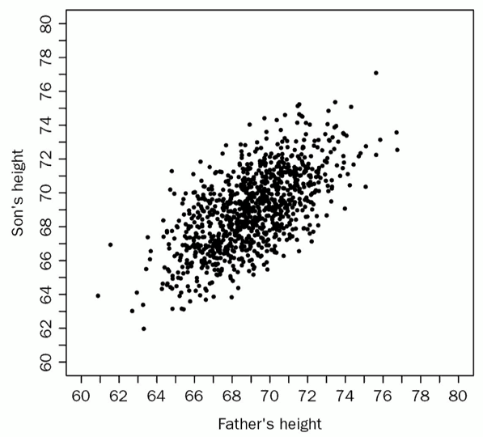
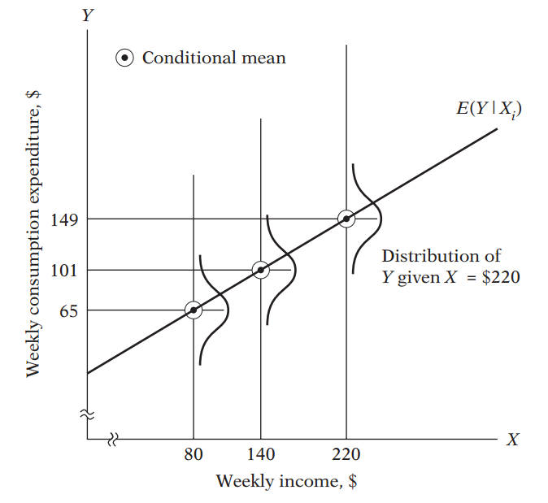
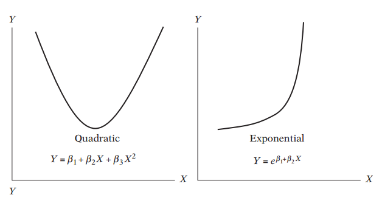
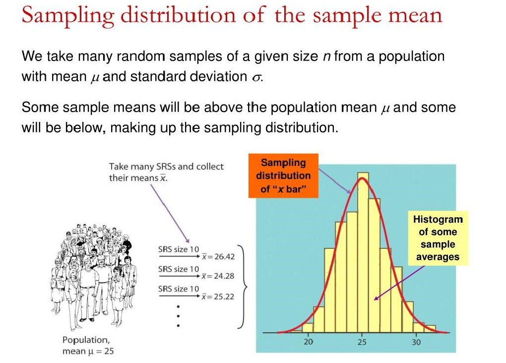
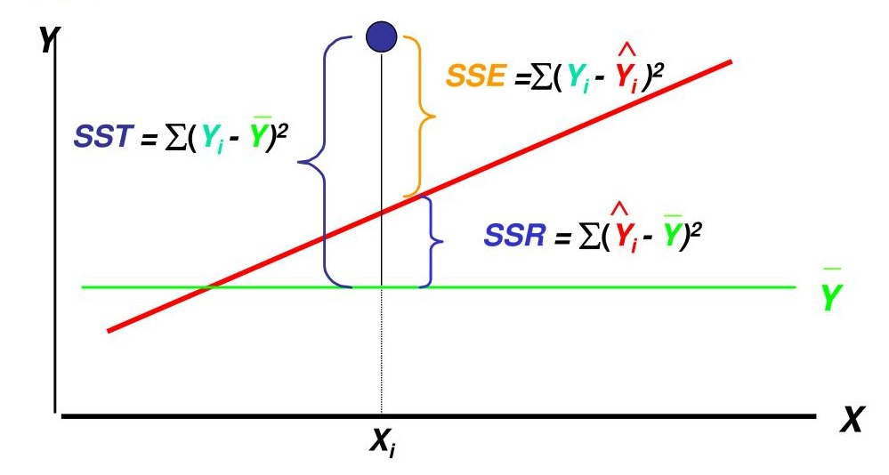

```{r setup, include = FALSE}

knitr::opts_chunk$set(echo = FALSE, warning = FALSE, message = FALSE)
options(digits = 2)

```

# 管理计量分析概述

## 课程简介及教学目标

《管理计量分析》是在本科卫生管理统计学和运筹学基础上为\textcolor{red}{卫生管理、卫生信息管理和图书情报研究者}提供解决卫生领域问题中涉及\textcolor{red}{计量分析}的一门工具，重点掌握解决实际问题中的设计、分析和实现求解的方法技术，提高定量研究的思维水平。

教学目标是让研究生进一步熟悉卫生管理、卫生信息管理和图书情报的\textcolor{red}{基本定量研究方法}，掌握计量分析方法的素养和解决问题的定量研究思维，使研究生能\textcolor{red}{正确选用}合适的各类计量分析模型并在软件上实现问题求解。

## 教学内容

1.  **管理计量分析概述与多重线性回归**
2.  **路径分析与结构式方程模型**
3.  **Logistic回归与Probit回归分析**
4.  一般线性模型与广义线性模型
5.  主成分分析与因子分析
6.  聚类分析与判别分析
7.  多水平模型与meta分析
8.  面板数据模型与医学综合评价

## 需求分析

当前研究生在管理计量分析方面存在的\textcolor{red}{主要问题}是：

-   统计软件工具更加智能，线上资源更加丰富，面临的研究或实践议题更加复杂。似乎都会统计分析，但是极少能够严谨地做统计分析。因而如何结合\textcolor{red}{具体情境}，选用\textcolor{red}{合适的}计量模型，是存在的突出问题。
-   管理实践与研究方法\textcolor{red}{脱节}，且研究方法训练亟待提高。

## 教学理念

-   依据新时代本领域研究生的培养目标制定课堂教学要求。\textcolor{red}{目标导向}和\textcolor{red}{需求导向}为主，\textcolor{red}{不自我设限}，重视发掘学生的潜能。
-   秉持"\textcolor{red}{社会科学+医学}"的风格，结合自身优势，补齐短板。这一点需要授课教师和学生\textcolor{red}{双方}都付出更多努力。
-   克服统计学传统中的\textcolor{red}{因果推断偏见}。因果推断在过去40年内的新进展，超过了历史上其他任何时代。因而，需要在管理计量分析中强调因果推断的框架和逻辑，摒弃唯随机对照实验（RCT）独尊的思想。
-   \textcolor{red}{统计建模}是弥合管理实践与研究方法的桥梁，应当置于核心环节。

## 教学方法

课堂教学环节：

-   \textcolor{red}{综合选用}国际主流计量经济学教材，重在培养计量分析思维。
-   强调\textcolor{red}{统计史}上，与卫生领域（更多是公共卫生、卫生经济等领域）相关的实践问题，讨论前辈学者如何处理这些议题及存在的重要争议，从而培养如何融合管理实践和管理研究方法。
-   采用\textcolor{red}{案例讨论}方式，澄清计量分析教学中的疑难和含混之处。

上机实践环节：

-   提供\textcolor{red}{实际案例背景和数据}，学生自行分析、设计和求解。

## 课程存储地址

-   课程存储地址： <https://github.com/wuhsiang/Courses>
-   资源：课件、案例数据及代码

{width="40%"}

## 课程思政

-   面向卫生管理、卫生信息管理和图书情报领域的重大需求和\textcolor{red}{典型议题}，探讨如何做计量建模，以及动手实践。目前已有一些二手数据可以支持相应的研究。
-   倡导\textcolor{red}{负责任的}定量研究。

# 线性回归概述

## 辛普森悖论

{width="80%"}

-   不论男性患者还是女性患者，处理组（服药）的痊愈率更高
-   就整体人群而言，处理组（服药）的痊愈率更低
-   该药物到底是否能够提高痊愈率？

## 性别歧视？

{width="80%"}

-   就整个大学来看，女性的录取率低于男性
-   就各专业来看，女性的录取率均高于男性
-   该大学是否在招生时存在性别歧视？

## 模拟案例

考虑智力测验成绩$x$、教育年限$z$和年收入$y$（万元）之间的关系。数据生成过程（**data generating process**, DGP） $y = -0.5 + 0.2 \cdot x$得到的样本。

```{r}

# clear directory
rm(list = ls())
set.seed(123)

```

```{r, echo = TRUE}

# generate dataset
x <- rnorm(n = 200, mean = 110, sd = 10)
beta <- c(-0.5, 0.2)
y <- beta[1] + beta[2] * x + rnorm(n = 200, mean = 0, sd = 0.5)
z <- round(-2 + 0.1 * x + rnorm(n = 200, mean = 0, sd = 0.4))
dat <- data.frame(x = x, y = y, z = z)

```

## 回归分析

```{r}

# linear regression
fit1 <- lm(y ~ x, data = dat)
summary(fit1)$coef

```

考虑$x$对$y$的效应，线性模型$R^{2}$ = `r summary(fit1)$r.squared`，预测值$\hat{\beta}$ = (`r fit1$coef[1]`, `r fit1$coef[2]`)接近实际值$\beta$ = (-0.5, 0.2)。

```{r}

fit2 <- lm(y ~ z, data = dat)
summary(fit2)$coef

```

考虑$z$对$y$的效应，$y$ = `r fit2$coef[1]`+`r fit2$coef[2]` $z$，且$R^{2}$ = `r summary(fit2)$r.squared`。

## 虚假 vs 真实效应

```{r, echo = TRUE}

# linear regression
fit3 <- lm(y ~ x + z, data = dat)
summary(fit3)$coef

```

考虑模型$y = \beta_{0} + \beta_{1} x + \beta_{2} z$。结果显示，$y$ = `r fit3$coef[1]` + `r fit3$coef[2]` $x$，且$R^{2}$ = `r summary(fit3)$r.squared`。

**课堂思考: z对y的效应，是否显著？**

## 正效应 vs 负效应？

```{r, echo = TRUE}

# add a sample
dat1 <- rbind(dat, c(160, -100, 10))
fit4 <- lm(y ~ x, data = dat1)
summary(fit4)$coef

```

增加一个样本c(160, -100, 10)，重新考虑$x$对$y$的效应，$R^{2}$ = `r summary(fit4)$r.squared`，预测值$\hat{\beta}$ = (`r fit4$coef[1]`, `r fit4$coef[2]`)大幅偏离实际值$\beta$ = (-0.5, 0.2)。

**课堂思考: x对y的效应，到底是正还是负？**

## 遗漏了变量？

{width="40%"}

我：我的统计模型是。。。估计了体育锻炼和抑郁症状的关系

答辩委员：影响抑郁症状的因素非常多，很多变量都没有纳入，这个模型是有问题的！

**课堂思考: 做统计模型，到底需要纳入多少变量？**

## 如何学习线性回归？

{width="40%"}

**理念**：

-   方便有多门，归元无二路：原理 + 建模 + 诊断 \>\> 软件操作
-   挽弓当挽强，用箭当用长

## 参考教材

-   谢宇. 回归分析. 北京：社会科学文献出版社. 2010.
-   威廉·贝里. 理解回归假设. 上海:格致出版社. 2012.
-   欧文·琼斯. R语言的科学编程与仿真. 西安：西安交通大学出版社. 2014.

# 线性回归原理

## 经典的现实问题

请思考面临的一些现实问题：

-   Galton的身高研究：遗传因素如何影响人类的身高？换言之，\underline{父代的身高}如何影响\underline{子代的身高}？
-   兰德医疗保险实验（RAND Health Insurance Experiment）：更慷慨而全面的\underline{医疗保险}是否会影响患者的\underline{医疗使用行为}及\underline{健康水平}？
-   \underline{法定饮酒年龄}如何影响\underline{地区的死亡率}？
-   \underline{教育年限}如何影响\underline{工资收入}？
-   过去三十年里，民众的\underline{经济收入}如何（随着\underline{时间}）变化？
-   ...

我们希望理解这些议题，其共通之处是什么？

\textcolor{red}{解释变量}（explanatory variable, $X$） --\> \textcolor{red}{结果变量}（outcome variable, $Y$）

## 回归模型设定

我们先考虑最简单的情形：一元线性回归模型。我们希望探讨解释变量$X$如何影响结果变量$Y$，且在总体中随机抽取了$n$个观测样本，由此得到$(X_{i}, Y_{i})$。那么，一元线性\textcolor{red}{回归模型设定}为： $$
Y_{i} = \alpha + \beta X_{i} + \epsilon_{i}, i \in [1, n].
$$

其中$\epsilon_{i}$为\textcolor{red}{误差项}，它代表了未被纳入模型的因素，亦即除$X$以外的因素，对结果变量的影响。因而，给定$X_{i}$时，我们\textcolor{red}{估计或预测}结果变量为： $$
\hat{Y_{i}} = Y_{i} - \epsilon_{i}.
$$

提示：这一步骤，我们应当仔细思考两个问题：（一）从\textcolor{red}{常识、逻辑和理论}上分析，解释变量$X$到底如何影响结果变量$Y$？亦即，二者是否真的存在作用关系？（二）模型的\textcolor{red}{误差项}到底包含了哪些变量？

## 理解回归的三种视角

回归模型考虑解释变量$X$与结果变量$Y$的关系， $$
Y_{i} = f(X_{i}) + \epsilon_{i} = \alpha + \beta X_{i} + \epsilon_{i}
$$ 将观测值$Y_{i}$分为\textcolor{blue}{结构部分}$\hat{Y}_{i} = f(X_{i})$和\textcolor{blue}{随机部分}$\epsilon_{i}$，并可以从\textcolor{red}{三个视角}来理解：

-   \textcolor{red}{因果性}（计量经济领域）：观测项 = 机制项 + 干扰项
-   \textcolor{red}{预测性}（机器学习领域）：观测项 = 预测项 + 误差项
-   \textcolor{red}{描述性}（统计领域）：观测项 = 概括项 + 残差项

本课程\textcolor{blue}{结合因果性和描述性}的视角：在给定情境下采取因果性视角，在一般情形下采取描述性视角。

## Galton的身高研究

{width="40%"}

-   探讨"父代的身高如何影响子代的身高？"，到底意味着什么？
-   给定父代的身高，我们如何估计或预测子代的身高？换言之，如何定义预测值$\hat{Y}$？如何建立预测值$\hat{Y}$与解释变量$X$之间的关系？

## 社会科学定量研究逻辑

社会科学定量研究与自然科学定量研究的区别：

-   核心区别：变异（variation） vs 共相（universal，相对应的是殊相particular）
-   结论：或然性 vs 必然性
-   方法：归纳法 vs 演绎法
-   特征：特定\textcolor{red}{情境}下的规律 vs 普适规律

因而，社会科学定量研究即是，在特定的\textcolor{red}{社会（或管理）情境}，选取合宜的解释变量，以尽可能理解总体中结果变量的\textcolor{red}{变异的来源}。\textcolor{red}{变异性}是社会科学研究的真正本质。

## 条件分布

{width="45%"}

给定$X = X_{k}$，对应的**多个**$Y$值，应当如何给出其估计或预测值$\hat{Y}|X=X_{k}$？

## 线性回归核心假设-1：（误差）独立同分布假设

给定$X = X_{k}$时，结果变量存在多个值，进一步\textcolor{red}{假定其分布}为 $$
Y | X = X_{k} \sim N(\mu_{k}, \sigma^{2}).
$$ 从而给定$X = X_{k}$时，结果变量的合理预测值$\hat{Y}$是其\textcolor{blue}{条件均值}或\textcolor{red}{条件期望}， $$
\hat{Y} = E(Y | X = X_{k}) = \mu_{k}.
$$ 这一假定也意味着，误差项服从 $$
\epsilon_{i} \text{ i.i.d. } \sim N(0, \sigma^{2}).
$$

**讨论**：严重偏态分布下，应如何合理选择预测值$\hat{Y}$？例如，北美社会的收入变化。

## 线性回归核心假设-2：线性模型假设

尽管模型设定上，我们容易直观理解线性假设的含义。但更本质地，线性模型假设可以从两个方面理解：

-   \textcolor{blue}{关于变量的线性}（linearity in the variables）：结果变量的条件期望$E(Y|X)$是解释变量$X$的线性函数，即$E(Y|X) = \alpha + \beta X$。这一视角下，$E(Y|X) = \alpha + \beta X^{2}$不是线性模型。
-   \textcolor{red}{关于参数的线性}（linearity in the parameters）：结果变量的条件期望$E(Y|X)$是参数$\beta$的线性函数，因而$E(Y|X) = \alpha + \beta X^{2}$是线性模型。

两个方面的理解都是合理的。从建模的角度来看，第二个解释更合适。因为使用新变量$X' = X^{2}$替换原始变量$X$之后，即可变换为通常形式的线性模型。

## 线性模型假设：图示

{width="45%"}

总体回归线穿过$(X_{k}, \mu_{Y|X_{k}})$这一系列点。参数$\beta$刻画了$X$的变化对$Y$的\textcolor{red}{条件期望}的影响。 $$
E(Y|X = X_{k}) = \mu_{k} = \alpha + \beta X_{k}.
$$

## 线性模型假设：建模层面

{width="60%"}

以上两个模型，是否属于线性模型的范畴？

## 线性回归核心假设-3：正交或外生假设

解释变量$X$是\textcolor{red}{外生的}（exogenous），或者说是确定性的（deterministic）。例如在随机对照实验中，解释变量$X$是事先确定的实验处理方案。这意味着，解释变量$X$不受误差项$\epsilon$（亦即没有纳入模型的、遗漏的变量）的影响。因此，外生假设也称为正交假设： $$
X \perp \epsilon.
$$ 或者， $$
\text{Cov}(X, \epsilon) = 0.
$$

注：随机对照试验（RCT）严格符合外生假设，从而能够提供准确的因果效应估计。但RCT只是满足外生假设的一种形式，\textcolor{red}{观察研究}只要满足外生假设，也能够提供准确的因果效应估计。

## 线性回归核心假设

核心假设包括三条：

1.  （误差）独立同分布假设: $\epsilon_{i} \text{ i.i.d. } \sim N(0, \sigma^{2})$
2.  线性模型假设：$E(Y|X) = \alpha + \beta X$
3.  正交或外生假设：$X \perp \epsilon$

## 核心假设如何作用于线性回归模型？

在回归模型的经典设定下， $$
Y_{i} = \alpha + \beta X_{i} + \epsilon_{i},
$$ 在\textcolor{red}{误差独立同分布假设}下，对等式两边同时取\textcolor{red}{条件期望}， $$
E[Y|X] = \alpha + \beta X + E[\epsilon|X],
$$ 由\textcolor{red}{正交假设}$X \perp \epsilon$以及\textcolor{red}{误差独立同分布假设}$\epsilon_{i} \text{ i.i.d. } \sim N(0, \sigma^{2})$，可知$E[\epsilon|X] = 0$，从而： $$
E[Y|X] = \hat{Y} = \alpha + \beta X.
$$ 这意味着，\textcolor{red}{线性模型假设}与我们最初的经典设定是一致的。换言之，只有符合线性模型假设（及其它两个核心假设），最初的经典设定才是正确的，才不存在\textcolor{red}{模型错误设定}（model misspecification）问题。

## 回归的含义

> Regression analysis is concerned with the study of the dependence of one variable, the dependent variable, on one or more other variables, the explanatory variables, with a view to estimating and/or predicting the (population) mean or average value of the former in terms of the known or fixed (in repeated sampling) values of the latter. -- By Gujarati & Porter (2008), "Basic Econometrics".

回归的现代解释，包含了如下核心概念：

-   \textcolor{red}{条件期望}（conditional expectation）：\textcolor{red}{给定}解释变量$X = X_{k}$时，如何估计或者预测结果变量的\textcolor{red}{总体均值}$E(Y)$？

## 参数估计

普通最小二乘法（ordinary least squares, OLS）通过最小化残差平方和（扩展到多元回归的情境$y = \beta X + \epsilon$）估计参数： $$
\text{min } SSE = \text{min} \sum_{i=1}^{n} (y_{i} - \hat{y}_{i})^{2} = \sum_{i=1}^{n} (y_{i} - \beta X_{i})^{2}
$$ 由偏导公式 $$
\frac{\partial SSE}{\partial \beta} = 0
$$ 得到参数估计值 $$
\hat{b} = (X'X)^{-1}X'y.
$$

**课堂思考: (1)如何在熟悉的编程语言中，撰写函数估计多元线性模型？(2) 在实践中，OLS会造成什么缺陷？**

## 抽样分布

先考虑从总体中抽取$n$个样本，样本均值$\bar{x}$的分布：

{width="75%"}

## 展示（或解读）回归结果

估计线性回归模型之后，需要以表格形式展示回归结果。阅读文献时，也需要理解它们展示的回归结果。

{width="75%"}

## 衡量估计方法

评判估计量（estimator）的黄金准则 （Fisher）：

-   **无偏性**：在总体中进行$M$次抽样，$E[\hat{b}_{m}] = \beta$。
-   **有效性**：在众多估计量中，$b$的抽样分布的方差最小（i.e., 标准误最小）。
-   **一致性**：样本量增大时，$b$趋近于$\beta$。

**课堂思考：统计显著性与样本量有无关系？**

## 变异分解逻辑

样本观测值$y_{i}$、均值$\bar{y}$、预测值$\hat{y}$之间的关系

{width="60%"}

**板书演示：变异分解逻辑**

## 变异分解公式

总平方和（sum of squares total, SST）可以分解为回归平方和（sum of squares regression, SSR）和残差平方和（sum of squares error, SSE）之和，

具体而言： $$
\begin{aligned}
SST & = \sum_{i=1}^{n}(y_{i} - \bar{y})^{2} \\
    & = \sum_{i=1}^{n} [(y_{i} - \hat{y}_{i}) + (\hat{y}_{i} - \bar{y})]^{2} \\
    & = \sum_{i=1}^{n} (y_{i} - \hat{y}_{i})^{2} + \sum_{i=1}^{n} (\hat{y}_{i} - \bar{y})^{2} \\
    & = SSE + SSR
\end{aligned}
$$

判定系数（coefficient of determination）$R^{2} = SSR / SST.$

**板书演示：变异分解推导**

## 多元线性回归与方差分析

假定多元线性模型中，样本量为$n$，待估计的参数个数为$p$，那么方差和自由度的分解如下：

-   SST: 自由度为$n-1$
-   SSE: 自由度为$n - p$
-   SSR：自由度为$p - 1$

因而，自由度的分解为： $$
n - 1 = (n - p) + (p - 1)
$$

**课堂思考: 假设模型有两个解释变量，其中**$x_{1}$是连续变量，$x_{2}$是包含5个分类的分类变量，SSR的自由度为多少？

## 方差分析表

| 变异来源 | 平方和 | 自由度  | 均方              |
|----------|--------|---------|-------------------|
| 回归模型 | SSR    | $p - 1$ | MSR = SSR/$(p-1)$ |
| 误差     | SSE    | $n - p$ | MSE = SSE/$(n-p)$ |
| 总变异   | SST    | $n-1$   | MST = SST/$(n-1)$ |

: 多元线性回归的方差分析表

相应地，可以构造$F$检验： $$
F(\text{df}_{\text{SSR}}, \text{df}_{\text{SSE}}) = \frac{\text{MSR}}{\text{MSE}} ?> F_{\alpha}
$$

**延伸内容：聚类分析**

## 模型选择

-   模型选择：**精确性原则** vs **简约性原则**
-   情境：假定在线性回归模型$A$的基础上，加了几个变量得到模型$B$，应当如何在模型A和B之间选择？

构造$F$检验： $$
F(\Delta \text{df}, \text{df}_{\text{SSE}}) = \frac{\Delta \text{SSR} / \Delta \text{df}}{\text{MSE}_{\text{B}}} ?> F_{\alpha}
$$

## 遗漏变量问题

**遗漏变量（omitted variables）问题**是指，真实模型为： $$
y \sim \beta_{1} x_{1} + \beta_{2} x_{2}. (1)
$$ 但遗漏了变量$x_{2}$，且$Cov(x_{1}, x_{x}) \neq 0$，从而模型被错误设定为： $$
y \sim \beta_{1} x_{1}. (2)
$$ 记模型(1)的系数估计分别为$\hat{\beta_{1}}$和$\hat{\beta_{2}}$，模型(2)的系数估计为$\tilde{\beta_{1}}$，模型$x_{2} \sim \gamma x_{1}$的系数估计为$\hat{\gamma}$，那么，可以证明： $$
\tilde{\beta_{1}} = \hat{\beta_{1}} + \hat{\beta_{2}} \cdot \hat{\gamma}.
$$

## 遗漏变量偏误

\textcolor{red}{遗漏变量偏误}（omitted variable bias, OVB）即为： $$
\text{OVB} = \hat{\beta_{2}} \cdot \hat{\gamma}.
$$

案例：辛普森悖论、大学招生、教育的经济回报、药物治疗效果

**课堂讨论：（1）哪些变量一定要纳入模型，作为控制变量？（2）哪些变量不必纳入模型作为控制变量？（3）出现了遗漏变量，如何判断回归系数偏误的方向？**

# 线性回归建模

## 线性回归建模

本部分请参阅slides！

# 线性回归诊断

## 因变量分布与Box-Cox变换

当因变量不服从正态分布时，Box & Cox (1964)建议采用如下Box-Cox变换 $$
y_{i} =
\begin{cases}
[(y_{i}+\lambda_{2})^{\lambda_{1}} - 1] / \lambda_{1} & \text{ if } \lambda_{1} \neq 0, \\
ln(y_{i} + \lambda_{2}) & \text{ if } \lambda_{1} = 0.
\end{cases}
$$ 将非正态的分布转换为正态分布。

**课堂思考: (1) 对数变换或Box-Cox变换是否合适？(2) 如何推导出"变化比例"这一含义？**

## 多重共线性

参数估计值 $$
\hat{\beta} = (X'X)^{-1}X'y
$$ 要求$X'X$是**可逆（非奇异）**的。

-   完全多重共线性：模型无法识别
-   严重多重共线性：不影响估计的无偏性和一致性，损害参数估计的**有效性**，及标准误会增大
-   判断标准：**方差膨胀因子**（variance inflation factor, VIF）最大值超过10，平均值明显大于1

## 消除共线性

-   $k$水平分类变量：虚拟变量（dummy variable）化后，只能有$k-1$个虚拟变量
-   减少解释变量个数
-   维度规约：因子分析
-   变量选择：如lasso等统计机器学习方法，尤其是$n < p$时模型无法识别的情形

```{r, echo = T, eval = F}

suppressMessages(library(car))
# calculate VIF
vif(fit)

```

## 异方差

通常将违背残差分布假定的

-   自相关：$\text{Cov}(\epsilon_{i}, \epsilon_{j}) \neq 0$
-   异方差：$\text{Var}(\epsilon_{i}) \neq \text{Var}(\epsilon_{j})$

统称为**异方差**。异方差不影响估计的无偏性和一致性，但会损害估计的**有效性**。

处理异方差的方法包括：

-   调整标准误的计算，采用稳健标准误
-   采用广义最小二乘法（generalized least squares, GLS）估计模型

## 处理非线性

-   纳入二次项：处理$U$型关系
-   采用对数项：处理比例关系
-   纳入交互项：处理调节作用

## 高影响点及异常值处理

OLS采用最小化误差**平方和**的方式，使估计值对异常值非常敏感

-   **高影响点/高杠杆点**（influential/leverage points）：观测案例$i$对**回归系数**影响较大的点，通常可由Cook距离等统计量衡量
-   **异常值**：模型拟合失败的观测点，它们大幅**偏离回归线**，通常由标准化残差来衡量（其绝对值不宜大于5）

因而需要识别高影响点和异常值，并**谨慎判断**是否要排除这些观测样本。

## 回归分析总结

1.  回归建模与诊断：如何得到可靠的结论？
2.  变异及其分解：社会科学定量研究的核心
