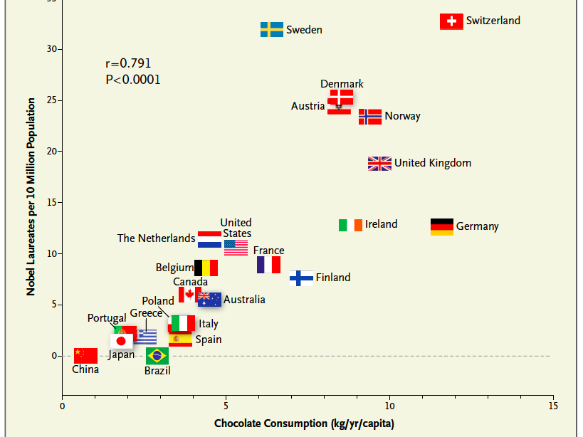

```{r setup, include = FALSE}

# global setting
knitr::opts_chunk$set(echo = FALSE, warning = FALSE, message = FALSE, fig.height = 3, fig.width = 5)
options(digits = 2)

# load packages
suppressMessages(library(ggplot2))
suppressMessages(library(magrittr))
suppressMessages(library(stargazer))

# set seeds
set.seed(1234)

```

# 结构方程模型及其起源

## 结构方程模型案例

考虑以下典型的**结构方程模型**（SEM）案例。

{width="80%"}

请思考：（1）箭头是什么含义？（2）X--\>Y的箭头指向，依据是什么？

## 结构方程模型案例（续）

以上SEM可以使用LISEREL、AMOS、SmartPLS、Mplus、R:lavaan、R:sem等软件包估计，得到\textcolor{red}{路径系数}：

{width="60%"}

## 路径分析评注

Pearl (2018)非常推崇路径分析，并给出了如下评注：

    路径分析在经济学和社会学中有着不同的命运轨迹，但两者最终
    都走向了对Sewall Wright思想的背叛。社会学家将路径分析
    改名为结构方程建模（structural equation modeling, 简称
    SEM），他们接纳了其中的图形表示法，并将其广泛应用于各类
    研究——直到1970年，LISREL程序包被开发出来，用于自动计算
    路径系数。Sewall Wright很可能预测到了接下来发生的事：
    路径分析变成了生搬硬套的方法，研究者则变成了软件使用者，
    对后台发生的事情全无兴趣。

Pearl则由路径分析发展出了\textcolor{red}{因果图}（causal diagrams）。

<!-- ## 巧克力消费水平与诺贝尔奖得主数量 -->

<!-- 以地区为基本分析单元，探讨人均巧克力消费水平X与诺贝尔奖得主数量Y之间的关系。 -->

<!-- {width=60%} -->

<!-- ## Messerli (2012)介绍 -->

<!-- Messerli (2012)在Introduction部分的思路如下： -->

<!-- 存在于巧克力中的**膳食类黄酮**已被证明可以改善**认知功能**。因而，假设巧克力消费可以改善个体的认知功能，同时进一步假设巧克力消费可以改善整个人群的认知功能。因而，作者想知道国家层面的巧克力消费水平是否与其人口的认知功能相关。据作者所知，并无关于整体国家认知功能的公开数据，然而可以想象人均**诺贝尔获得者数量**可以作为反映国家层面的卓越认知功能。因此，本文旨在研究巧克力消费水平与诺贝尔奖得主数量之间的关系。 -->

<!-- 来源：Kornrich, S. Messerli, Franz. Chocolate Consumption, Cognitive Function, and Nobel Laureates. The New England Journal of Medicine 2012; 367: 1562-1564, October 18 (http://www.nejm.org/doi/full/10.1056/NEJMon1211064). -->

<!-- **讨论**：如何看待以上研究动机及研究设计？ -->

## 为什么需要结构模型？

案例讨论：张三硕士毕业后，在医院工作了5年，年薪为27万。如果当时念完博士再进入职场，那么其期望年薪是多少？

假设使用数百份随机样本来探讨这一问题，估计如下模型：

$$
Income_{i} = \alpha + \beta_{1} \cdot Educ_{i} + \beta_{2} \cdot Exper_{i} + \epsilon_{i}
$$ 得到$\hat{\alpha} = 20$，$\hat{\beta_{1}} = 3$，$\hat{\beta_{2}} = 1$。那么，如上问题的答案是？请给出理由。

要点：结构模型（structural model） vs 简约模型（reduced model）

## 辛普森悖论

{width="80%"}

-   不论男性患者还是女性患者，处理组（服药）的痊愈率更高
-   就整体人群而言，处理组（服药）的痊愈率更低
-   该药物到底是否能够提高痊愈率？

## 性别歧视？

{width="80%"}

-   就整个大学来看，女性的录取率低于男性
-   就各专业来看，女性的录取率均高于男性
-   该大学是否在招生时存在性别歧视？

## 研究评注

卫生管理、卫生信息管理和图书情报研究中应当注意的事项：

-   问题导向而非数据驱动：研究过程始于研究情境和研究问题，进而是有研究理论推演研究假设，然后才是数据搜集和分析。
-   克服对因果推断的\textcolor{red}{偏见}："相关不等于因果"众所周知，然而因果是什么？除了作为金标准的RCT，如何探讨其它情形下的因果问题，例如吸烟与肺癌？
-   注重\textcolor{red}{数据生成过程}：研究模型分析应当先于数据分析。单纯的数据分析有误导性，例如探寻冰淇淋销售量X与犯罪率Y之间的关系。
-   使用\textcolor{red}{常识、理论和逻辑}：用于推演研究假设，或者图示化的研究模型。
-   使用精确的、数学化的统计模型：清晰表述数据是什么，统计分析在做什么。

# 因果推断概述

## 三国史论

-   **官渡之战**："昔许子远舍袁就曹，规画计较，应见纳受，遂破袁军，以定曹业。向使曹氏不信子远，怀疑犹豫，不决於心，则今天下袁氏有也。" --《三国志·是仪胡综传》
-   **赤壁之战**：后太祖征荆州还，於巴丘遇疾疫，烧船，叹曰："郭奉孝在，不使孤至此。" --《三国志·郭嘉传》
-   **夷陵之战**：先主既即尊号，将东征孙权以复关羽之耻，群臣多谏，一不从。章武二年，大军败绩，还住白帝。亮叹曰："法孝直若在，则能制主上，令不东行；就复东行，必不倾危矣。" --《三国志·法正传》

请思考并讨论，（1）以上《三国志》各段，阐明了什么观点？其**逻辑**是什么？（2）赤壁之战前夕，谁游说了孙权联刘抗曹？

## 赤壁东风

                      杜牧《赤壁》

              折戟沉沙铁未销，自将磨洗认前朝。
              东风不与周郎便，铜雀春深锁二乔。

**讨论**：诗中阐述了哪两个变量之间的关系？其逻辑是如何的？

## 大运河

                  皮日休《汴河怀古二首》

              万艘龙舸绿丝间，载到扬州尽不还。
              应是天教开汴水，一千余里地无山。

              尽道隋亡为此河，至今千里赖通波。
              若无水殿龙舟事，共禹论功不较多。

**讨论**：诗中阐述了哪几个变量之间的关系？其逻辑是如何的？

## 真伪难辨

                 白居易《放言五首·其三》

              赠君一法决狐疑，不用钻龟与祝蓍。
              试玉要烧三日满，辨材须待七年期。
              周公恐惧流言日，王莽谦恭未篡时。
              向使当初身便死，一生真伪复谁知？

**讨论**：诗中阐述了哪几个变量之间的关系？其逻辑是如何的？

## 如何评估因果效应？

{width="80%"}

## The Road Not Taken

    The Road Not Taken -- By ROBERT FROST

    Two roads diverged in a yellow wood,
    And sorry I could not travel both
    And be one traveler, long I stood
    And looked down one as far as I could
    To where it bent in the undergrowth;
    Then took the other, as just as fair,
    ...
    I shall be telling this with a sigh
    Somewhere ages and ages hence:
    Two roads diverged in a wood, and I-
    I took the one less traveled by,
    And that has made all the difference.

## 因果推断主要学术流派

因果推断主要存在三大流派：

-   \textcolor{red}{统计学流派}：代表人物为Donald Rubin、Guido Imbens（2021年诺奖得主）、Paul Rosenbaum等。提出的Rubin Causal Model更加精确，且符合流行病学的传统思路，易于卫生管理领域的学者理解。
-   \textcolor{red}{人工智能流派}：代表人物为Judea Pearl（2011图灵奖得主，贝叶斯网络之父）。在路径模型基础上提出的Causal Diagrams，更加直观、容易理解。do算子则相对困难。
-   \textcolor{red}{计量经济学流派}：代表人物为James Heckman（2000年诺奖得主）、Joshua Angrist（2021年诺奖得主）等。

## 参考教材

因果推断领域在近几十年内有重大进展，诸多专著均成书于过去10年内。请参阅：

-   Imbens, G. W., & Rubin, D. B. (2015). Causal inference in statistics, social, and biomedical sciences. Cambridge University Press.
-   Pearl, J., Glymour, M., & Jewell, N. P. (2016). Causal inference in statistics: A primer. John Wiley & Sons.
-   Pearl, J., & Mackenzie, D. (2018). The book of why: the new science of cause and effect. Basic books.
-   Angrist, J. D., & Pischke, J. S. (2008). Mostly harmless econometrics. Princeton university press.
-   Angrist, J. D., & Pischke, J. S. (2014). Mastering'metrics: The path from cause to effect. Princeton university press.

# 因果推断的反事实框架

## Rubin因果模型

\textcolor{red}{Rubin因果模型}（Rubin Causal Model, RCM），包括三个核心概念：

-   潜在结果（potential outcomes）
-   个体处理效应稳定性假设SUTVA
-   处理分配机制（assignment mechanism）

## 潜在结果

Rubin (1975)认为"\textcolor{red}{没有操纵就没有因果关系}"（no causation without manipulation）。此处的操纵，可以源于处理、干预，以及\textcolor{red}{想象}。操纵作用于单元（unit）之上，为了简化，后续均以个体代表单元，以二值处理代表操纵。

设$D_{i}$表示个体$i$是否接受处理或干预，$D_{i}=1$代表处理，$D_{i}=0$代表对照，而$Y_{i}^{obs}$代表观察到的结果变量。每个操纵都对应一个\textcolor{red}{潜在结果}（potential outcomes）$Y_{i}(D_{i})$，这些潜在结果是\textcolor{red}{先验可观察的}（priori observable），即一旦给定具体的处理水平，就可以观察到。

同时，从\textcolor{red}{后验}（posteriori）意义上，一旦应用于具体的处理水平，\textcolor{red}{最多}可以观察到一个潜在结果。

## 因果效应定义

$\{Y_{i}(1), Y_{i}(0)\}$代表个体$i$接受处理或者对照的潜在结果，因而个体$i$接受处理的\textcolor{red}{因果效应}（causal effect）为： $$
CE_{i} = Y_{i}(1)-Y_{i}(0).
$$ 可以看到，\textcolor{red}{因果效应涉及潜在结果的比较}。

总体的\textcolor{red}{平均因果效应}（average causal effect, ACE）如下： $$
ACE(D \rightarrow Y) = E[Y_{i}(1)-Y_{i}(0)].
$$

## 因果效应定义（续）

如果结果变量取值为二值时，可以使用风险差、风险比及比数比来定义因果效应。

风险差（risk difference, RD）衡量的因果效应为： $$
CRD(D \rightarrow Y) = P(Y(1)=1) - P(Y(0)=1).
$$

比数比（odds ratio, OR）衡量的因果效应为： $$
COR(D \rightarrow Y) = \frac{P(Y(1)=1)/P(Y(1)=0)}{P(Y(0)=1)/P(Y(0)=0)}.
$$

## 因果效应定义（续）

因果效应的定义，有两个重要之处：

-   因果效应的定义取决于潜在结果，但并不取决于实际观察到的结果。从数学上来看，个体层面的因果效应$\pi_{i} = Y_{i}(1) - Y_{i}(0)$，并不涉及实际观察到的结果$Y_{i}^{obs}$。
-   因果效应是处理后同一时间、同一个体的潜在结果的比较。特别需要强调的是，因果效应不是不同时间的结果比较，例如服用阿司匹林前后个体头痛情况的比较。

因果效应的定义，与侵权法和刑法中but-for测试的逻辑一致，but-for测试问道："要不是X的存在，Y会发生吗？"（but for the existence of X, would Y have occurred?）

## 因果效应估计

在定义因果效应时，我们考虑了单一个体（单元）。估计因果效应时，我们需要比较潜在结果。由于任一个体都最多只有一个实现了的潜在结果，因此在估计因果效应时需要考虑多个个体。更确切地说，我们必须观察\textcolor{red}{多个}个体，有些接受了处理，而有些接受了对照。

为了使用多个个体估计因果效应，我们面临两个潜在风险：

-   存在个体相互干扰的可能性。
-   处理水平应用于多个个体，这些处理水平可能存在形式或版本差异。

因此，我们引入额外的假设：个体处理效应稳定性假设。

## SUTVA

\textcolor{red}{个体处理效应稳定性假设}（the stable unit treatment value assumption, SUTVA）：

    SUTVA假设：任何个体（或称单元）的潜在结果，不会随着分配给
    其他个体的处理而变化。并且对于每个个体，每个处理水平没有
    不同的形式或版本，使得不同的潜在结果产生。

## SUTVA（续）

SUTVA包含两个部分：

-   无干扰部分（no-interference component）：即假设应用于个体的处理不会影响其他个体的潜在结果。这一假设通常是合理的。但在传染病疫苗接种等情形下，并不成立。此时，可以重新界定分析单元，例如分析单元为个体能够交互的社区，但社区之间是隔离的。
-   无隐藏的处理变化（no hidden variations of treatments）：即每个处理水平没有不同的形式或版本，使得不同的潜在结果产生。这一假设要求明确定义处理和潜在结果是什么。

## 因果效应估计（续）

在SUTVA假定下，个体$i (1 \leq i \leq N)$，要么接受处理（此时$D_{i} = 1$），要么接受对照（此时$D_{i} = 0$）。两个潜在结果只能实现一个，因而最多也就能观察到一个。此时，实现并且观察到（realized and observed）的结果： $$
Y_{i}^{obs} = Y_{i}(D_{i}) = D_{i} \cdot Y_{i}(1) + (1 - D_{i}) \cdot Y_{i}(0) =
\begin{cases}
Y_{i}(1),\text{ if } D_{i} = 1;\\
Y_{i}(0), \text{ if } D_{i} = 0.
\end{cases}
$$

与此同时，另一潜在结果则无法观察到，因而在数据上是\textcolor{red}{缺失}的： $$
Y_{i}^{mis} = Y_{i}(1 - D_{i}) = D_{i} \cdot Y_{i}(0) + (1 - D_{i}) \cdot Y_{i}(1) =
\begin{cases}
Y_{i}(0),\text{ if } D_{i} = 1;\\
Y_{i}(1), \text{ if } D_{i} = 0.
\end{cases}
$$

## 分配机制

由于因果效应是通过比较潜在结果来定义的，因而无论采取什么处理，它都可以良好地被定义。然而，我们最多观察到所有潜在结果的一半，并且没有观察到任何个体层面的因果效应，因此存在因果效应的推断或估计问题。

从这一意义上而言，\textcolor{red}{因果推断的问题，本质上是缺失数据问题}（Rubin, 1974）：给定分配给个体的任何处理，那么与替代处理相关的潜在结果就缺失了。因此，缺失数据机制或者说\textcolor{red}{分配机制}（assignment mechanism）发挥了关键作用。如何确定哪些个体得到了处理，或者换言之，哪些潜在结果可以实现，而哪些不能？这一机制对于因果推断问题非常重要。

## 因果效应估计案例

考虑患者可能接受两个处理：手术治疗（$D = 1$）和药物治疗（$D = 0$）。潜在结果为患者治疗后的生存年数$Y$。

-   在给定潜在结果的情形下，请计算因果效应。
-   考虑给定的观察结果，思考其可能的分配机制是什么。

## 因果效应估计（续）

{width="80%"}

## 因果效应估计（续）

{width="80%"}

## 因果效应估计（续）

问题在于，真实的平均因果效应$E[Y_{i}(1)-Y_{i}(0)]$与观察到的组间（处理组 vs 对照组）差异$E(Y_{i}^{obs}|D_{i}=1) - E(Y_{i}^{obs}|D_{i}=0)$是什么关系？

## 因果效应估计（续）

观察到的处理组与对照组在结果变量$Y$上的平均差异，可以分解为两部分： $$
\begin{aligned}
& E(Y_{i}^{obs}|D_{i} = 1 - Y_{i}^{obs}|D_{i}=0) \\
= & E[Y_{i}(1)|D_{i}=1 - Y_{i}(0)|D_{i}=0] \\
= & \underbrace{E[Y_{i}(1)|D_{i}=1 - Y_{i}(0)|D_{i}=1]}_{\text{average causal effect}} + \underbrace{E[Y_{i}(0)|D_{i}=1 - Y_{i}(0)|D_{i}=0]}_{\text{selection bias}}
\end{aligned}
$$

如果第二项选择性偏误等于零，则观察到的处理组与对照组在结果变量上的平均差异，就等于平均因果效应。此时要求，处理$D$独立于潜在结果$\{Y_{0}, Y_{1}\}$： $$
D \perp \{Y_{0}, Y_{1}\}.
$$

## 随机对照实验

如何满足$D \perp \{Y_{0}, Y_{1}\}$？\textcolor{red}{随机化！}

因此，估计因果效应时，可以直接比较处理组和对照组在结果上的差异。此时可以推导： $$
ACE(D \rightarrow Y) = E[Y(1) - Y(0)] = E[Y(1)|D=1] - E[Y(0)|D=0].
$$

**讨论**：（1）为什么RCT满足如上假设；（2）观察研究中，如何估计因果效应？

## 可忽略性

更一般地，如果给定协变量$Z$后，处理的分配机制可以做到随机化，例如有区组的随机化实验，那么分配机制就是可忽略的。

    可忽略处理分配（ignorable treatment assignment）假设

$$
D \perp \{Y_{0}, Y_{1}\} | Z.
$$

在满足\textcolor{red}{可忽略处理分配假设}时，\textcolor{red}{观察研究}也可以做因果推断。这一假设也称为selection on observables。

## 可忽略性（续）

当$D \perp \{Y_{0}, Y_{1}\} | Z$时，平均因果效应：

$$
\begin{aligned}
& ACE(D \rightarrow Y) = E[Y(1) - Y(0)] \\
= & E\{E[Y(1)|Z]\} - E\{E[Y(0)|Z]\} \\
= & E\{E[Y(1)|Z,D=1]\} - E\{E[Y(0)|Z,D=0]\} \\
= & E\{E[Y^{obs}|Z,D=1]\} - E\{E[Y^{obs}|Z,D=0]\}.
\end{aligned}
$$

因而，此时$ACE(D \rightarrow Y)$可以直接使用观察数据来估计。

## 可忽略性（续）：辛普森悖论

请重新考虑辛普森悖论，并估计药物对痊愈的因果效应。

{width="80%"}

## 可忽略性（续）：辛普森悖论估计案例

在给定性别$Z$的条件下，服药与否$D$独立于是否痊愈这一潜在结果$\{Y(0), Y(1)\}$。女性（$Z = 1$）占比为(87+270)/700=0.51；男性（$Z = 0$）占比为(263+80)/700=0.49。因此， $$
\begin{aligned}
& ACE(D \rightarrow Y) \\
= & E\{E[Y^{obs}|Z,D=1]\} - E\{E[Y^{obs}|Z,D=0]\} \\
= & (93\% \times 0.51 + 73\% \times 0.49) - (87\% \times 0.51 + 69\% \times 0.49) \\
= & 83.2\% - 78.2\% = 5\%.
\end{aligned}
$$

## 可忽略性（续）

Q: 如果协变量$Z$较多时，则难以直接使用以上公式来计算。此时该如何处理？

A：可以计算\textcolor{red}{倾向得分}，使用倾向得分来做统计调整，或者匹配。匹配方法的思路是，找到类似的样本，可以填补缺失的潜在结果。此时的处理方法，可以参阅Imbens & Rubin (2015)关于倾向得分的表述，以及Guo & Fraser (2014)的倾向得分匹配方法。

## 可忽略性（续）

Q: 如果不满足可忽略处理分配（ignorable treatment assignment）假设，应当如何处理？

A：此时称为\textcolor{red}{selection on unobservables}，处理上需要更多假设或者工具，Rubin在此处的阐述不及另两个因果推断流派。因而，处理方法可以参阅Pearl的因果图+do算子，以及Heckman的样本选择模型。

# 路径模型与因果图

## Monty Hall悖论

美国电视娱乐节目Let's Make a Deal的主持人Monty Hall:

-   你面前有三扇关闭着的门，其中一扇门后是汽车，其余两扇门后是山羊，选中后面有车的那扇门就可以赢得该汽车。假设你选定了A门，主持人开启了另外两扇门中的一个，露出一只山羊，例如此时主持人打开的是C门。那么，你是否要更换选择，选B门？

在流行病领域，类似的问题称为\textcolor{red}{博克森悖论}：两种疾病即使在一般人群中彼此不存在实际联系，在医院的病人中也会形成某种似是而非的关联。

## 讨论：如何抉择？

{width="80%"}

## 三种基本结构

{width="60%"}

## 链结构案例

**开放讨论**：

-   UC Berkeley招生案例中，大学层面的女学生录取率更低，而各个专业的女学生录取率更高。请问，是否存在性别歧视？
-   如何理解中介模型？

提示：总效应 vs 直接效应

## 分叉结构案例

**讨论**：

-   有哪些常见的分叉结构的例子？
-   如何绘制和分析巧克力--\>诺贝尔奖数量这一研究设计？

## 对撞结构：Monty Hall悖论分析

{width="80%"}

**讨论**：如果改变游戏规则，主持人Monty Hall随机打开另外两扇门，即可能打开有汽车的那扇门。那么，你是否会选择换门？

## Monty Hall悖论分析（续）

{width="80%"}

## Monty Hall悖论分析（续）

{width="60%"}

## 案例分析与讨论

{width="36%"}

在以上路径图（或因果图）中，如何估计（即应当控制哪些变量）：

-   X对Y的效应
-   Z对Y的效应

## 案例分析与讨论（续）

请使用因果图方法，考虑如下案例，应当如何估计水的纯净度（X）与霍乱（Y）之间的关系。

{width="60%"}
