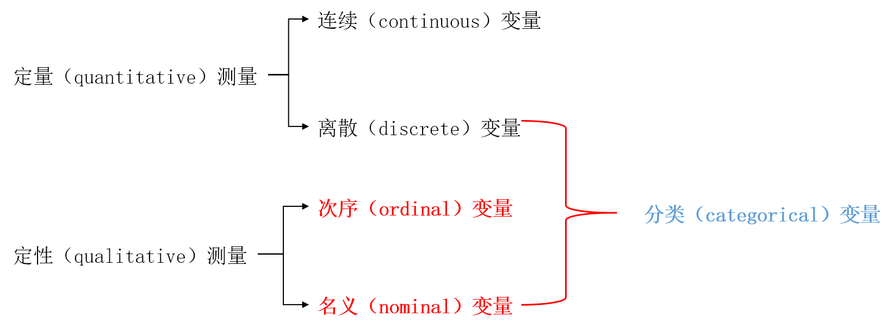
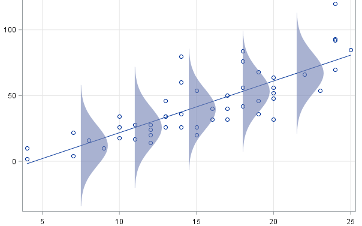

```{r setup, include = FALSE}

knitr::opts_chunk$set(echo = FALSE, warning = FALSE, message = FALSE)
options(digits = 2)

```


# 因果推断概述


## 案例讨论：谁能影响战争结局？

- **官渡之战**：“昔许子远舍袁就曹，规画计较，应见纳受，遂破袁军，以定曹业。向使曹氏不信子远，怀疑犹豫，不决於心，则今天下袁氏有也。” --《三国志·是仪胡综传》
- **赤壁之战**：后太祖征荆州还，於巴丘遇疾疫，烧船，叹曰：“郭奉孝在，不使孤至此。” --《三国志·郭嘉传》
- **夷陵之战**：先主既即尊号，将东征孙权以复关羽之耻，群臣多谏，一不从。章武二年，大军败绩，还住白帝。亮叹曰：“法孝直若在，则能制主上，令不东行；就复东行，必不倾危矣。” --《三国志·法正传》

请思考并讨论，（1）按照《三国志》中观点，东汉末年三次大战，谁扭转了战局？其**逻辑**是什么？（2）赤壁之战前夕，谁游说了孙权联刘抗曹？

## 案例讨论：赤壁

\begin{quotation}
  折戟沉沙铁未销，自将磨洗认前朝。\\
  东风\textcolor{red}{不}与周郎便，铜雀春深锁二乔。\\
  --杜牧《赤壁》
\end{quotation}

## 案例讨论：大运河

\begin{quotation}
万艘龙舸绿丝间，载到扬州尽不还。\\
应是天教开汴水，一千余里地无山。\\

尽道隋亡为此河，至今千里赖通波。\\
\textcolor{red}{若无}水殿龙舟事，共禹论功不较多。\\
  --皮日休《汴河怀古二首》
\end{quotation}


## 案例讨论：辨真伪

\begin{quotation}
赠君一法决狐疑，不用钻龟与祝蓍。\\
试玉要烧三日满，辨材须待七年期。\\
周公恐惧流言日，王莽谦恭未篡时。\\
\textcolor{red}{向使}当初身便死，一生真伪复谁知？\\
  --白居易《放言五首·其三》
\end{quotation}

## 如何归因？


## 归因模型


## 如何评估因果效应？

## 课程存储地址

- 课程存储地址： [https://github.com/wuhsiang/Courses](https://github.com/wuhsiang/Courses)
- 资源：课件、案例数据及代码

{width=40%}

## 参考教材

- 丹尼尔·鲍威斯，谢宇. 分类数据分析的统计方法（第二版）. 北京：社会科学文献出版社. 2018.

## 数据的测量类型

- \textcolor{red}{定量}（quantitative）测量：数值有实质含义。包括连续变量（或定距变量）、离散变量（通常是计数变量）。
- \textcolor{red}{定性}（qualitative）测量：数值\textcolor{red}{无实质含义}。包括次序变量和名义变量。
- 实践中的处理：年龄变量、李克特量表

{width=75%}

## 线性回归回顾

线性回归中，一组预测变量向量$X$只对应一个预测值$\hat{y}$，总体回归线穿过$(X^{k},E(y|X^{k}))$。

{width=60%}

## 分类因变量与线性回归模型

线性回归模型
$$
y = \beta X + \epsilon
$$
最关键的推导和设定包括两步：
$$
E(y|X) = \beta X + E(\epsilon|X), \text{ and } E(\epsilon|X) = 0.
$$
从而剥离出误差项$\epsilon$，并通过普通最小二乘法（OLS）得到最佳线性无偏估计量（best linear unbiased estimator, BLUE）。

$E(y|X)$对分类因变量\textcolor{red}{不适用}，因此分类因变量需要\textcolor{red}{新的统计模型}！

**课堂讨论：分类变量，分别作为自变量和因变量的情形，应如何处理？其差异是什么？**


## logistic回归总结

1. 二项logistic回归：变换方法 vs 潜在变量方法
2. 多项logistic回归：基线logit模型
3. 次序logistic回归：累积logit模型


# 因果推断的反事实框架


## 反事实


## Rubin


# 路径模型概述


## 链结构


## 链结构案例

```{r}

# generate dataset
n <- 300
x <- rnorm(n = n, mean = 110, sd = 10)
y <- -0.5 + 0.2 * x + rnorm(n = n, mean = 0, sd = 2)
z <- 2 + 5 * y + rnorm(n = n, mean = 0, sd = 5)
dat <- data.frame(x = x, y = y, z = z)

```

## 链结构案例（续）


```{r, fig.height=5}

# scatter plot
suppressMessages(library(ggplot2))
ggplot(dat, aes(x = x, y = z)) + geom_point() + geom_smooth(method=lm, color="darkred", fill="blue") + theme_bw() 

```

## 链结构案例（续）


```{r, results='asis'}

suppressMessages(library(magrittr))
suppressMessages(library(stargazer))
fit1 <- lm(z ~ x, data = dat)
fit2 <- lm(z ~ x + y, data = dat)
# output as a table
stargazer(fit1, fit2, type = "latex", header = FALSE, single.row = TRUE)

```


## 分叉结构


## 对撞结构
