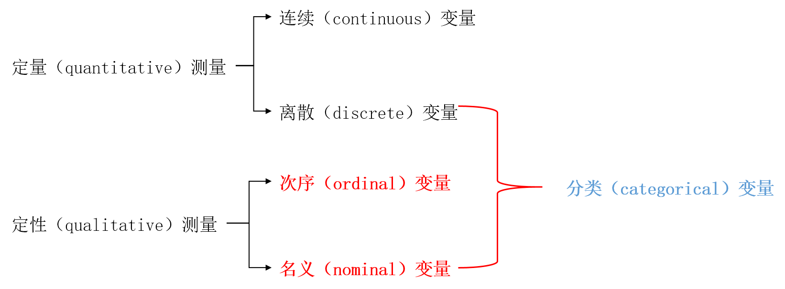
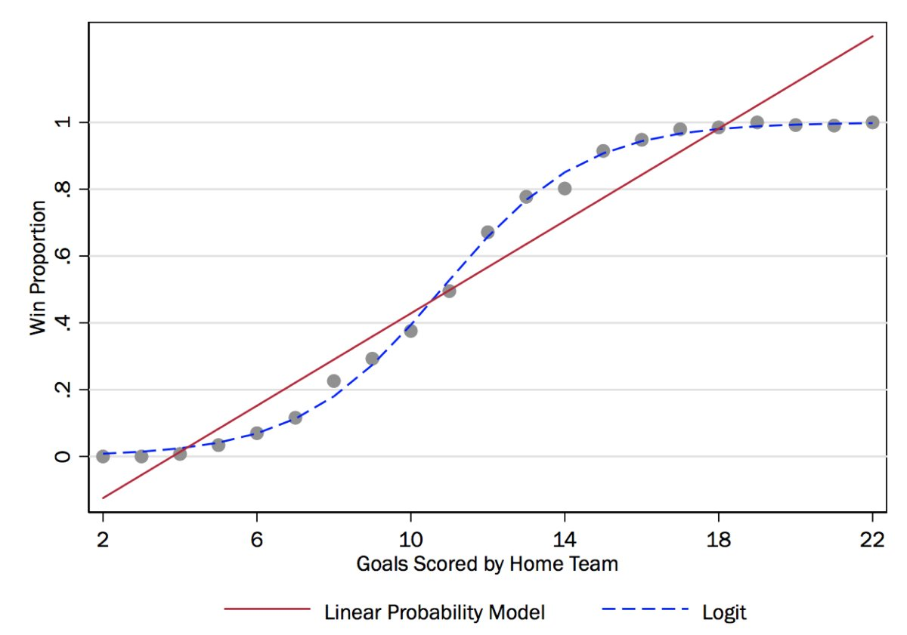
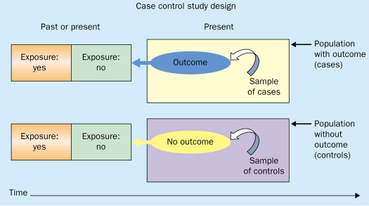
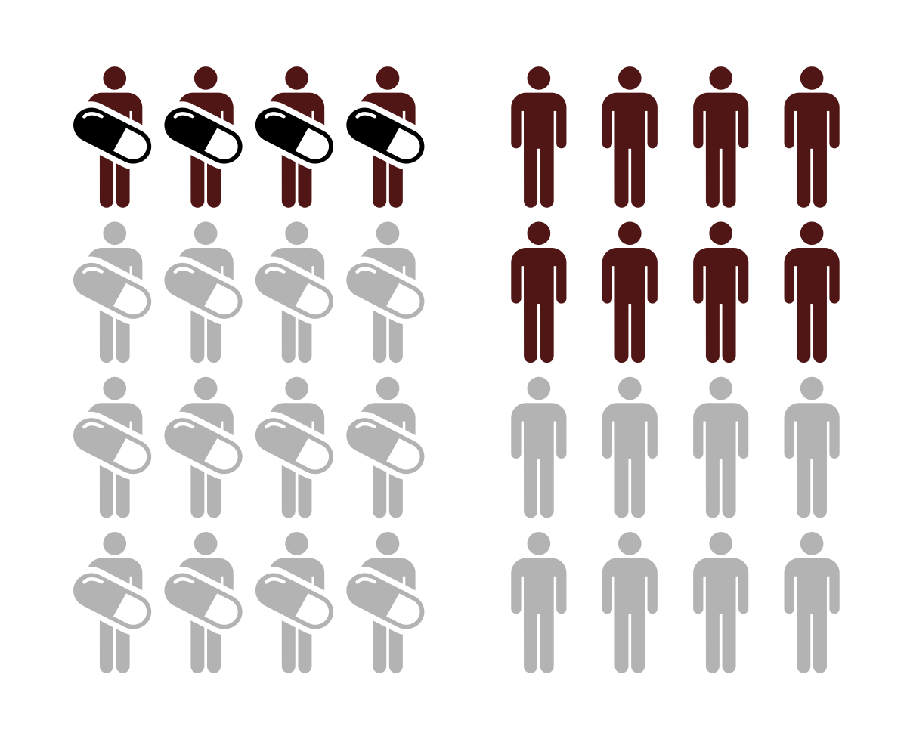
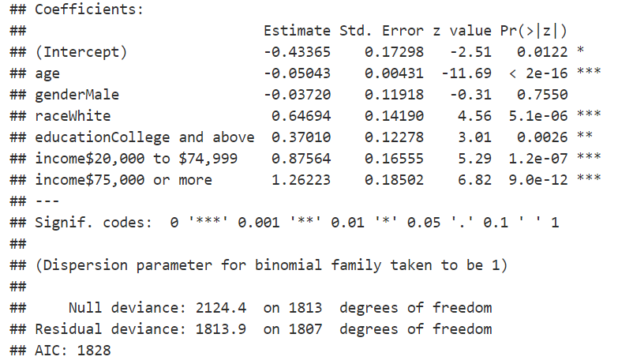
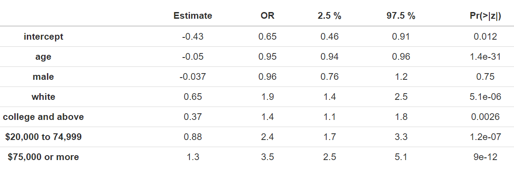

```{r setup, include = FALSE}

knitr::opts_chunk$set(echo = FALSE, warning = FALSE, message = FALSE)
options(digits = 2)

```

# 分类数据分析概述

## 参考教材

-   丹尼尔·鲍威斯，谢宇. 分类数据分析的统计方法（第二版）. 北京：社会科学文献出版社. 2018.

## 数据的测量类型

-   \textcolor{red}{定量}（quantitative）测量：数值有实质含义。包括连续变量（或定距变量）、离散变量（通常是计数变量）。
-   \textcolor{red}{定性}（qualitative）测量：数值\textcolor{red}{无实质含义}。包括次序变量和名义变量。
-   实践中的处理：年龄变量、李克特量表

{width="75%"}

## 线性回归回顾

线性回归中，一组预测变量向量$X$只对应一个预测值$\hat{y}$，总体回归线穿过$(X^{k},E(y|X^{k}))$。

{width="60%"}

## 分类因变量与线性回归模型

线性回归模型 $$
y = \beta X + \epsilon
$$ 最关键的推导和设定包括两步： $$
E(y|X) = \beta X + E(\epsilon|X), \text{ and } E(\epsilon|X) = 0.
$$ 从而剥离出误差项$\epsilon$，并通过普通最小二乘法（OLS）得到最佳线性无偏估计量（best linear unbiased estimator, BLUE）。

$E(y|X)$对分类因变量\textcolor{red}{不适用}，因此分类因变量需要\textcolor{red}{新的统计模型}！

**课堂讨论：分类变量，分别作为自变量和因变量的情形，应如何处理？其差异是什么？**

## 分类因变量与logistic回归

{width="90%"}

## 二分类因变量

因变量只能在两个可能的数值中取值，要么"是"或者"发生"，要么"否"或者"未发生"。例如，患病、犯罪、抑郁、自杀等健康管理研究议题。

二分类因变量（binary dependent variable）：取值为二分类，两种可能结果被描述为"发生"或者"不发生"。研究关注的结果视作"发生"，且编码为1；另一结果则被视为"不发生"，且编码为0。即因变量$y \in {0, 1}$。但0和1不具有\textcolor{red}{数值上}的实质意义。

研究者目的在于，估计或预测\textcolor{red}{事件发生的概率}如何受到自变量的影响。相应地，每个独立样本可以视作一次**伯努利试验**（Bernoulli trial），试验结果要么是1（发生），要么是0（不发生）。

**课程讨论：分类变量在**\textcolor{red}{本质上}是离散的，还是连续的？

## 两种哲学观点

-   **统计学视角**：认为分类变量在本质上是\textcolor{red}{离散}的，且依赖数据的变换来推导回归类模型，亦即\textcolor{red}{变换方法（transformational approach）}。这一方法的统计建模意味着，分类因变量在经过某种变换之后，其\textcolor{red}{条件期望}可以表达成自变量的线性函数。此类变换函数称为\textcolor{red}{链接函数}（link functions），而这类模型则统称为\textcolor{red}{广义线性模型}。
-   **计量经济学视角**：认为分类变量背后存在一个连续的、未观测到的变量，即\textcolor{red}{连续的潜变量}（latent variable）。当该潜变量越过某个\textcolor{red}{阈值}，观测到的分类变量取值就会变化，亦即\textcolor{red}{潜在变量方法（latent variable approach）}。这一方法认为，分类变量有别于通常的连续变量，在于它的\textcolor{red}{部分可观测性}（partial observability）。因此，统计建模意味着，探讨自变量如何影响潜在的连续变量（即\textcolor{red}{结构分析}）而非观测到的分类变量。

## 潜在变量方法：议题理解

请根据自己的理解，讨论以下二分类或多分类变量的情形：

-   如何理解个体是否患病？
-   如何理解消费者的产品购买行为？
-   如何理解消费者的品牌选择行为？
-   如何理解已婚妇女是否进入劳动力市场？

## 潜在变量方法：统计建模

考虑二分类因变量$y$，其背后的连续潜在变量记为$y^{*}$，且阈值交叉（threshold-crossing）测量模型为： $$
y_{i} =
\begin{cases}
1 & \text{ if } y_{i}^{*} > 0; \\
0 & \text{ otherwise}.\\
\end{cases}
$$

统计建模则是建立连续的潜在变量$y^{*}$与自变量$\textbf{x}$的关系： $$
y^{*}_{i} = \beta \textbf{x}_{i} + \epsilon_{i}, \text{ and } 1 \leq n \leq N.
$$

至此，与线性回归模型无异。

## 变换方法

变换方法核心在于如何寻找\textcolor{red}{合适的变换}，主要包括：

-   线性概率模型
-   Logit模型
-   Probit模型

变换方法与潜在变量方法在统计结果上并无太大差异，关键在于其哲学基础和理解方式。统计学领域通常采用变换方法来解释模型，而计量经济学领域则通常采用潜在变量方法来解释模型，因其能够奠基于诸如效用（utility）、支付意愿（willingness to pay, WTP）等\textcolor{red}{经济学概念}之上。

## 线性概率模型

研究者目的在于，估计或预测\textcolor{red}{事件发生的概率}$p$如何受到自变量的影响。

**线性概率模型**（linear probability model, LPM）**直接**用自变量$X$来解释事件发生概率$p$： $$
p_{i} = \beta X + \epsilon_{i}.
$$

**课堂讨论：如何看待LPM？它是否合适？**

## LPM的缺陷

{width="40%"}

LPM存在两个主要的问题：

-   异方差问题。
-   预测值$\hat{p}_{i}$很可能落在$[0,1]$区间以外。

因而，LPM随即被logit和probit模型取代。

## 发生比（odds）

事件的\textcolor{red}{发生比}（odds，也称发生比率、\textcolor{red}{比数}），定义为事件发生的概率$p$与不发生的概率$(1-p)$的比率： $$
\text{odds} = \frac{p}{1 - p}.
$$ 此时$\text{odds} \in [0, \infty]$。

进一步，\textcolor{red}{对数发生比}（log-odds），也称为发生概率$p$的\textcolor{red}{logit}： $$
\text{logit}(p) = \text{log}(\frac{p}{1-p}).
$$

## Logit变换

Logit模型采用如下变换： $$
\text{logit}(p) = \text{log}(\frac{p}{1-p}).
$$

显然，

-   $\text{logit}(p) \in (- \infty, \infty)$。$p \rightarrow 0$时，$\text{logit}(p) \rightarrow - \infty$；$p \rightarrow 1$时，$\text{logit}(p) \rightarrow \infty$。
-   此外，还有$p \rightarrow 0.5$时，$\text{logit}(p) \rightarrow 0$。

## Probit变换

标准正态分布的累积分布函数记为$\Phi(\cdot)$，Probit模型采用如下变换： $$
\text{probit}(p) = \Phi^{-1}(p).
$$

显然，

-   $\text{probit}(p) \in (- \infty, \infty)$。$p \rightarrow 0$时，$\text{probit}(p) \rightarrow - \infty$；$p \rightarrow 1$时，$\text{probit}(p) \rightarrow \infty$。
-   此外，还有$p \rightarrow 0.5$时，$\text{probit}(p) \rightarrow 0$。

## 病例对照研究

\textcolor{red}{病例对照研究}（case-control study）属于回顾性研究，它比较特定疾病的患病者（病例组）与未患病者（对照组）暴露于某可能危险因素的百分比差异，分析这些因素是否与该疾病存在联系。

{width="60%"}

## 发生比与病因探究

\textcolor{red}{发生比的比率（或称为：比数比）（odds ratio, OR）}，即病例组中暴露人数（a）与非暴露人数（c）的比值，除以对照组中暴露人数（b）与非暴露人数（d）的比值： $$
\text{OR} = \frac{a/c}{b/d}.
$$

OR可用于推断病因：

-   若$OR = 1$，表明病例组的暴露发生比与对照组无差异，因而该暴露（exposure）与该疾病（disease）不相关。
-   若$OR > 1$，表明病例组的暴露发生比大于对照组，因而该暴露可能是该疾病的\textcolor{red}{危险因素}（risk factor）。
-   若$OR < 1$，表明病例组的暴露发生比小于对照组，因而该暴露可能是该疾病的\textcolor{red}{保护因素}（protective factor）。

## 相对风险

\textcolor{red}{相对风险}（relative risk, RR）指群体暴露在一定风险下（干预组）与未暴露在该风险下（对照组），某事件发生概率的比值。

{width="30%"}

左侧干预组患病风险是1/4，右侧对照组患病风险是1/2，因此相对风险为1/2。

## 列联表展示

可以使用\textcolor{red}{列联表}（contigency table）来理解OR和RR：

{width="45%"}

**课堂讨论：结合新冠的危险因素，及疫苗接种效果，理解以上两个概念。**

## OR与RR

发生比的比率（或称为：比数比）（OR）与相对风险（RR）的概念密切相关。当事件发生\textcolor{red}{概率很小}时，OR经常被用作RR的近似。 $$
\text{RR} = \frac{r_{t}/(1 - r_{t})}{r_{c}/(1 - r_{c})} \approx \frac{r_{t}}{r_{c}} = \text{OR}.
$$

因为事件发生概率很小时，干预组和对照组的事件发生概率$r_{t}$和$r_{c}$均很小，因而$1 - r_{t}$和$1 - r_{c}$这两项均接近于1。

# 二项logistic回归

## 二项logistic回归

二项logistic回归认为，$\text{logit}(p_{i})$是自变量$X_{i}$的线性函数。 $$
\text{log}(\frac{p_{i}}{1-p_{i}}) = \text{logit}(p_{i}) = \beta X_{i} + \epsilon_{i}.
$$ 从而，事件发生概率 $$
p_{i} = \text{logistic}(\beta X_{i}) = \frac{\text{exp}(\beta X_{i})}{1 + \text{exp}(\beta X_{i})}.
$$

注：$\text{logit}(\cdot)$与$\text{logistic}(\cdot)$互为逆函数（inverse function）。

通过\textcolor{red}{最大似然估计}（maximum likelihood estimation, MLE）方法，得到参数$\beta$的估计值$\hat{\beta}$。

## 二项logistic回归案例

考虑如下问题：**哪些民众更倾向使用互联网作为健康信息来源？**当观测样本$i$使用互联网作为健康信息来源时，记作$y_{i} = 1$；否则，记作$y_{i} = 0$。将所有其它变量纳入模型作为自变量，用以解释民众使用互联网作为健康信息来源的概率$p$。 $$
\text{logit}(p_{i}) = \beta_{0} + \beta_{1} Age_{i} + \beta_{2} Gender_{i} + \beta_{3} Race_{i} + \beta_{4} Educ_{i} + \beta_{5} Inc_{i} + \epsilon_{i}.
$$ 进一步将分类自变量其虚拟变量化，得到最终二项logistic回归模型中，最后一项$\beta_{5} Inc_{i}$则变成两个虚拟变量项： $$
\beta_{5} IncM_{i} + \beta_{6} IncH_{i}
$$

案例更多细节，详见[\textcolor{blue}{二项logistic回归案例:健康信息搜寻行为}](https://github.com/wuhsiang/Courses/blob/master/econometricsintro/cases/case-hisb.pdf)

## 二项logistic回归结果

{width="90%"}

## 参数解释

二项logistic回归得到如下参数估计结果： \begin{align*}
\text{logit}(p_{i}) = & -0.43 -0.05 Age_{i} + 0.65 RaceW_{i} + 0.37 EducH_{i} \\
 & + 0.88 IncM_{i} + 1.26 IncH_{i} + \epsilon_{i}.
\end{align*}

然而，该如何解释参数$\beta$的含义？我们分以下四个情形逐一讨论：

-   截距项
-   二分类自变量：种族、教育水平
-   多分类自变量：收入
-   连续自变量：年龄

## 参数解释：截距项

截距项$\hat{\beta}_{0} = -0.43$，其含义为：当其它变量取值均为0的时候，对数发生比$\text{log}(\text{odds}) = -0.43$。

其它变量取值均为0的含义：年龄55岁（样本均值）、非白人种族、教育程度在大学以下、年收入在20,000美元以下。

$\text{log}(\text{odds}) = -0.43$的含义是，使用互联网获取健康信息的概率与不使用互联网获取健康信息的概率之比（odds）为： $$
\text{odds} = \text{exp}(-0.43) = 0.65.
$$

**注**：年龄进行对中（centering）处理之前，截距项估计值$\hat{\beta}_{0} = 2.35$，可计算相应的对数发生比$\text{odds} = \text{exp}(2.35) = 10.49$，但此数值无法解释。

## 参数解释：二分类自变量

二分类自变量种族（$\hat{\beta}_{3} = 0.65$）和教育水平（$\hat{\beta}_{4} = 0.37$）的系数的含义是什么？

\textcolor{red}{其它条件不变}（ceteris paribus）时，种族变量对民众使用互联网获取健康信息的对数发生比的净效应是$0.65$。换言之，其它条件不变时，非白人族群使用互联网获取健康信息的对数发生比记为$\alpha_{0}$，那么相应的白人族群对应的对数发生比为$\alpha_{0} + 0.65$。由此，白人族群使用互联网获取健康信息的发生比（odds）与非白人族群使用互联网获取健康信息的发生比的比率（或称为：比数比）为： $$
\frac{\text{odds}_{RaceW}}{\text{odds}_{RaceNW}} = \frac{\text{exp}(\alpha_{0} + 0.65)}{\text{exp}(\alpha_{0})} = \exp(0.65) = 1.91.
$$ 因此，$\hat{\beta}_{3} = 0.65$的含义是：白人族群使用互联网获取健康信息的发生比是非白人族群的1.91倍。

## 参数解释：多分类自变量

多分类自变量收入（$\hat{\beta}_{5} = 0.88$，$\hat{\beta}_{6} = 1.26$）的系数的含义是什么？

其它条件不变时，低收入群体使用互联网获取健康信息的对数发生比记为$\alpha_{0}$。那么，中等收入群体和高收入群体的对数发生比相应为$\alpha_{0} + 0.88$和$\alpha_{0} + 1.26$。类似地， $$
\frac{\text{odds}_{IncM}}{\text{odds}_{IncL}} = \exp(0.88) = 2.41, \text{ and } \frac{\text{odds}_{IncH}}{\text{odds}_{IncL}} = \exp(1.26) = 3.53.
$$

**课堂讨论**：中等收入群体和高收入群体之间是否可比？

## 参数解释：连续自变量

连续自变量年龄（$\hat{\beta}_{1} = -0.05$）的系数的含义是什么？

其它条件不变时，由于没有参考水平，我们取年龄为$x_{0}$，而除年龄以外的其它项对应的对数发生比记为$\alpha_{0}$。那么，年龄$x_{0}$的群体使用互联网获取健康信息的对数发生比为$\alpha_{0} + \hat{\beta}_{1} x_{0}$；而年龄增加1岁，相应的对数发生比为$\alpha_{0} + \hat{\beta}_{1} (x_{0} + 1)$。由此， $$
\frac{\text{odds}_{x_{0} + 1}}{\text{odds}_{x_{0}}} = \frac{\text{exp}[\alpha_{0} + \hat{\beta}_{1} (x_{0} + 1)]}{\text{exp}(\alpha_{0} + \hat{\beta}_{1} x_{0})} = \exp(\hat{\beta}_{1}) = \exp(-0.05) = 0.95.
$$ 因此，年龄每增加1岁，使用互联网获取健康信息的发生比降低5%。

## 参数解释：事件发生概率的预测

**问题**：一位年龄50岁的白人男性民众，受教育程度在大学以下，年收入为20,000至74,999美元区间（中等收入水平）。请问他使用互联网获取健康信息的概率是多少？

**分析**：首先预测对数发生比 $$
\text{logit}(\hat{p}_{i}) = \text{log}(\hat{\text{odds}}_{i}) = -0.43 - 0.05 \times (50 - 55) + 0.65 + 0.88 = 1.35.
$$ 从而发生比的预测值为$\hat{\text{odds}}_{i} = \exp(1.35) = 3.86$，该民众使用互联网获取健康信息的概率预测值为$\hat{p}_{i} = 3.86/4.86 = 0.79$。

## 发生比的比率（odds ratio）

以上各种类型的自变量（二分类自变量、多分类自变量、连续变量）的系数解释时，都使用了以下概念：\textcolor{red}{发生比的比率（或称为：比数比）}（odds ratio, OR）。

假定有A组和B组，我们通常会考虑两组的发生比的比率（或称为：比数比）： $$
\text{OR} = \frac{\text{odds}_{A}}{\text{odds}_{B}}.
$$

使用OR解释系数含义更加直观，因此我们通常报告OR及相应的CI。

**课堂讨论**：解释以上各个系数时，相应的A组和B组是什么？

## 报告OR及相应的CI

$\hat{\beta} > 0$，则有$OR > 1$；若$\beta$系数显著不等于0，则$OR$的置信区间（confidence interval, CI）不包含1。

{width="80%"}

## 似然函数

**问题**：箱子里有10个球，或是白球，或是黑球。从中有放回地取出5个球，得到结果：{白球、白球、白球、黑球、白球}。请估计，箱子中有几个白球、几个黑球？

**建模**：令$p \in [0, 1]$：箱子中白球的比例，事件$A$：取出的球是白球。那么，单次伯努利试验中事件$A$发生的概率为$p$。样本观测值为：{1,1,1,0,1}。

**分析**：给定参数$p$，得到以上观测数据$D$的概率是，$\text{Prob}(D|p) = p \times p \times p \times (1-p) \times p = p^{4} (1-p)$。

以上概率是未知参数$p$的函数，称为**似然函数**（likelihood function），表述为$L(p) = \text{Prob}(D|p) = p^{4} (1-p)$。

## 最大似然估计

更一般化，给定**参数**$\theta$和**观测数据**$D$，似然函数$L(\theta) = \text{Prob}(D|\theta)$是未知参数$\theta$的函数，刻画了给定参数$\theta$时观测到数据$D$的概率。

\textcolor{red}{最大似然估计}（maximum likelihood estimation, MLE）的逻辑：找到$\theta = \hat{\theta}$，使似然函数$L(\theta)$取最大值。换言之，使得数据$D$以最大可能性被观测到的参数值$\hat{\theta}$即为最大似然估计值。通常$L(\theta) \in (0, 1)$极小，因而参数估计时使用其对数$LL(\theta)$。

以上例子中，$LL(p) = 4 \text{log}(p) + \text{log}(1-p)$。当$p = 0.8$时，$LL(p)$取得最大值。因此，我们估计箱子中白球的比例是$\hat{p} = 0.8$，亦即箱子中有8个白球、2个黑球。

## 二项logistic回归的参数估计

二项logistic回归的似然函数 $$
L(\beta) = \prod_{i=1}^{n} p_{i}^{y_{i}} (1 - p_{i})^{(1-y_{i})}
$$ 进一步，对数似然函数 $$
LL(\beta) = \sum_{i=1}^{n} [y_{i} \cdot \text{log}(p_{i}) + (1-y_{i}) \cdot \text{log} (1 - p_{i})].
$$ 可以使用最大似然估计得到参数估计值$\hat{\beta}$。

## 模型拟合优度

logistic回归模型采用最大似然估计方法估计参数，因而模型拟合优度也应基于似然函数。

通常会报告模型的最大似然值，即-2LL。最大似然值取最大值时，-2LL取最小值。因此在给定的统计建模下，-2LL越小，拟合效果越好。类似于$R^{2}$，-2LL通常会随着模型复杂程度增加而变小。

假定模型中待估计的参数个数为$k$，样本量为$n$，似然函数的最大值为$\hat{L}$，则可计算AIC（Akaike information criterion）和BIC（bayesian information criterion）统计量： $$
\text{AIC} = 2 k - 2 LL \text{ and } \text{BIC} = \text{log}(n) \cdot k -2 LL.
$$

## 评估模型拟合优度

在以上例子中，样本量$n = 1814$，参数个数$k = 7$，对数似然函数最大值$LL = -907$。因而， $$
-2\text{LL} = 1814.
$$ 以及 $$
\text{AIC} = 2 \times 7 - 2 \times (-907) = 1828.
$$ 以及 $$
\text{BIC} = \text{log}(1814) \times 7 -2 \times (-907) = 1866.
$$

## 似然比统计量

显然，-2LL与样本规模有关，样本规模越大，LL越小，-2LL越大。因而，-2LL难以用于比较不同模型。

当前模型似然值记为$L_{c}$，假定零模型（null model）和饱和模型（saturated model）的似然值分别为$L_{0}$和$L_{f}$。由此，可以使用似然比统计量，亦即\textcolor{red}{偏差（deviance）}，$G^{2}$，来测量当前模型偏离饱和模型的程度： $$
G^{2} = -2 \text{log}(L_{c}/L_{f}) = -2(LL_{c} - LL_{f}).
$$

## 似然比检验

假定模型$M_{1}$嵌套于$M_{2}$，即$M_{1}$代表约束更多的模型，$M_{2}$代表约束较少的模型。两个模型的对数似然值分别为$LL_{1}$和$LL_{2}$，那么\textcolor{red}{似然比卡方统计量} $$
-2(LL_{1} - LL_{2})
$$ 服从于自由度为$(K_{2} - K_{1})$的卡方分布。

由此，可以在$M_{1}$和$M_{2}$之间做\textcolor{red}{模型选择}。

## 预测准确率？

在统计学习中，通常结合\textcolor{red}{混淆矩阵}（confusion matrix）来评估Logit模型的预测效果。

{width="80%"}

## 如何报告二项logistic回归结果？

建议报告的部分：

-   系数
-   OR值
-   OR值的置信区间
-   p值
-   LL（或-2LL)，AIC（或BIC）

# 多项logistic回归

## 多项logistic回归

当因变量取值是多分类变量时，需要使用多项logistic回归模型。其基本逻辑是：\textcolor{red}{一次比较两个结果}。

假定因变量有$J$个类别，我们将第$j(1 \leq j \leq J)$个分类与第一个分类（参考水平, reference level）进行比较，从而得到第$j$个分类的\textcolor{red}{基线logistic回归模型}： $$
\text{BL}_{j} = \text{log}[\frac{\text{Prob}(y = j)}{\text{Prob}(y = 1)}] = \beta_{j} X + \epsilon_{j}.
$$ 估计方法和其余细节都与二项logistic回归模型类似。

## 多项logistic回归案例

考虑如下问题：**哪些因素影响了民众选择健康信息来源？** $$
\text{logit}(p_{j}/p_{1}) = \beta_{0j} + \beta_{1j} Age_{i} + \beta_{2j} Gender_{i} + \beta_{3j} Race_{i} + \beta_{4j} Educ_{i} + \beta_{5j} Inc_{i} + \epsilon_{ij}.
$$

案例更多细节，详见[\textcolor{blue}{多项logistic回归案例:健康信息搜寻行为}](https://github.com/wuhsiang/Courses/blob/master/econometricsintro/cases/case-hisb.pdf)

## 离散选择模型

消费决策过程中，通常面临几个候选项。这与多项logistic回归模型的设定是一致的。

同时，每个候选项可以由具体的\textcolor{red}{属性}刻画，例如产品属性。

给定候选项及其属性的时候，消费者如何决策？

**提示：回顾变换方法和潜在变量方法。**

## 离散选择试验

{width="70%"}

# 次序logistic回归

## 次序logistic回归

在次序logistic回归中，基线logistic回归模型难以刻画其次序特征。通常，可以使用\textcolor{red}{累积logistic回归模型}来建模。

假设响应变量$y_{i}$的次序取值为$1, 2, ..., J (J \geq 3)$，那么累积概率建模为 $$
C_{i,j} = \text{Prob}(y_{i} \leq j) = \sum_{k=1}^{j} \text{Prob}(y_{i} = k) = F(\beta \textbf{x}_{i}).
$$

当$F(\cdot)$服从累积逻辑斯蒂分布时，就得到了次序logit模型。

## 次序Logit模型

次序Logit模型中，我们给出类似于"对数发生比"的表达式： $$
\text{CL}_{j} = \text{log}[\frac{\text{Prob}(y_{i} \leq j | \text{x}_{i})}{\text{Prob}(y_{i} > j | \text{x}_{i})}] = \beta \textbf{x}_{i}.
$$

估计方法和其余细节都与二项logistic回归模型类似。

**课堂讨论：二项、多项和次序logit模型中，如何理解变换方法？**

## logistic回归总结

1.  二项logistic回归：变换方法 vs 潜在变量方法
2.  多项logistic回归：基线logit模型
3.  次序logistic回归：累积logit模型
