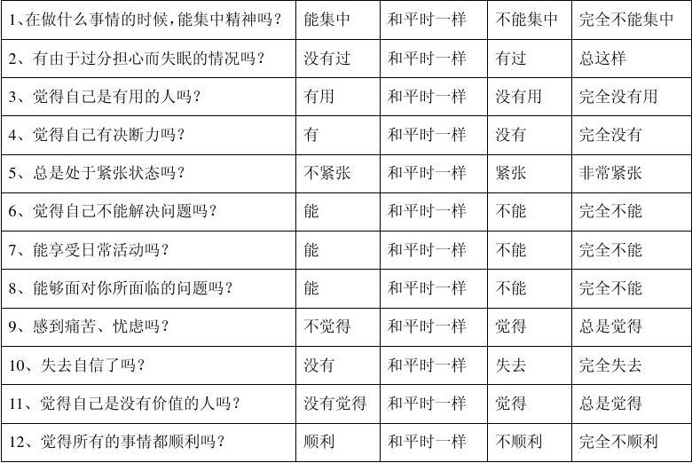

<style type="text/css">
body{ /* Normal  */
      font-size: 24px;
  }
td {  /* Table  */
  font-size: 20px;
}
h1.title {
  font-size: 48px;
  color: DarkRed;
}
h1 { /* Header 1 */
  font-size: 36px;
  color: DarkBlue;
}
h2 { /* Header 2 */
    font-size: 32px;
  color: DarkBlue;
}
h3 { /* Header 3 */
  font-size: 28px;
  font-family: "Times New Roman", Times, serif;
  color: DarkBlue;
}
code.r{ /* Code block */
    font-size: 24px;
}
pre { /* Code block - determines code spacing between lines */
    font-size: 24px;
}
</style>

```{r setup, include = FALSE}

knitr::opts_chunk$set(echo = TRUE, warning = F, message = F)

```
## 概述

我们通过案例来阐述如何使用社会网络分析研究健康管理。所有分析过程均通过R语言实现。

本案例源自以下论文和数据集，我们非常感谢作者公开数据集。若非如此，我们无法在本次教学中给出这个合适的案例。

- Rabbani A, Biju NR, Rizwan A, Sarker M (2018) Social network analysis of psychological morbidity in an urban slum of Bangladesh: a cross-sectional study based on a community census. BMJ Open 8(7): e020180. https://doi.org/10.1136/bmjopen-2017-020180
- Rabbani A, Biju NR, Rizwan A, Sarker M (2018) Data from: Social network analysis of psychological morbidity in an urban slum of Bangladesh: a cross-sectional study based on a community census. Dryad Digital Repository. https://doi.org/10.5061/dryad.320bv7b

[这个网页](https://datadryad.org/resource/doi:10.5061/dryad.320bv7b)提供了数据的详细描述和以上论文的摘要，首先请下载[.dta格式的STATA数据集](https://datadryad.org/bitstream/handle/10255/dryad.179233/bmjopen-2017-020180.zip?sequence=1)，并阅读[变量的含义](https://datadryad.org/bitstream/handle/10255/dryad.179233/README.txt?sequence=2)

数据描述

- 源自于对孟加拉国Dhaka，针对824名年轻都市青年的调查
- 采用GHQ-12测量了受试者的心理健康状况
- 收集了受试者的社会网络关系数据
- 据此可以估计社会关系在缓解抑郁和焦虑以及促进人群的心理健康方面的作用发挥着重要作用

接下来，我们将通过论文导读与R语言实现两个部分了解文章思路及方法的具体应用。

## 论文导读

### 研究背景及问题

精神疾病占全球疾病负担的7.1%，中低收入国家的低收入人群承担着更多的精神疾病困扰。研究表明，社会关系的质量与更深层次的社会嵌入是心理健康的重要影响因素。在孟加拉国，证实了社会网络有助于城市和农村地区的卫生服务提供，然而，社会关系及网络属性如何影响心理健康尚不清楚。

因此，本研究以孟加拉国Dhaka城市贫民社区的青年为研究对象，探索社会网络是否在减轻抑郁症与焦虑方面发挥作用，从而促进贫困城市社区青年的心理健康。

### 研究设计

横断面研究设计，2016年12月，针对Dhaka市Vashantek社区某一分区18岁-29岁男性进行了为期26天的调查，收集了824名青年的心理健康状况数据，详细的社会经济学特征数据和朋友网络数据。

抽样流程如下：

- 选取Dhaka市Vashantek贫民窟四个分区之一，作为社会调查区域
- 列举该调查区域中的所有家庭，核实每个家庭是否有18岁-29岁的男性青少年
- 最终得到790个家庭，包含942个可能的受访者
- 9位受过训练的调查者，在2016年12月份通过26天的调查，得到了842份有效样本
- 受访者与该调查区域以外的人存在的朋友关系，被排除在外

### 数据描述

**心理健康测量**：采用了GHQ-12测量受试者的心理健康状况，12个健康问题，四点式李克特量表法计分，分数越高表明心理健康状况不佳。



数据集中GHQ-12测量结果以GHQ_score命名，标准化结果以zghq命名。在R语言实现部分，我们将通过GHQ_score描述受试者心理健康状况，标准化的心理健康状况数据zghq将作为回归分析中的因变量，揭示多个自变量与心理健康状况的因果关系。

**社会经济学特征**：研究收集了受试者的社会经济学特征数据，这些特征将会影响受试者的社会嵌入，社会支持等，因此需要作为自变量纳入到回归模型中。

数据集中职业变量以qa_命名，年龄rage，教育程度reduce，是否出生于当地rvas，婚姻状况rmar，标准化的财富状况数据requ。以上变量将作为回归模型的因变量，揭示与心理健康状况的因果关系。

**社会网络特征**：受试者的朋友数量，在朋友网络中的位置（即度，网络中心性）将作为重要的解释变量，揭示社会关系对心理健康状况的影响。

通过询问确定了824名受试者的朋友关系，建立了$824 \times 824$邻接矩阵，使用社会网络分析软件Pajek进行网络特征值的计算。因此，在数据集中直接给出了社会网络特征指标计算的结果。

为了还原整个数据分析过程，了解社会网络分析的应用，我们需要根据论文提供的社会网络特征线索，构造一个“相似”的随机网络，并从该网络中生成网络特征指标变量。

### 统计分析

为揭示社会关系与心理健康之间的关系，研究使用不同的社会网络特征指标分别运行了多元线性回归模型，社会经济学特征指标将作为控制变量纳入到每个回归模型中。同时对连续型变量进行了标准化处理，使其具有可比性，符合多元线性回归应用条件。

在R语言实现的第三部分，我们将分别运行一个基准模型（因变量为社会经济学指标）和四个纳入不同解释变量（中心性度量指标）的模型。

### 研究结果

这一部分我们将在最后结合R语言实现结果进行解释。

## R语言实现

1. 读取论文数据集，应用数据集中的人口统计学特征信息、社会经济学特征信息及心理健康测量信息。
2. 模拟论文数据构造社会网络，从既定的社会网络中生成网络指标变量。
3. 分析社会网络对健康的作用。

### 人口统计特征

首先，我们读取`.dta`格式的Stata数据文件，并将其存储为`.RData`格式的R数据文件。

为确保可重复性，我们设置随机数的种子。如此，在不同的计算机上、在不同时候运行此文档，其结果均相同。

```{r}

# clean the work directory
rm(list = ls())

# set seeds
set.seed(123)

# read stata data file
suppressMessages(library(readstata13))
suppressMessages(library(pander))
suppressMessages(library(dplyr))
dat <- read.dta13("dhaka.dta")

```

可以看到，数据集包含`r nrow(dat)`个样本和`r ncol(dat)`个变量。

在接下来的分析中，我们会用到其中社会经济学特征变量，而朋友网络特征指标将会在我们第二步中的随机网络中产生。


需要检验变量是否有缺失值，函数complete.cases()用来识别矩阵中没有缺失值的行。

```{r}

mean(!complete.cases(dat))
attach(dat)

```

结果表明，数据集完整。

通过论文阅读，我们知道有些变量应为分类变量（如职业，教育水平，居住地区等），在这里可以通过函数is.factor()来验证，函数as.factor()用于转换数据类型。

```{r}

transvars <- c("rmar", "rvas", "reduc", "qa_12_1", "qa_12_3",
           "qa_12_2", "qa_12_5", "qa_12_4", "qa_12_20", "qa_12_6")
transtats <- function(x, print = FALSE){
  if(!is.factor(x))
    x <- as.factor(x)
  return(is.factor(x))
}
sapply(transvars, transtats)

```

is.factor()运行结果表明，数据转换完成。

为了进一步了解数据，我们看看受试者的**心理健康测量结果（GHQ_score）**如何，函数hist()用来绘制直方图。

```{r}

# distribution of GHQ-12 scores
m <- mean(GHQ_score)
med <- median(GHQ_score)
sd <-sd(GHQ_score)
print(c(Mean = m, Median = med, SD = sd))
hist(GHQ_score,
     freq = FALSE,
     main = "",
     xlab = "GHQ scores")

```


社会经济学特征变量**年龄（rage），财富状况（requ）**是连续型变量。

```{r, echo = F, eval = F}

#continuous variable : age, equity score
cvars <- c("rage", "requ")
cstats <- function(x){
  m <- mean(x)
  s <- sd(x)
  return (c(Mean = m, SD = s))
}
sapply(dat[cvars], cstats) %>% pandoc.table()

```

社会经济学特征变量**婚姻状况（rmar），是否在当地出生（rvas），受教育程度（reduc），职业（qa_）**是分类变量。

```{r, eval = F, echo = F}

#factors : currently married, born in Vashantel, education, occupation
fvars <- c("rmar", "rvas", "reduc", "qa_12_1", "qa_12_3",
           "qa_12_2", "qa_12_5", "qa_12_4", "qa_12_20", "qa_12_6")
fstats <- function(x){
  f <- table(x)
  p <- prop.table(table(x))*100
  return (c(Frequency = f, Prop = p))
}
sapply(dat[fvars], fstats)

sup

```

清楚数据集中我们将要用到的一些变量的分布特征了，接下来需要模拟一个朋友网络，生成社会网络特征指标。


### 模拟社会网络

论文虽然提供了每个受访者的属性数据，但并未提供其社会网络关系数据。因此，我们首先设法重现其社会关系。

构造一个尽可能“相似”的随机网络，我们需要一些线索。论文报告的主要参数如下：

- 网络规模：$n = 824$
- 平均度：$\bar{d} = 1.6$

我们假设即将构造的随机网络中的824个节点，每个节点的边以相同的概率创建（即谁与谁建立朋友关系个概率是一样的）。

```{r}

suppressMessages(library(igraph) )
g <- erdos.renyi.game(824, 0.002)

```

构造完成，你构造的网络有`r vcount(g)`个节点，`r ecount(g)`个边，每个人平均有`r mean(degree(g))`朋友。

是不是与论文中的朋友网络很”相似“了呢，所以我们可以直接用该网络的指标进行分析了。

为了更加了解朋友网络，让我们用fruchterman-reingold算法的布局绘制随机生成的仿-824名青年朋友网络图。

```{r}

D <- degree(g)
plot(g, layout=layout.fruchterman.reingold, vertex.label=NA, vertex.size=1)

```

**度（D）**指标反映受试者在朋友网络中朋友数量，还有三个中心性指标（接近中心性、中介中心性和特征向量中心性）可以反映受试者在网络中的位置。

我们在第三步的分析中将用这四个指标反映朋友网络特征，需要说明的是，最后将会对后三个中心性指标进行标准化处理。

```{r, echo = F}

# centrality scores
Cloc <- closeness(g)
# print(c(mean(Cloc), sd(Cloc)))
Betc <- betweenness(g, normalized = T)
# print(c(mean(Betc), sd(Betc)))
Eigc <- evcent(g)$vector
# print(c(mean(Eigc), sd(Eigc)))

```

社会网络特征指标已生成，接下来需要回归模型揭示变量间因果关系了。


### 拼接属性数据与关系数据

首先，我们第一步中的原数据集与第二部中生成的社会网络是相互分离的（即社会网络中的节点仅仅是个虚拟节点，并不代表824名受试者）。

因此，需要通过对虚拟节点的“修饰”将受试者与生成的随机网络图联系起来。

函数vertex_attr()可将原数据集中的样本属性赋给网络图节点。

```{r}

vertex_attr(g) <- list(names = qa_7,
                       age = rage,
                       occupation_Driver = qa_12_1,
                       occupation_Student = qa_12_2,
                       occupation_service = qa_12_3,
                       occupation_construction = qa_12_4,
                       occuparion_business = qa_12_5,
                       occupation_van = qa_12_6,
                       occupation_daily = qa_12_20,
                       GHQ_score = GHQ_score,
                       sGHQ = zghq,
                       educ = reduc,
                       location = rvas,
                       marry = rmar,
                       urbanWS = equity_UrbanScore,
                       urbanWQ = equity_UrbanQuintile)

```

对三个中心性指标进行标准化处理后得到重要的解释变量**closeness centrality（sCloc），betweenness centrality（sBetc），eigenvector centrality（sEigc）**。

```{r, echo = F}

# standardization : centrality scores
sCloc <- scale(Cloc)
sBetc <- scale(Betc)
sEigc <- scale(Eigc)

```

### 回归分析

考虑基准模型：

\begin{equation}
    y_{i} = \beta X_{i} + \epsilon_{i},
\end{equation}

其中$X_{i}$为人口统计变量，如年龄、职业等。因变量$y$为*标准化的心理健康状况值（zghq）*。

在后续的模型中，我们在基础模型的基础上依次加入四个中心性变量$z_{i}$：

- 度中心性
- 接近中心性
- 中介中心性
- 特征向量中心性

以探讨社会支持对精神健康的作用。

\begin{equation}
    y_{i} = \beta X_{i} + \gamma z_{i} + \epsilon_{i}.
\end{equation}


```{r}

# base
fit.base <- lm(zghq ~ rage + reduc + rvas + rmar + requ + qa_12_1 + qa_12_2 + qa_12_3 + qa_12_4 + qa_12_5 + qa_12_6 + qa_12_20)

# degree
fit.d <- lm(zghq ~ D + rage + reduc + rvas + rmar + requ + qa_12_1 + qa_12_2 + qa_12_3 + qa_12_4 + qa_12_5 + qa_12_6 + qa_12_20)


# closeness
fit.c <- lm(zghq ~ sCloc + rage + reduc + rvas + rmar + requ + qa_12_1 + qa_12_2 + qa_12_3 + qa_12_4 + qa_12_5 + qa_12_6 + qa_12_20)


# betweenness
fit.b <- lm(zghq ~ sBetc + rage + reduc + rvas + rmar + requ + qa_12_1 + qa_12_2 + qa_12_3 + qa_12_4 + qa_12_5 + qa_12_6 + qa_12_20)


# eigenvalue
fit.e <- lm(zghq ~ sEigc + rage + reduc + rvas + rmar + requ + qa_12_1 + qa_12_2 + qa_12_3 + qa_12_4 + qa_12_5 + qa_12_6 + qa_12_20)

```


我们将所有结果以表格形式呈现如下。

模型拟合结果表明，有更多的关系或更多的朋友（p<0.05)心理健康状况将会更好，中心性的四个变量也均显著影响因变量（p<0.1,p<0.05,p<0.01），即在网络中的位置越重要，越嵌入与网络中的人心理健康状况会更好。

同时，控制变量的分析结果也很有趣，例如，出生在当地的受试者有更好的心理健康状况，受过更高教育的受试者有更好的心理健康状况，随着年龄的增长心理健康状况将会恶化。

最后，我们的结果证实了社会关系将会影响人的心理健康，社会关系较好，网络嵌入较高的年轻人心理健康状况较好。

```{r, results = 'asis'}

suppressMessages(library(stargazer))
# output as a table
stargazer(fit.base, fit.d, fit.c, fit.b, fit.e, type = "html", report = "vc*")

```
