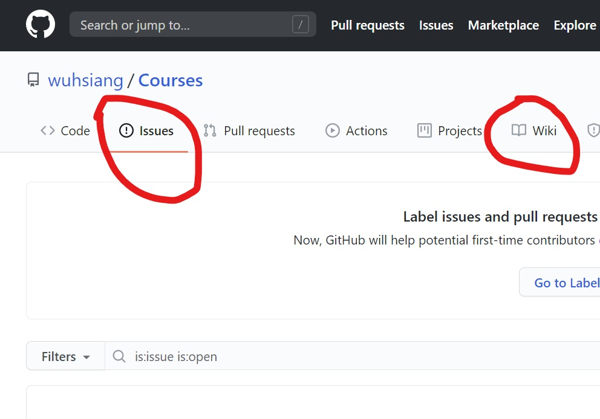
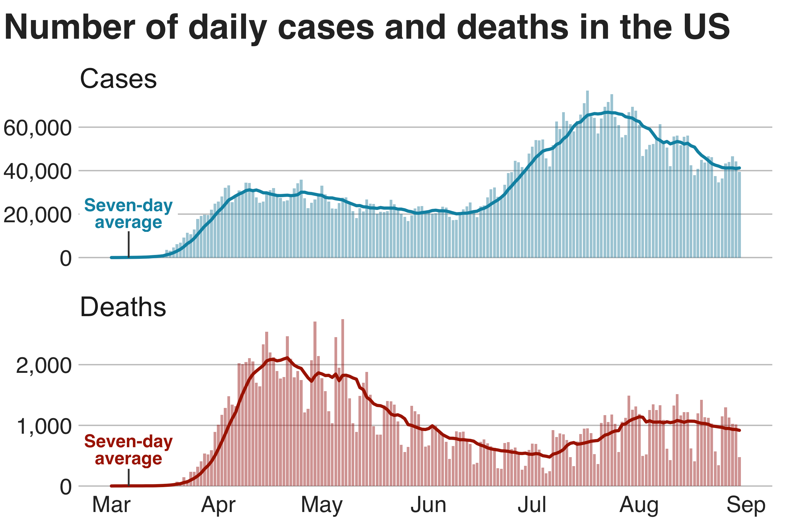
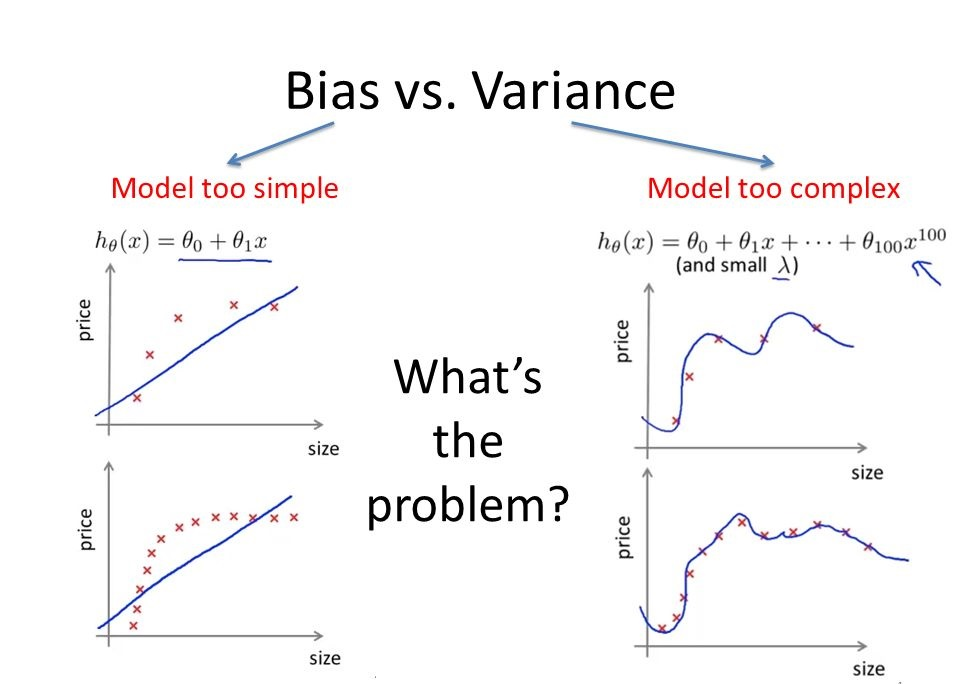
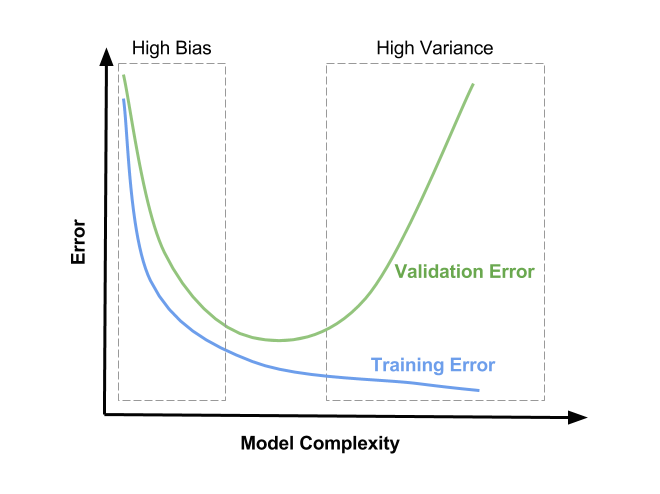
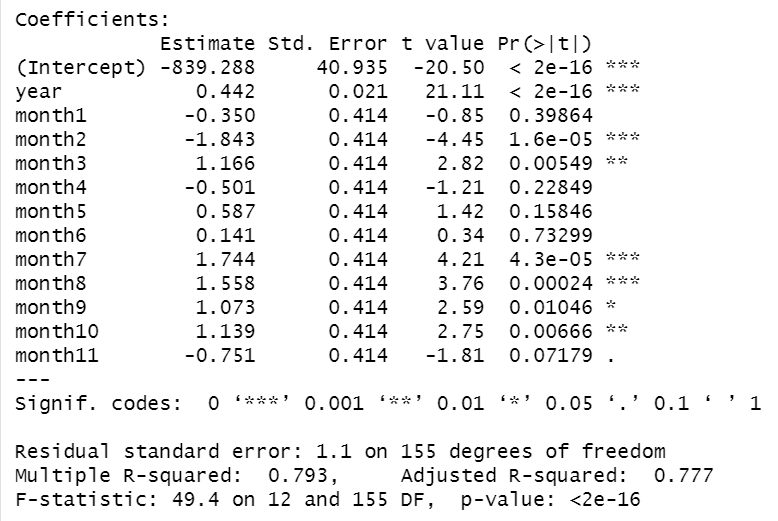

```{r setup, include = FALSE}

knitr::opts_chunk$set(echo = FALSE, warning = FALSE, message = FALSE)
options(digits = 2)

```

```{r, echo = FALSE}

# load packages
suppressMessages(library(magrittr))
suppressMessages(library(smooth))
set.seed(1234)

```

# 时间序列分析概述（2个课时）

## 课程存储地址

-   课程存储地址： <https://github.com/wuhsiang/Courses>
-   资源：课件、案例数据及代码

{width="30%"}

## GitHub：Courses仓库

{width="80%"}

## Courses仓库：交流平台

{width="80%"}

## 参考教材

-   James D. Hamilton著. 时间序列分析（2册）. 北京:人民卫生出版社. 2015.
-   Jonathan D. Cryer & Kung-Sik Chan著.时间序列分析及应用（R语言）（原书第2版）. 北京：机械工业出版社. 2011.
-   Robert I. Kabacoff著 . R语言实战（第二版）. 北京:人民邮电出版社. 2016.
-   David Salsburg著. 女士品茶：统计学如何变革了科学和生活. 南昌:江西人民出版社. 2016.

## 时间序列案例：传染病

{width="90%"}

## 本节知识点

-   时间序列分析方法起源
-   时间序列基本概念
-   时间序列分析要素
-   时间序列分析建模

## 11.1 时间序列分析方法起源

时间序列分析的方法，起源于英国统计学家Ronald Fisher在英国洛桑实验站（1919-1933）的\textcolor{red}{农作物收成变动研究}。这一研究产生了统计史上的三个重要方法：

-   \textcolor{red}{时间序列分析思想}
-   \textcolor{red}{随机对照实验}
-   \textcolor{red}{方差分析}

我们通过回顾这一研究，以深入理解时间序列分析的思想。

## Fisher与洛桑实验站

英国\textcolor{red}{洛桑实验站}（Rothamsted Experimental Station），现为洛桑研究所（Rothamsted Research），在漫长的历史中（1843-1919）积累了大量的"实验数据"和其它记录，包括：

-   降水量和温度的每日精确记录
-   施肥量与土壤检测数据的每周记录
-   农作物收成的每年记录
-   人造肥料和不同农作物（小麦、黑麦、大麦、马铃薯等）的组合实验方案

## 洛桑实验站的农作物

{width="55%"}

## 收成变动研究

Fisher考虑特定年份（$t$）的特定田地（$i$）上的农作物产量（$Y_{it}$），并试图回答以下问题：

-   \textcolor{red}{降水量}对小麦产量有何影响？
-   不同\textcolor{red}{肥料}对不同品种的马铃薯产量有何影响？

**课堂讨论**：第一个问题（5min）

## 收成变动研究（一）：如何预测小麦产量？

选定一块田地（名曰："宽埂"），这块田地\textcolor{red}{只使用过}动物粪便作为肥料，考虑\textcolor{red}{降水量如何影响小麦产量}。

-   降水量和小麦均是\textcolor{red}{时变}的，即考虑不同年份（$t$）的降水量（$X_{t}$）和小麦产量（$Y_{t}$）。

-   探讨降水量$X_{t}$与小麦产量$Y_{t}$的关系，即属于\textcolor{red}{时间序列分析}范畴。

-   问题演变为，如何\textcolor{red}{预测}小麦产量$Y_{t}$？

## 小麦产量的影响因素分解

-   土壤退化导致的产量总体稳步减小
-   长期缓慢变化，每个变化周期为期数年
-   不同年份的气候因素（例如降水量）导致的变化

## 长期缓慢的变化

```{r, echo = FALSE, fig.align='center', fig.height=6}

rm(list = ls())
# plot year and yields
x <- 1843:1919
y <- 200 + (x >= 1876 & x < 1880) * (-30) + (x >= 1880 & x < 1894) * (-50) + (x >= 1894 & x < 1901) * (-20) + (x>= 1901) * (-48)
# create a ts object and plot the trend
y <- ts(data = y, start = min(x), end = max(x))
plot.ts(y, xlab = "year", ylab = "trend component")

```

## 理解长期而缓慢的变化

-   难以解释的长期缓慢变化：产量从1876年开始剧烈下降，从1880年开始下降更加剧烈，至1894年产量开始改善，从1901年开始又剧烈下降

-   小麦田地中杂草的生长情况与之相反

-   最终解释：1876年前，人们雇佣小男孩到田里除草 --\> 1876年《教育法》规定适龄儿童必须上学--\>1880年法律处罚不让适龄儿童上学的家庭--\>1894年洛桑附近的女子寄宿学校校长认为，高强度户外运动有助于儿童健康--\>1901年校长去世

## 收成变动研究（二）：肥料使用对马铃薯产量的影响

研究问题：如何评估肥料使用对马铃薯产量的影响？

{width="75%"}

## 洛桑实验站的早期方案

-   洛桑实验站的\textcolor{red}{早期方案}：在不同片田地上，针对不同马铃薯品种，使用不同化肥，并记录其产量。
-   潜在问题
    -   \textcolor{red}{田地}相关的混淆因素，例如土壤肥力、排水方式、营养物质、杂草等。
    -   \textcolor{red}{年份}相关的混淆因素，例如气候变化（降雨量）、土壤肥力等。

{width="75%"}

## 理想设定

从因果图上来看，理想的设定如下：

{width="75%"}

## Fisher开创的统计方法

-   \textcolor{red}{随机对照实验}
    -   每片田地分块之后，进一步把每块田地分为若干排
    -   采用随机化方案，对每块地的每一排实施不同的处理
-   \textcolor{red}{方差分析}

{width="75%"}

## 分解思想

Fisher在洛桑实验站研究农作物收成变动时，采用了\textcolor{red}{分解（decomposition）的思想}：

-   时间序列中\textcolor{red}{要素分解}
-   方差分析中的\textcolor{red}{效应分解}

## 11.1.2 时间序列基本概念

-   \textcolor{red}{时间序列}（time series）
    -   定义：一组在特定时刻的观测值$Y_{t}$，例如特定田地上的小麦收成
    -   领域：广泛存在于宏观经济、金融财务以及医疗领域
-   \textcolor{red}{时间序列分析}（time series analysis）
    -   数据：时间序列数据，与横截面数据、面板数据，为三类主要的观测数据类型
    -   分析方法：通常基于宏观经济学理论建模，并被视作宏观计量经济学的主要方法

## 横截面 vs 时间序列数据

-   横截面数据（cross sectional data）
    -   定义：不同\textcolor{red}{研究对象}在某一时点的变量观测数据
    -   例子：通常的问卷调查
-   时间序列数据（time series data）
    -   定义：也称为纵剖面(longitudinal sectional)数据，是某一研究对象在不同\textcolor{red}{时点}的变量观测数据
    -   例子：股票价格数据

## 面板数据

-   定义：不同研究对象在不同时点的变量观测数据
-   特征：具有"横截面"和"时间序列"两个维度
-   例子：中国健康与养老追踪调查（China Health and Retirement Longitudinal Study, CHARLS）、中国健康与营养调查（China Health and Nutrition Survey, CHNS）等

## 时间序列数据

```{r, echo = FALSE, cache = TRUE, fig.align='center', fig.height=6}

# clean the directory
rm(list = ls())
# number of births per month in New York city
births <- scan("http://robjhyndman.com/tsdldata/data/nybirths.dat") %>% ts(frequency = 12, start = c(1946, 1))
# plot the time series data
plot.ts(births, xlab = "time (month)")

```

## 11.1.3 时间序列分析要素

影响时间序列观测值的因素，可以分为以下几类：

1.  \textcolor{red}{趋势因素}（trend component）：观测值的长期的趋势，通常是非线性的
2.  循环因素（cyclical component）：非季节因素引起的波动，通常也被归入趋势因素中
3.  \textcolor{red}{季节因素}（seasonal component）：在一定时期内呈现的规律变化，例如一年内随着自然季节的更替而发生的变化
4.  \textcolor{red}{不规则因素}（irregular component）：诸如随机因素

通常将趋势因素和循环因素合并在一起考虑，成为趋势-循环因素（trend-cycle），或简称\textcolor{red}{趋势因素}。

## 课堂讨论

讨论以下情境中，趋势因素（trend component）和季节因素（seasonal component）的\textcolor{red}{含义}是什么

-   京东 & 淘宝上某一产品的销售量
-   某一医院在过去十年的每日门诊病人数量

## 11.1.4 时间序列建模

时间序列可以分解为趋势因素、季节因素和随机因素 $$
Y_{t} = f(T_{t}, S_{t}, E_{t})
$$

常用的函数类型$f(\cdot)$有两种：累加、累乘。

## 加法模型

假定趋势因素、季节因素和随机因素\textcolor{red}{相互独立}，则可以用\textcolor{red}{加法模型}（additive model）来分解各个因素 $$
Y_{t} = T_{t} + S_{t} + E_{t}.
$$

## 因素分解：加法模型

```{r, echo = FALSE, fig.align='center', fig.height=6}

# decomposition
births.ad <- decompose(births, type = "additive")
# plot the decomposition
plot(births.ad, xlab = "time (month)")

```

## 加法模型之趋势因素

```{r, echo = FALSE, fig.align='center', fig.height=6}

# plot the trend
plot(births.ad$trend, xlab = "time (month)", ylab = "trend component")

```

## 加法模型之季节因素

```{r, echo = FALSE, fig.align='center', fig.height=6}

# plot the trend
plot(births.ad$seasonal, xlab = "time (month)", ylab = "seasonal component")

```

## 加法模型之随机因素

```{r, echo = FALSE, fig.align='center', fig.height=6}

# plot the trend
plot(births.ad$random, xlab = "time (month)", ylab = "irregular component")

```

## 乘法模型

趋势因素、季节因素和随机因素不满足相互独立的条件，则可以用\textcolor{red}{乘法模型}（multiplicative model）来分解各个因素 $$
Y_{t} = T_{t} \times S_{t} \times E_{t}.
$$

## 因素分解：乘法模型

```{r, echo = FALSE, fig.align='center', fig.height=6}

# decomposition
births.mp <- decompose(births, type = "multiplicative")
# plot the decomposition
plot(births.mp, xlab = "time (month)")

```

## 时间序列分析步骤

1.  搜集数据，绘制时间序列图
2.  因素分解，得到趋势因素、季节因素和随机因素
3.  对特定情境建模，分别预测趋势因素和季节因素的时间序列值
4.  获得最终的预测模型

# 时间序列经典分析方法（3个课时）

## 本节知识点

-   预测方法概述
-   移动平均法
-   指数平滑法
-   生长曲线法
-   灰色系统预测法（略）

## 11.2.1 通用预测模型

因变量（响应变量，response variable）记为$y$，自变量（预测变量，predictors）集合记作向量$\textbf{x} = c(x_{1}, x_{2}, ..., x_{p})$，则通用模型可以写成：

$$
y = \underbrace{f(\textbf{x})}_{\text{Prediction}} + \underbrace{\epsilon}_{\text{Error}}.
$$

从而由

$$
\hat{y} = \hat{f}(\textbf{x})
$$

得到预测值。研究者可以选择不同的建模方法，从而得到对$f(\cdot)$的不同估计$\hat{f}(\cdot)$。在时间序列预测模型中，自变量$\textbf{x}$是因变量的历史数据$y_{\tau}$，其中$1 \leq \tau \leq t - 1$。

## 理解视角

将观测值$y$分为结构部分$f(\textbf{x})$和随机部分$\epsilon$，可以从\textcolor{red}{三个视角}来理解：

-   \textcolor{red}{因果性}（计量经济领域）：观测项 = 机制项 + 干扰项
-   \textcolor{red}{预测性}（\textcolor{red}{统计学习领域}）：观测项 = 预测项 + 误差项
-   \textcolor{red}{描述性}（统计领域）：观测项 = 概括项 + 残差项

**课堂讨论**：（1）三个视角在研究目的上有何区别？（2）在建模思路和模型选取上有何差异？

## 模型误差

本质上，统计学习指一套估计$f(\cdot)$的方法。为此，我们需要了解在估计$f(\cdot)$中涉及的\textcolor{red}{关键理论概念}，以及\textcolor{red}{评估准则}。

给定$\hat{f}(\textbf{x})$和$\textbf{x}$，那么： $$
E(y - \hat{y})^{2} = E[f(\textbf{x}) + \epsilon - \hat{f}(\textbf{x})]^{2} = \underbrace{[f(\textbf{x}) - \hat{f}(\textbf{x})]^{2}}_{\text{Reducible}} + \underbrace{\text{Var}(\epsilon)}_{\text{Irreducible}}.
$$

第一项是\textcolor{red}{可约误差}（reducible error），若使用更适当的方式估计$f(\cdot)$，则可以减少可约误差；第二项是\textcolor{red}{不可约误差}（irreducible error），它是由未被测量的因素导致的，因而不可消除。

## 自由度

模型\textcolor{red}{自由度}，表征了模型的\textcolor{red}{复杂程度}，是研究者在估计$f(\cdot)$时的重要考量因素。

在统计学习中，尤其需要理解模型的自由度。 \vspace{12pt}

> The number of \textcolor{red}{degrees of freedom} is the number of values in the final calculation of a statistic that are free to vary.
>
> `r tufte::quote_footer('--- In Statistics')`

\vspace{12pt}

> The \textcolor{red}{degrees of freedom} are an accounting of how many parameters are estimated by the model and, by extension, a measure of complexity for linear regression models.
>
> `r tufte::quote_footer('--- In Statistical Learning')`

## 自由度分解

假定多元线性模型$y = \beta X + \epsilon$中，假定$X$包括一列常数和$(p - 1)$列变量，那么待估计的参数个数为$p$，方差和自由度的分解如下：

-   SST: 自由度为$n - 1$
-   SSE: 自由度为$n - p$
-   SSR：自由度为$p - 1$

因而，自由度的分解为： $$
n - 1 = (n - p) + (p - 1)
$$

线性回归模型中，模型的自由度等于预测变量的个数。

**课堂思考**: 假设模型有两个解释变量，其中$x_{1}$是连续变量，$x_{2}$是包含5个分类的分类变量，SSR的自由度为多少？

## 方差分析表

| 变异来源 | 平方和 | 自由度  | 均方              |
|----------|--------|---------|-------------------|
| 回归模型 | SSR    | $p - 1$ | MSR = SSR/$(p-1)$ |
| 误差     | SSE    | $n - p$ | MSE = SSE/$(n-p)$ |
| 总变异   | SST    | $n-1$   | MST = SST/$(n-1)$ |

假定在线性回归模型$A$的基础上，加了几个变量得到模型$B$，模型选择取决于构造的$F$检验： $$
F(\Delta \text{df}, \text{df}_{\text{SSE}}) = \frac{\Delta \text{SSR} / \Delta \text{df}}{\text{MSE}_{\text{B}}} ?> F_{\alpha}
$$

## 预测精度 vs 可解释性

Q1：如何选择函数$f(\cdot)$？

随着模型自由度（degree of freedom）增加，模型变得更加复杂。

-   预测精度（accuracy）：尽可能减少可约误差，因此要求自由度更大的模型。
-   可解释性（interpretability）：尽可能用少数变量来解释$\textbf{x}$如何影响$y$，因此要求自由度更小的模型。

统计学习中，大多数时候更加关注\textcolor{red}{预测精度}，因而可以将$f(\cdot)$视作\textcolor{red}{黑箱}。

## 权衡预测精度与模型可解释性

{width="70%"}

## 参数方法 vs 非参数方法

Q2：函数$f(\cdot)$的形式，是否有明确假设？或说，给定训练集（training set）数据，如何估计函数$f(\cdot)$？

参数方法（parametric methods）：

-   步骤：（1）设定具体的\textcolor{red}{函数形式}，包括线性或非线性函数；（2）使用训练集数据，拟合（fit）或说训练（train）模型，得到参数估计值。
-   优点：简化了$f(\cdot)$的估计问题，估计一组参数通常很方便。
-   缺点：一旦模型设定有误，则会导致较大误差。

\vspace{6pt}

非参数方法（non-parametric methods）

-   步骤：使用附近的观测值来估计给定$\textbf{x}$时的预测值。
-   优点：避免设定特定的函数形式，从而规避了模型设定错误。
-   缺点：无法将估计$f(\cdot)$这一问题变成少量参数的估计，因而远远超过参数方法需要的观测值才能获得$f(\cdot)$的准确估计。

## 衡量预测精度

定义预测误差$e_{t}$为实际观测值$Y_{t}$与预测值$\hat{Y}_{t}$之差，

$$
e_{t} = Y_{t} - \hat{Y}_{t}.
$$

由此得到两个衡量预测精度的指标，\textcolor{red}{均方误差}（mean square error, MSE）和\textcolor{red}{平均绝对离差}（mean absolute deviation, MAD） $$
\text{MSE} = \frac{\sum_{t=1}^{n} e^{2}_{t}}{n}, \text{MAD} = \frac{\sum_{t=1}^{n} |e_{t}|}{n}.
$$

## 测试均方误差的分解

\textcolor{red}{测试集}（test set）均方误差的期望值（**expected test MSE**）可以分解为如下三个部分： $$
E(y - \hat{f}(x))^{2} = \underbrace{\text{Var}(\hat{f}(x))}_{\text{Variance}} + \underbrace{[\text{Bias}(\hat{f}(x))]^{2}}_{\text{Bias}} + \underbrace{\text{Var}(\epsilon)}_{\text{Irreducible}}.
$$

-   模型方差（variance）：针对不同的训练数据，$\hat{f}$的变化程度。
-   模型偏误（bias）：通过相对简化的模型来**近似**真实世界的问题时所引入的误差。

## 模型复杂程度

{width="70%"}

## 权衡模型偏误与方差

{width="70%"}

## 如何选择统计模型？

-   传统统计模型的局限：线性回归模型等统计模型通常最小化训练数据的均方误差，但是其测试均方误差（\textcolor{red}{test MSE}）却较大。换言之，传统统计模型执着于寻求"真实规律"，以致于将一些随机因素\textcolor{red}{误判}为$f$的真实性质。
-   权衡模型偏误与方差（\textcolor{red}{bias-variance trade-off}）：随着模型灵活性（或自由度）的增加，模型方差随之增大，但模型偏误则相应减小（过度拟合问题）。通过交叉验证来权衡两者。
-   权衡预测精度与可解释性（\textcolor{red}{accuracy-interpretability trade-off}）：诸如bagging、boosting、support vector machines等非线性模型具有很高的预测精度，但不易解释；linear models等易于解释，但预测精度不高。两者的权衡取决于研究目的。

## 交叉验证

\textcolor{red}{交叉验证}（cross-validation）将原始数据集分为训练集（**training set**）和验证集（**validation set**），并以验证集的错误率选择最佳模型。

-   留一交叉验证法（leave-one-out cross validation, LOOCV）
-   $k$折交叉验证法（$k-$fold CV）：将观测集随机分为$k$个大小基本一致的组，或说折（fold）。每次选取其中一折作为验证集，而剩余$k-1$折作为训练集。通常，取$k=5$或$k=10$。

\textcolor{red}{分类模型}验证集错误率： $$
\text{CV}_{(k)} = \frac{1}{k} \sum_{i=1}^{k} \text{Err}_{k} = \frac{1}{k} \sum_{i=1}^{k} \frac{1}{m_{k}} \sum_{i=1}^{m_{k}} I(y_{i} \neq \hat{y}_{i}).
$$

## 11.2.2 移动平均法

\textcolor{red}{移动平均}（moving average）

-   思路：计算最近m个连续观测值的平均值，作为时间序列的预测值
-   假设：（1）趋势因素是线性的；（2）不规则因素有明确的节奏波动模式

## 移动平均法：模型

预测$Y_{t+1}$的算法为， $$
Y_{t+1} = \frac{Y_{t} + Y_{t-1} + ... + Y_{t-m+1}}{m}
$$ 而可以通过\textcolor{red}{最小化误差}选取适当的$m$值。具体步骤，可以使用R中的[smooth](https://cran.r-project.org/web/packages/smooth/vignettes/smooth.html)包来完成。

## 移动平均法：案例

```{r, echo = T}

ma.ts <- sma(births, h = 20)
ma.ts

```

## 移动平均法：案例（续）

```{r, echo = FALSE, fig.align='center', fig.height=5}

ma.ts %>% forecast() %>% plot()

```

## 移动平均法：其它实践

除了简单移动平均法以外，还有一些改进的预测方法：

-   加权移动平均法：给予近期数据更大的权重，但维持权系数$\sum_{\tau = 1}^{m} w_{\tau} = 1$。
-   趋势移动平均法：同时使用一次和二次移动平均法。

## 11.2.3 指数平滑法

\textcolor{red}{指数平滑法}（exponential smoothing）

-   思想：介于全期平均法和移动平均法之间。（1）使用\textcolor{red}{全期数据}，而非部分近期数据；（2）给予近期数据更大的权重，而远期数据的权重则呈\textcolor{red}{指数衰减}
-   假设：时间序列的态势具有稳定性或规则性，因而过去的态势会在某种程度上持续到未来

## 指数平滑法：模型

定义初始平滑值$S_{0} = Y_{0}$，则指数平滑模型可以表示为：

-   任一期$t$的平滑值$S_{t}$，均是本期观测值$Y_{t}$和上期平滑值$S_{t-1}$的加权平均

$$
S_{t} = \alpha Y_{t} + (1 - \alpha) S_{t-1}, \alpha \in [0, 1].
$$

-   平滑参数$\alpha$决定了近期或远期数据的权重。$\alpha \to 1$时，赋予近期观测值更大的权重
-   可以通过预测精度确定最佳平滑参数$\alpha^{*}$

## 何为"指数平滑"？

推导可知， $$
S_{t} = \alpha [Y_{t} + (1-\alpha)Y_{t-1} + ... + (1-\alpha)^{t-1}Y_{1}] + (1-\alpha)^{t} Y_{0}.
$$

远期数据权重呈几何级数衰减，而几何级数衰减是指数衰减的离散版本，因此得名"指数平滑"。

## 指数平滑法：案例

```{r, echo = T}

es.ts <- es(births, h = 20, holdout = T)
es.ts

```

## 指数平滑法：案例（续）

```{r, echo = FALSE, fig.align='center', fig.height=5}

es.ts %>% forecast() %>% plot()

```

## 指数平滑法：其它实践

-   二次指数平滑法：对（一次）指数平滑法的再次平滑处理

## 非参数模型小结

-   不考虑问题的具体特征，而将其视作\textcolor{red}{黑箱}
-   通常仅使用历史数据$Y_{\tau} (1 \leq \tau < t)$进行预测
-   与K最近邻（k-nearest neighbors, KNN）等非参数模型类似，采用\textcolor{red}{直观逻辑}进行预测
-   \textcolor{red}{调节参数}（tuning parameter）通常依据预测误差最小化原则来确定

## 其它模型？

我们也可以自行建模，例如 $$
Y_{t} = a + b \cdot t + Month_{t} + \epsilon_{t}.
$$

其中线性函数$(a + b \cdot t)$刻画了\textcolor{red}{趋势因素}，虚拟变量集合$Month_{t}$刻画了\textcolor{red}{季节因素}。

## 数据准备

```{r, echo = TRUE}

nlength <- length(births)
year <- 0:(nlength - 1) %/% 12 + 1946
month <- as.factor(1:nlength %% 12)
dat <- data.frame(births, year, month)
lm.ts <- lm(births ~ year + month, data = dat)

```

## 模型估计

```{r, echo = FALSE, eval = FALSE}

summary(lm.ts)

```

{width="60%"}

## 模型预测

```{r, echo = FALSE, fig.align='center', fig.height=5}

births.lm <- fitted(lm.ts)%>% ts(frequency = 12, start = c(1946, 1))
ts.plot(births, births.lm, gpars = list(col = c("black", "red")))

```

## 预测模型比较

```{r, echo = T}

# write a function to assess accuracy
accuracy.ts <- function(y, yhat){
    # calculate MSE and MAD
    mse <- sum((y - yhat)^2) / length(y)
    mad <- sum(abs(y - yhat)) / length(y)
    # return MSE and MAD
    res <- data.frame(mse = mse, mad = mad)
    return(res)
}

```

## 模型比较

```{r, echo = FALSE}

# moving average, exponential smoothing and our model
accuracy <- accuracy.ts(births, fitted(ma.ts)) %>%
  rbind(accuracy.ts(births, fitted(es.ts))) %>%
  rbind(accuracy.ts(births, fitted(lm.ts)))

# display the results
rownames(accuracy) <- c("moving average", "exponential smoothing", "our model")
accuracy

```

## GDP历史数据

{width="70%"}

## WHO疫情统计数据

{width="80%"}

## 11.2.4 生长曲线法

-   指数增长模型
-   Logistic增长模型
-   再论人口增长模型

## 指数增长模型

\textcolor{red}{指数增长模型}

-   性质：属于\textcolor{red}{参数方法}，即设定具体的统计模型
-   假设：时间序列（1）刻画了事物的\textcolor{red}{增长过程}（或发展演化过程），且（2）增长率恒定；（3）资源充足
-   例子：资源充足情况下的种群增长

## 指数增长模型：建模

在资源充足的情况下，物种的固有增长率为$r$（即繁殖率），种群数量$Y_{t}$可以刻画为 $$
\frac{\text{d}Y_{t}}{\text{d}t} = r \cdot Y_{t}.
$$ 由此求解得到种群数量 $$
Y_{t} = Y_{0} \cdot e^{rt}.
$$

## 指数增长型时间序列

```{r, echo = FALSE, fig.align='center', fig.height=5}

# create a time series
y.start <- 20
r <- 0.1
t <- 1:30
y <- y.start * exp(r * t) %>% round() %>% ts(frequency = 1)
plot.ts(y, main = "exponential growth model")

```

## 指数增长模型：估计

-   取对数，采用最小二乘法估计
-   采用非线性最小二乘法估计

## Logistic增长模型

\textcolor{red}{Logistic增长模型}

-   性质：属于\textcolor{red}{参数方法}，即设定具体的统计模型
-   假设：时间序列刻画了事物的\textcolor{red}{增长过程}（或发展演化过程）
-   例子：（1）种群数量变化；（2）新产品销售量；（3）疾病感染人数

## 种群数量变化

在某个自然环境中，假定只有单一物种竞争资源，那么其种群数量$Y_{t}$的变化可以描述为 $$
\frac{\text{d}Y_{t}}{\text{d}t} = r \cdot Y_{t} \cdot (1 - \frac{Y_{t}}{N})
$$ 参数的含义：

-   种群的固有增长率$r$，即繁殖率
-   环境资源容纳的最大种群数量$N$
-   $Y_{t} \ll N$时，近似为指数增长；$Y_{t} \to N$时，增长近似停滞

## 种群数量变化（续）

以上模型得到Logistic函数，即 $$
Y_{t} = \frac{N}{1 + (N/Y_{0} - 1) \cdot e^{-rt}}
$$

由此得到$S$型曲线，从而呈现以下特征：

-   $Y_{t} \ll N$时，近似为指数增长
-   $Y_{t} \to N$时，增长近似停滞

## Logistic型时间序列

```{r, echo = FALSE}

# create a time series
y.start <- 20
r <- 0.5
N <- 20000
t <- 1:30
y <- N / (1 + (N / y.start - 1) * exp(- r * t))
y <- y %>% round() %>% ts(frequency = 1)
plot.ts(y, main = "logistic growth model")

```

## 新产品销售量

假定完全创新的新产品（永久品），进入市场之后，其销售量$Y_{t}$的变化可以描述为 $$
\frac{y_{t}}{N - Y_{t}} = p + q \cdot \frac{Y_{t}}{N}
$$

参数含义如下：

-   $y_{t}$为第$t$期的购买者，而$Y_{t}$为第$t$期初的累积购买者
-   $N$为市场容量
-   $p$为创新系数，$q$为模仿系数，分别刻画广告和口碑的效应

## 疾病传播模型

疾病传播模型与以上模型类似，可以自行推导。

## 再论人口增长模型

-   马尔萨斯人口论与治乱循环
-   中国历史上的土地/人口比例议题
-   模型参数的变化
    -   固定增长率，如生育率的变化
    -   容量的变化，如技术进步带来的粮食增产等

# 时间序列案例分析（1个课时）

## 本节知识点

-   时间序列分析建模与预测

-   <https://github.com/wuhsiang/Courses/blob/master/healthinfo/cases/case-outpatient.Rmd>)

# 时间序列分析实习（2个课时）

## 实习内容

数据来源及说明：

-   <https://covid19.who.int/data>

实习内容：

-   选择感兴趣的议题（感染人数、死亡人数、疫苗接种人数）和部分数据（例如，全球或特定国家）
-   选用特定工具（如SPSS、Python、R等）
-   使用时间序列分析方法，探索其规律，并给出后续预测值、评估预测效果
