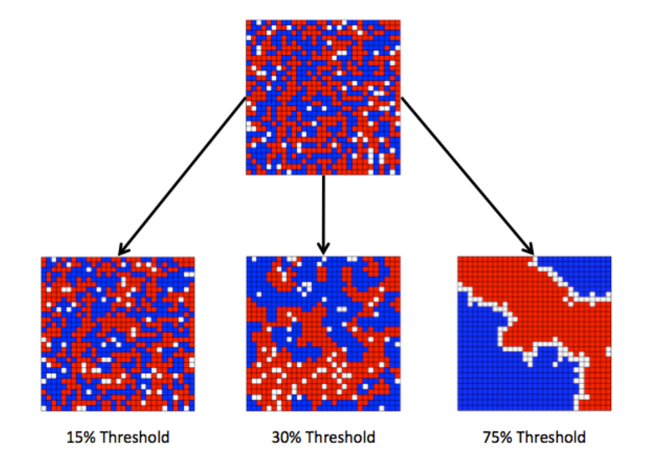
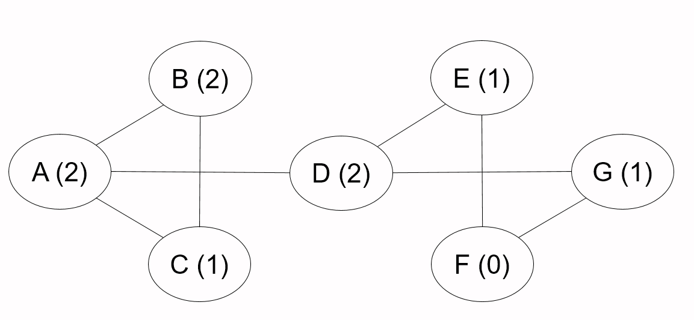
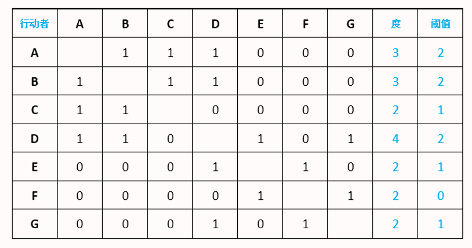
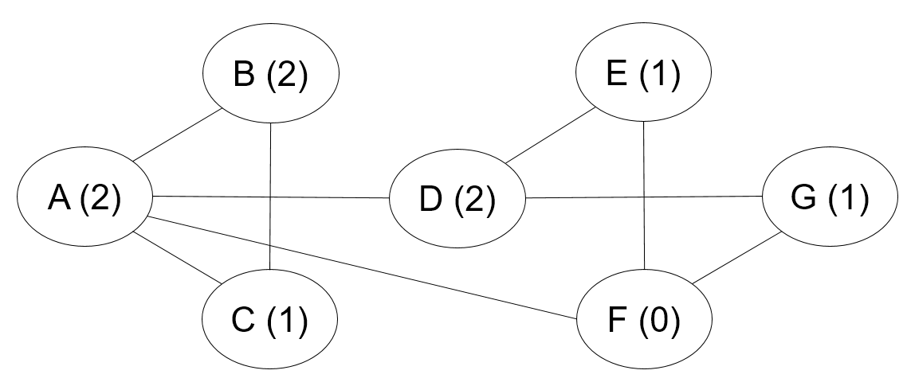
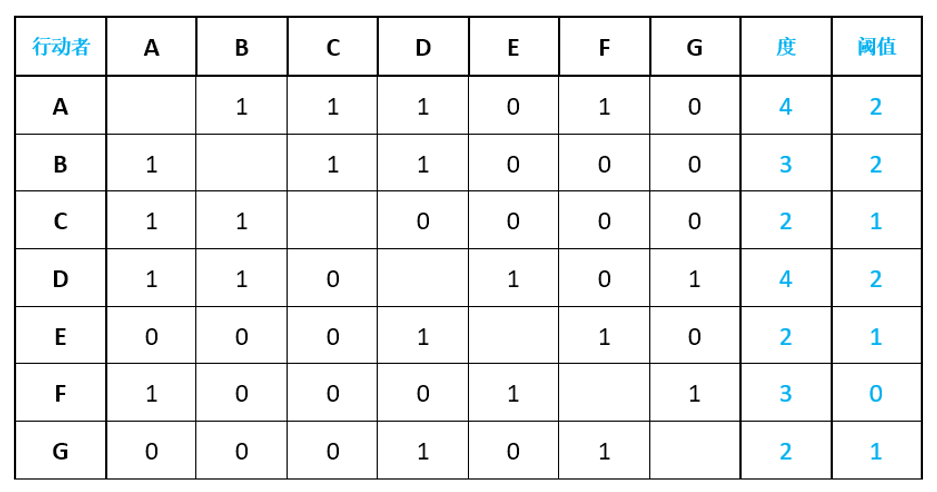
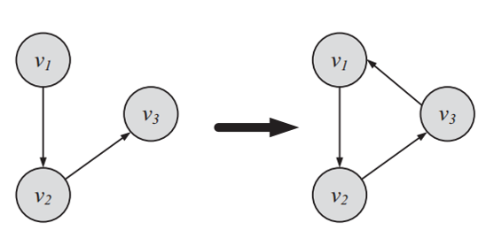
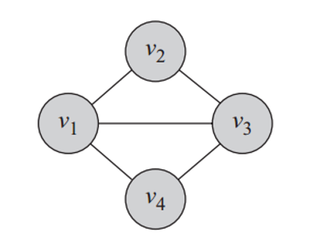
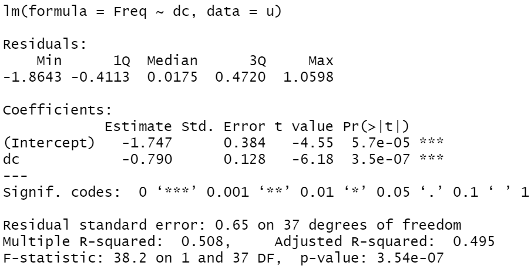
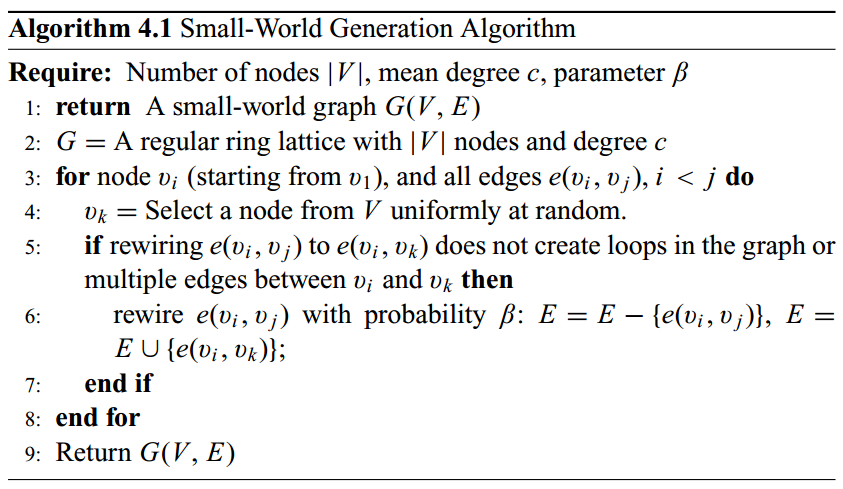
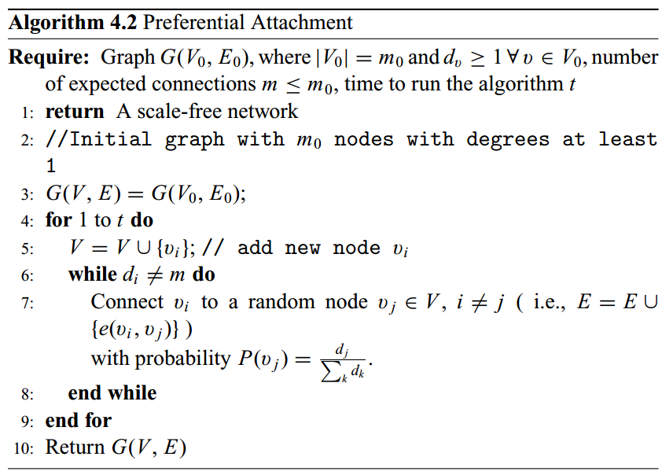

```{r setup, include = FALSE}

knitr::opts_chunk$set(echo = FALSE, warning = FALSE, message = FALSE)
options(digits = 2)

```

# 社会网络分析概述（2个课时）

## 课程存储地址

-   课程存储地址： <https://github.com/wuhsiang/Courses>
-   资源：课件、案例数据及代码

{width="40%"}

## 参考教材

-   斯坦利·沃瑟曼, 凯瑟琳·福斯特. 社会网络分析:方法与应用. 北京：中国人民大学出版社. 2012. (注：对应英文版于1996年出版)
-   托马斯. 社会网络与健康:模型、方法与应用. 北京:人民卫生出版社. 2016.
-   埃里克·克拉泽克, 加博尔·乔尔迪. 网络数据的统计分析：R语言实践. 西安:西安交通大学出版社. 2016.

## 本节知识点

-   社会网络的基本概念
-   社会网络的符号表示
-   吸烟行为建模：社会网络视角
-   基本社会网络结构
-   社会网络分析软件

## 社会网络与健康

{width="50%"}

-   哪种饮食结构/生活习惯会让人变胖？
-   肥胖会"\textcolor{red}{传染}"吗？

## 社会网络与健康（续）

{width="50%"}

-   哪种特质的人更容易抑郁？
-   \textcolor{red}{社会支持}是否有助于改善抑郁？

## 社会网络与健康（续）

{width="50%"}

-   医联体/医共体模式是否有助于提升基层卫生服务能力？

## 社会网络视角

-   行动者之间的\textcolor{red}{关系}是主要的，行动者的属性是次要的
-   行动者和他们的行动被视为\textcolor{red}{相互依赖}的，而不是相互独立的自治体
-   行动者之间的联系是信息和资源的流动通道
-   个体的网络模型将网络结构环境视为个体行动的机遇或限制
-   网络模型将（社会、经济、政治、情感等）结构概念化为行动者之间关系的稳定形式

Q: 如何以疾病传播和健康促进为例，理解社会网络视角与传统视角的区别。

## 7.1.1 基本概念

\textcolor{red}{社会网络分析}（social network analysis, SNA）的关键概念：

-   \textcolor{red}{行动者}：社会网络分析中的社会实体被称为行动者，包括个体、企业、民族国家等
-   \textcolor{red}{关系连接}：行动者通过社会关系彼此相连。这些联系包括：评价、资源传输、行为互动等。联系存在于特定的成对行动者之间
-   \textcolor{red}{关系}：群体成员间某种类型的联系的集合
-   \textcolor{red}{社会网络}：行动者（人、组织等），及其之间关系的集合

其它关键概念还包括：二元图、三元图、子群、群。

## 基本特征

SNA的基本特征：

-   考虑整个网络结构
-   论证网络结构如何影响个体行为
-   运用图表展示
-   运用数学的形式

## 7.1.2 社会网络数据

\textcolor{red}{社会网络数据}包括：

-   行动者集合
-   社会关系
-   行动者属性

社会网络数据的\textcolor{red}{符号表示}包括：

-   图论
-   社会计量

## 图论符号表示法

图$G = (N, L)$由节点的集合$N$和边的集合$L$所定义。

| 社会网络 |  图  |
|:--------:|:----:|
|  行动者  | 节点 |
| 社会关系 |  边  |

: 社会网络与图论的对应关系

图论符号表示法中，可以采用节点集合和边列表来表示社会网络数据。

## 图论符号表示法（续）

-   行动者集合$G$ = {A, B, C, D, E, F, G}
-   社会关系集合$L$ = {\<A, B\>，\<A, C\>，\<A, D\>，\<D, E\>，\<D, G\>，\<E, F\>, \<F, G\>}

```{r, fig.align='center', fig.height=4.5}

# use igraph package
suppressMessages(library(igraph))
rm(list = ls())
# set random seeds
set.seed(123)
# create graph g from literal
g.smoking <- graph_from_literal(A-B, A-C, A-D, D-E, D-G, E-F, F-G)
# plot the graph
plot(g.smoking, layout = layout.circle)

```

## 社会计量符号表示

-   社会计量（sociometric）：由人以及被度量的人与人之间的情感关系组成的社会网络数据集合，旨在研究一群人中积极和消极的感情关系
-   社会关系矩阵：\textcolor{red}{邻接矩阵}，对应于量化行动者之间的社会关系图

## 邻接矩阵

```{r, results='asis'}

suppressMessages(library(pander))
suppressMessages(library(magrittr))
g.smoking %>% as_adjacency_matrix(sparse = F) %>% pandoc.table(split.tables = Inf)

```

## 其它情形

-   有值关系：例如，强关系和弱关系

-   有向关系：例如，网站链接、微博、文献网络

-   多重关系：例如，社会角色与网络

-   网络动态性：例如，网络社区演化

## Schelling种族隔离模型

Schelling在1970s探讨了如下问题：如果不存在种族歧视，是否也会出现不同种族聚族而居的现象？

其核心假设如下：

-   使用元胞自动机构建模型，每个行动者有8个邻居
-   只有邻居中与自己同种族的比例达到阈值$B_{a}$，才有充足的安全感；否则，会缺乏安全感
-   缺乏安全感时，行动者会重新移动到有空格的位置；如此，不断调整直至达到均衡状态

## 不同阈值下的均衡结果

阈值$B_{a}$从15%提高至75%时，出现了显著不同的结果。

{width="60%"}

## 吸烟行为建模：社会网络视角

{width="75%"}

## 案例背景描述

假定吸烟情境可以提炼为如下核心特征：

-   吸烟人群，但同时也认识到吸烟的危害
-   自制力程度有差异，且可以由行动的阈值来刻画
-   \textcolor{red}{行动阈值}：周围朋友吸烟的人数达到特定值（threshold）时，才会开始吸烟

## 社会网络符号表示：图论

{width="80%"}

## 社会网络符号表示：社会计量

{width="80%"}

## 吸烟行为分析：情境一

[slides on smoking behavior](smoking.ppt)

## 情境二：网络结构变化

-   假定A在某次聚会中认识了F，两人成为了好朋友
-   以上社会网络中的吸烟行为规律是否会变化？

## 社会网络符号表示：图论

{width="80%"}

## 社会网络符号表示：社会计量

{width="80%"}

## 吸烟行为分析：情境二

[slides on smoking behavior](smoking.ppt)

## 案例总结讨论

-   案例有什么有意思的结论？
-   社会网络分析视角的特点是什么？
-   社会网络分析视角适合哪些健康领域的议题？

## 节点度

在无向图$G$中，节点$n_{i}$的度为

```{=tex}
\begin{equation}
  \underbrace{d(n_{i})}_{\text{degree}} = \underbrace{\sum_{j} x_{ji}}_{\text{indegree}} = \underbrace{\sum_{j} x_{ij}}_{\text{outdegree}}.
\end{equation}
```
对于有向图而言， \begin{equation*}
  \underbrace{\sum_{j} x_{ji}}_{\text{indegree}} \neq \underbrace{\sum_{j} x_{ij}}_{\text{outdegree}}.
\end{equation*}

## 节点度（续）

图$G$中节点度的均值为

```{=tex}
\begin{equation*}
  \bar{d} = \frac{\sum d(n_{i})}{g} = \frac{2L}{g}。
\end{equation*}
```
度的方差为 \begin{equation*}
  S_{D}^{2} = \frac{\sum [d(n_{i}) - \bar{d}]^{2}}{g}.
\end{equation*}

$S_{D}^{2} = 0$对应的图称为$d$-规则图（$d$-regular lattice）。

## 7.1.4 主要网络模型

参照网络模型：

-   随机网络
-   规则网络

现实网络模型：

-   小世界网络
-   无标度网络（优先连接网络）

## 随机网络

-   基本假定：节点之间的边是随机构建的
-   $G(n, p)$模型：图$G$有$n$个节点，$n\choose 2$条边以$p$的概率随机连接
-   节点的期望度是$(n - 1) p$，边的期望条数是$\frac{n (n - 1)}{2} \times p$

```{r, fig.align='center', fig.height=4.5}

# create and plot a random network
g.random <- erdos.renyi.game(9, 0.1)
g.random %>% plot(layout = layout.circle)

```

## 规则网络

-   基本假设：每个节点的度是常数$c$

```{r, fig.align='center', fig.height=4.5}

par(mfrow = c(1, 2))
g.lattice <- make_ring(n = 9, directed = FALSE, circular = TRUE)
g.lattice %>% plot(circular = T)
g.lattice <- g.lattice + edges(c(1, 3), c(2, 4), c(3, 5), c(4, 6), c(5, 7), c(6, 8), c(7, 9), c(8, 1), c(9, 2))
g.lattice %>% plot(circular = T)

```

## 小世界网络

-   基本问题：社会网络中两个节点之间传递信息将需要几个步骤？
-   基本假设：大多数节点几乎没有联系，但任意两个节点之间的距离都比预期的短
-   特点：这个世界真小啊！"六度分割"理论

```{r, fig.align='center', fig.height=4}

g.sw <- sample_smallworld(1, 9, 3, 0.02)
g.sw %>% plot(circular = T)

```

## 无标度网络

-   基本问题：加入现有网络时，行动者对要联系的人有偏好吗？
-   基本假设：行动者更喜欢连接到网络最中心的位置
-   特点："富者愈富"

```{r, fig.align='center', fig.height=4.5}

g.pa <- sample_pa(n = 9, power = 1, directed = F)
g.pa %>% plot(circular = T)

```

## 7.1.5 社会网络分析软件

常用分析工具：

-   UCINET
-   Pajek
-   NetMiner
-   STRUCTURE
-   MultiNet
-   StOCNET

## 新兴分析工具

-   Python-NetworkX

-   R-\textcolor{red}{igraph}

本课程采用`igraph`包进行演示。

# 社会网络主要分析角度（4个课时）

## 本节知识点

-   中心性与声望 （行动者层级）

-   凝聚子群 （子群层级）

-   评估网络属性 （网络层级）

## 7.2.1 中心性与声望

-   基本问题：如何识别社会网络中"\textcolor{red}{最重要的}"角色？
-   中心性测度的\textcolor{red}{有效性}
    -   我们是否能够捕捉到实质上所要表示的"重要"？
    -   先有理论基础，再进行量化
-   中心性与声望
    -   中心性：行动者参与其中，适用于无向关系和有向关系
    -   声望：行动者作为接受者，适用于有向关系
    -   情境（关系本身的性质）：讨厌（接受者，负面）、给出建议（发送者）

## 中心性度量

无向关系的社会网络中，主要的几种\textcolor{red}{中心性度量}：

-   度中心性（degree centrality）

-   特征向量中心性（eigenvector centrality）

-   接近中心性（closeness centrality）

-   中介中心性（betweenness centrality）

## 特殊网络

我们考虑星形网络、环形网络和线形网络。

```{r, fig.align='center', fig.height=5}

par(mfrow = c(1, 3))

# 星形网络
g.star <- make_star(n = 7, mode = "undirected")
plot(g.star)

# 环形网络
g.ring <- make_ring(n = 7, directed = FALSE, circular = TRUE)
plot(g.ring)

# 线形网络
g.line <- graph_from_literal(1-2, 2-3, 3-4, 4-5, 5-6, 6-7)
plot(g.line, circular = T)

# 更新吸烟网络
g.smoking <- graph_from_literal(A-B, A-C, A-D, B-C, D-E, A-F, D-G, E-F, F-G)

```

## 度中心性

\textcolor{red}{度中心性}（degree centrality）的测量逻辑：

-   中心的行动者在某种意义上必须是最活跃的
-   节点度可以衡量活跃程度

```{=tex}
\begin{equation}
  C_{D}(n_{i}) = \frac{d(n_{i})}{g - 1}
\end{equation}
```
## 度中心性（续）

在图$G$中，节点个数$g = 7$，度的最大值为$g - 1 = 6$

$d(A) = 4$, 故$C_{D}(A) = 2/3$

$d(D) = d(F) = 3$, 故$C_{D}(D) = 1/2$

$d(B) = d(C) = d(E) = d(G) = 2$，故$d(B) = 1/3$

{width="60%"}

## 度中心性（续）

```{r, results = 'asis'}

# calculate degree centrality
cd <- cbind(degree(g.star,  normalized = T), degree(g.ring,  normalized = T), degree(g.line,  normalized = T), degree(g.smoking,  normalized = T))
colnames(cd) <- c("star", "ring", "line", "smoking")
# print the results
pandoc.table(cd, caption = "Degree centrality for four graphs", digits = 2)

```

## 特征向量中心性

\textcolor{red}{特征向量中心性}（eigenvector centrality）的测量逻辑：

-   如果某个行动者邻居大多是中心行动者，那么他就是中心行动者
-   中心性不仅取决于认识多少人，还取决于认识的人是否重要

图$G$的邻接矩阵为$A$， \begin{equation*}
  A v = \lambda v,
\end{equation*} 其中$\lambda$为特征值，$v$为特征向量。

特征向量中心性$C_{e}(n_{i})$定义为\textcolor{red}{最大特征值}对应的特征向量。

```{r}

# calculate adjacency matrix
a.smoking <- g.smoking %>% as_adjacency_matrix(sparse = F)
# calculate eigvalues
eigmax <- eigen(a.smoking)$`values`[1]
eigvec <- eigen(a.smoking)$vectors[, 1]

```

## 特征向量中心性（续）

在图$G$中，最大特征值为`r eigmax`。

对应的特征向量为 $C_{e}(n_{i}) = c(0.53, 0.31, 0.31, 0.42, 0.31, 0.42, 0.31)$。 这一结果可以进一步归一化。

{width="60%"}

## 特征向量中心性（续）

```{r, results = 'asis'}

ce <- cbind(eigen_centrality(g.star, scale = T)$vector, eigen_centrality(g.ring, scale = T)$vector, eigen_centrality(g.line, scale = T)$vector, eigen_centrality(g.smoking, scale = T)$vector)
colnames(ce) <- c("star", "ring", "line", "smoking")
pandoc.table(ce, digits = 2, caption = "Eiggenvector centrality for four graphs")

```

## PageRank

Google搜索引擎

-   采用PageRank来度量网页的中心性
-   在检索时，和查询相匹配且PageRank值高的网页将最先显示

\textcolor{red}{PageRank}在特征中心性的基础上作了修正：

-   中心节点在传递其中心性时，考虑其度（有向图中，则是出度）
-   每个邻居获取其中心性的一部分（除以节点度）

## 接近中心性

\textcolor{red}{接近中心性}（closeness centrality）的测量逻辑：

-   占据中心地位的行动者在与其他行动者交流信息时更有效率
-   如果行动者能快速地与所有其他行动者产生内在连接，那么他就是中心行动者
-   最小距离可以用于测量中心性

```{=tex}
\begin{equation}
  C_{C}(n_{i}) = \frac{g - 1}{\sum_{j = 1}^{g} d(n_{i}, n_{j})}.
\end{equation}
```
## 接近中心性（续）

在图$G'$中，节点个数$g = 7$，最短距离之和的最小值为$g - 1 = 6$。

$\sum_{n_{j} \neq A} d(A, n_{j}) = 1 \times 4 + 2 \times 2 = 8$,故$C_{C}(A) = 6 / 8 = 0.75$

$\sum_{n_{j} \neq B} d(B, n_{j}) = 1 \times 2 + 2 \times 2 + 2 \times 3 = 12$, 故$C_{C}(B) = 0.5$

$\sum_{n_{j} \neq D} d(D, n_{j}) = 1 \times 3 + 2 \times 3 = 9$,故$C_{C}(D) = 6 / 9 = 0.67$

{width="60%"}

## 接近中心性（续）

```{r, results = 'asis'}

# calculate closeness centrality
cc <- cbind(closeness(g.star, normalized = T), closeness(g.ring, normalized = T), closeness(g.line, normalized = T), closeness(g.smoking, normalized = T))
colnames(cc) <- c("star", "ring", "line", "smoking")
# print the results
pandoc.table(cc, digits = 2, caption = "Closeness centrality for four graphs")

```

## 中介中心性

\textcolor{red}{中介中心性}（betweenness centrality）的测量逻辑：

-   如果某个行动者位于其它行动者的最短路径上，那么他就是中心行动者
-   最短距离地位具有战略重要性

假定连接$j$和$k$的最短路径共有$g_{jk}$条，而其中包含节点$i$的有$g_{jk}(n_{i})$条

```{=tex}
\begin{equation}
  C_{B}(n_{i}) = \frac{\sum_{j \leq k} g_{jk}(n_{i}) / g_{jk}}{(g - 1)(g - 2) / 2}.
\end{equation}
```
## 中介中心性（续）

在图$G$中，节点个数$g = 7$，除节点$i$以外，图$G$的路径最大数目为$(g - 1) (g - 2) / 2 = 15$

$A$：$\sum g_{n_{j}-A} = 4 \times 2 + 1/3 = 8.33$，故$C_{B}(A) = 8.33 / 15 = 0.56$

$D$：$\sum g_{n_{j}-D} = 2 \times 1/2 + 2 \times 1/2 \times 2 + 1/2 = 3.5$，故$C_{B}(D) = 3.5 / 15 = 0.23$

$E$：$\sum g_{n_{j}-E} = 1/3$，故$C_{B}(D) = 1 / 3 / 15 = 0.022$

{width="50%"}

## 中介中心性（续）

```{r, results = 'asis'}

cb <- cbind(betweenness(g.star,  normalized = T), betweenness(g.ring,  normalized = T), betweenness(g.line,  normalized = T), betweenness(g.smoking,  normalized = T))
colnames(cb) <- c("star", "ring", "line", "smoking")
pandoc.table(cb, digits = 2, caption = "Betweenness centrality for four graphs")

```

## 中心性测度的比较（续）

```{r, results = 'asis'}

cb <- cbind(degree(g.smoking,  normalized = T), eigen_centrality(g.smoking, scale = T)$vector, closeness(g.smoking, normalized = T), betweenness(g.smoking,  normalized = T))
colnames(cb) <- c("degree", "eigen_centrality", "closeness", "betweenness")
pandoc.table(cb, digits = 2, caption = "A comparison of centralities for smoking network")

```

## 有向关系

有向关系的社会网络中，主要的三种声望测量：

-   度数声望（类似于度中心性）
-   邻近声望（类似于接近中心性）
-   地位或等级声望（类似于特征向量中心性）

## 吸烟行为的干预策略

开放讨论：

-   在给出的案例中，应当如何有效干预吸烟行为？
-   关系属性与行动者属性是如何协同发挥作用的？

## 7.2.2 凝聚子群

社会网络的分析层次

-   行动者：中心性与声望

-   子群：凝聚子群

-   网络：评估网络属性

## 理论背景

\textcolor{red}{社会群体理论}

-   \textcolor{red}{结构化凝聚}

    -   假设：两个人存在正向互动时，存在趋向一致的压力

    -   例子：党同伐异

-   \textcolor{red}{同质性}

    -   社会规范：凝聚导致同质性

    -   个体选择：个体选择加入与自己类似的群体

讨论：（1）顶尖大学对绩效的效应；（2）社交对绩效的效应

## 社会群体理念

如何\textcolor{red}{概念化}社会群体？

-   联系的交互性

-   子群成员的接近度或可及性

-   成员间联系的频率

-   与非成员相比，子群成员联系的相对频率

## 凝聚子群分析方法

可以采用如下思路和方法，分析凝聚子群：

-   基于\textcolor{red}{完全交互性}

-   基于\textcolor{red}{可及性和直径}

-   基于\textcolor{red}{节点度}

-   凝聚程度的度量

-   图分割与层次聚类

## 构件与Girvan-Newman技术

-   \textcolor{red}{构件}（components）或连通子图
-   Girvan-Newman子群
    -   逐步剔除最大中介中心性的节点
    -   形成不同规模的群组
    -   计算Q值，即群内联系数占比

## 空手道俱乐部网络

考虑分裂为两个派别的空手道俱乐部网络`karate`，两派领导为Mr Hi和John A。

```{r, fig.align = 'center', fig.height = 5}

# clean the working directory
rm(list = ls())
suppressMessages(library(sand))
suppressMessages(library(pander))
suppressMessages(library(magrittr))
suppressMessages(library(igraph))
data(karate)
set.seed(123)

# plot karate
plot(karate, layout = layout.kamada.kawai(karate))

```

## 基于完全交互性

团（clique）

-   社会学含义：在友谊选择中，由那些彼此相互选择的人们构成的，并且包含了所有与\textcolor{red}{全体}子群成员相互选择的人

-   图论定义：节点个数$g_{s} \geq 3$的\textcolor{red}{最大完全子图}

## 团

```{r, results='asis', echo = T}

# summary of cliques
table(sapply(cliques(karate), length)) %>% pandoc.table()
# cliques with size = 5
cliques(karate)[sapply(cliques(karate), length) == 5][[1]]

```

## 团（续）

```{r}

# obtain two cliques
cl5 <- cliques(karate)[sapply(cliques(karate), length) == 5]
# plot these two cliques
par(mfrow = c(1, 2))
karate %>% induced_subgraph(cl5[[1]]) %>% plot()
karate %>% induced_subgraph(cl5[[2]]) %>% plot()

```

## 团（续）

缺点：

-   定义过于严格：任意一个联系缺失，则无法成团；现实例子非常少
-   团之间不存在内在的区别：在图论意义上，都是完全子图；无法探究团的特性带来的影响

改进：

-   \textcolor{red}{放松}其定义，使其在理论和应用上更加有用

## 基于可及性和直径

基于可及性，可以定义$n$-团

-   基本假定
    -   重要的社会过程可以通过中间人发生
    -   子群成员间的距离是最短的
-   定义
    -   在图$G$中，子图中任意节点距离$d(n_{i}, n_{j}) \leq n$

## $n$-团

```{r, eval = F}

# create a graph for example
graph_from_literal(1-2, 1-3, 2-3, 2-4, 3-5, 4-6, 5-6) %>% plot(circular = F)

```

```{=tex}
\begin{columns}
\begin{column}{0.58\textwidth}

右图的2-团包括：

\begin{itemize}
  \item {1, 2, 3, 4, 5}
  \item {2, 3, 4, 5, 6}
\end{itemize}

缺陷:

\begin{itemize}
  \item 节点4和5的最短路径包含了节点6
  \item 节点6不在子群中
\end{itemize}

\end{column}
\begin{column}{0.4\textwidth}
 \includegraphics[width=1.2\textwidth]{figures/cliqueexample.png}
\end{column}
\end{columns}
```
## $n$-族和$n$-社

反思：

-   $n$-团作为子图，其直径可能大于$n$
-   $n$-团可能是非连通的
-   $n$-团未能达到我们希望的凝聚程度

改进：

-   $n$-族：在子图$G_{s}$中，任意节点距离$d(n_{i}, n_{j}) \leq n$
-   $n$-社：直径为$n$的最大子图

## $n$-族和$n$-社（续）

```{=tex}
\begin{columns}
\begin{column}{0.58\textwidth}

右图的2-团包括：(1) {1, 2, 3, 4, 5}; (2) {2, 3, 4, 5, 6}

右图的2-族包括：{2, 3, 4, 5, 6}

右图的2-社包括：(1) {1, 2, 3, 4}; (2) {1, 2, 3, 5}; (3) {2, 3, 4, 5, 6}

\end{column}
\begin{column}{0.4\textwidth}
 \includegraphics[width=1.2\textwidth]{figures/cliqueexample.png}
\end{column}
\end{columns}
```
## 基于节点度

基本假定的适用性：

-   可及性：重要的社会过程可以通过\textcolor{red}{中间人}发生（信息与资源传播）
-   邻接性：重要的社会过程需要\textcolor{red}{直接接触}（团体内的知识学习）

## 基于节点度的子群

-   基本假定：行动者与子群内相当数量的成员相邻接
-   现实含义：多重冗余的沟通渠道，子图的"脆弱性"问题（星形网络）
-   $k$-丛（$k$-plex）：子图$G_{s}$中$d_{s}(n_{i}) \geq g_{s} - k$
-   $k$-核（$k$-core）：子图$G_{s}$中$d_{s}(n_{i}) \geq k$

## $k$-核与可视化

核数（coreness）为1（黑色）、2（红色）、3（绿色）、4（蓝色）

```{r, fig.align = 'center', fig.height = 7}

# calculate cores
cores <- graph.coreness(karate)
# get adjacency matrix
A <- as_adjacency_matrix(karate, sparse = F)
g <- network::as.network.matrix(A)
# plot the graph
suppressMessages(library(sna))
sna::gplot.target(g, cores, circ.col = "skyblue",
                  usearrows = F, vertex.col = cores, edge.col = "darkgray")


```

## 核心-边缘结构

-   随着$K$值上升，每次剔除$m_{K}$个节点
-   绘制$m_{K} \sim K$的柱状图
-   如果柱状图的高度急剧下降，这说明是核心边缘结构
-   \textcolor{red}{核心边缘结构}：极少部分行动者形成核心，而绝大多数节点几乎只与核心节点相连

## 凝聚程度的度量

度量的思路：

-   内外联系的比较
    -   子群内联系集中
    -   子群内外联系的强度或频率之比较大
-   健壮的连通性
    -   凝聚子群在连通性方面是健壮的（有益的冗余）
    -   移除一定数量的边之后，子群依然是连通的

## 图分割与层次聚类

```{r}

# clustering
kc <- cluster_fast_greedy(karate)

```

对空手道俱乐部网络进行层次聚类，发现`r length(kc)`个社团（communities），其大小分别为`r sizes(kc)[1]`、`r sizes(kc)[2]`和`r sizes(kc)[3]`。

```{r, fig.align = 'center', fig.height = 6}

# plot these communities
plot(kc, karate)

```

## 图分割与层次聚类（续）

采用树状图展示：

```{r, fig.align = 'center', fig.height = 6}

suppressMessages(library(ape))
dendPlot(kc, mode = "phylo")

```

## 7.2.3 评估网络属性

真实网络的属性：

-   度分布：幂律

-   聚类系数：较高

-   平均路径长度：较短

## 度分布

真实网络的节点度通常满足\textcolor{red}{幂律分布}，即度为$k$的节点在网络中的比例为

```{=tex}
\begin{equation}
  p_{k} = a k^{-b}
\end{equation}
```
或者得到

```{=tex}
\begin{equation}
  \text{ln}(p_{k}) = -b \text{ln}(k) + \text{ln} (a).
\end{equation}
```
符合幂律分布的网络称之为\textcolor{red}{无标度网络}。

## 传递性

\textcolor{red}{传递性}（transitivity）意味着，"我朋友的朋友也是我的朋友"。

{width="50%"}

## 聚类系数

\textcolor{red}{聚类系数}（clustering coefficient）定义为

\begin{equation}
  cl_{T}(G) = \frac{3 \tau_{\Delta}(G)}{\tau_{3}(G)},
\end{equation} 其中$\tau_{\Delta}(G)$是图$G$中三角形的个数，而$\tau_{3}(G)$为连通的三元组（即由两条边连接的三个节点，亦即2-star网络）的个数。

聚类系数衡量了"\textcolor{red}{传递三元组}"的比例。

## 聚类系数案例

请计算如下网络的聚类系数（答案：0.75）。

{width="30%"}

**游戏**：两人一组，在微信好友列表或微信朋友圈，（随机）找到6个不同的好友，则这6个好友共构成15个节点对，请粗略估计自己和这6个好友组成的7人网络，其聚类系数为多少。

## 平均路径长度

\textcolor{red}{平均路径长度}为

```{=tex}
\begin{equation}
  \bar{d} = \frac{\sum_{i \neq j} d(n_{i}, n_{j})}{g (g - 1)}.
\end{equation}
```
真实网络的平均路径长度大多在4-6之间。

## 真实网络案例

```{r, fig.align = 'center', fig.height = 6}

rm(list = ls())
detach("package:sna")
detach("package:network")
suppressMessages(library(sand))
suppressMessages(library(igraph))
suppressMessages(library(ggplot2))
suppressMessages(library(dplyr))
suppressMessages(library(pander))
data("fblog")
# fblog <- fblog %>% upgrade_graph()
plot(fblog)

```

## 度分布

法国的博客网络`fblog`，包含`r length(V(fblog))`个节点和`r length(E(fblog))`条边。

```{r, fig.align = 'center', fig.height = 4.5}

# calculate degree
dc <- igraph::degree(fblog)
u <- table(dc) %>% as.data.frame() %>%
  within({
    dc <- dc %>% as.character() %>% as.numeric() %>% log();
    Freq <- log(Freq / 192)
  }
  )
# plot
u %>% ggplot(aes(x = dc, y = Freq)) + geom_point(shape = 1) + geom_smooth(method = lm) + theme_bw()

```

## 估计幂律指数

```{r, results = 'asis', message = FALSE, eval = FALSE}

suppressMessages(library(stargazer))
fit <- lm(Freq ~ dc, data = u)
stargazer(fit, type = "latex", report = "vc*")

```

{width="80%"}

## 主要参数

我们计算三个主要参数：

-   平均度
-   聚类系数
-   平均路径长度

```{r, results = 'asis'}

# calculate these parameters
fblog.stat <- c(fblog %>% igraph::degree() %>% mean(), transitivity(fblog), mean_distance(fblog))
names(fblog.stat) <- c("degree", "clustering coefficient", "distance")
pandoc.table(fblog.stat)

```

## 随机网络

设置$n = 192$，$p = 15 / 192 = 0.078$，创建随机网络。

进而计算三个主要参数。

```{r, results = 'asis'}

# create a random graph
g.random <- erdos.renyi.game(n = 192, p.or.m = 0.078)
# calculate these parameters
grandom.stat <- c(g.random  %>% igraph::degree() %>% mean(), transitivity(g.random), mean_distance(g.random))
names(grandom.stat) <- c("degree", "clustering coefficient", "distance")
pandoc.table(grandom.stat)


```

随机网络：

-   度不是幂律分布
-   聚类系数过低

## 小世界网络

设置$n = 192$，重链概率$\beta = 0.078 \in (0.01, 0.1)$，创建小世界网络。

进而计算三个主要参数。

```{r, results = 'asis'}

# create a small world graph
g.sw <- sample_smallworld(1, size = 192, nei = 8, p = 0.078)
# calculate these parameters
gsw.stat <- c(g.sw  %>% igraph::degree() %>% mean(), transitivity(g.sw), mean_distance(g.sw))
names(gsw.stat) <- c("degree", "clustering coefficient", "distance")
pandoc.table(gsw.stat)


```

小世界网络：

-   度不是幂律分布

## 小世界网络生成算法

使用参数$\beta$控制模型的随机性。初始模型是规则网络，并按照参数$\beta$重连。重连（rewiring）即将节点$V_{i}$和$V_{j}$之间的现有边，以概率$\beta$替换为$V_{i}$和$V_{k}$之间不存在的边。$0 \leq \beta \leq 1$控制模型的随机程度。$\beta = 0$时，模型为规则网络；$\beta = 1$时，模型变为随机网络。

{width="50%"}

## 优先连接网络

设置$n = 192$，幂律指数$b = 0.79$，创建优先连接网络。

进而计算三个主要参数。

```{r, results = 'asis'}

# create a scale-free graph
g.pa <- sample_pa(n = 192, power = 0.79, m = 8, zero.appeal = 1, directed = F)
# calculate these parameters
gpa.stat <- c(g.pa  %>% igraph::degree() %>% mean(), transitivity(g.pa), mean_distance(g.pa))
names(gpa.stat) <- c("degree", "clustering coefficient", "distance")
pandoc.table(gpa.stat)


```

优先连接网络：

-   聚类系数过低

## 优先连接网络生成算法

优先连接网络生成算法更为简单。

{width="75%"}

## 典型网络的属性比较

我们最后比较典型网络的主要属性：

```{r, results = 'asis'}

# combine these parameters
mstat <- cbind(c(fblog %>% igraph::degree() %>% mean(), transitivity(fblog), mean_distance(fblog)),
      c(g.random  %>% igraph::degree() %>% mean(), transitivity(g.random), mean_distance(g.random)),
      c(g.sw  %>% igraph::degree() %>% mean(), transitivity(g.sw), mean_distance(g.sw)),
      c(g.pa  %>% igraph::degree() %>% mean(), transitivity(g.pa), mean_distance(g.pa)))

# create a data frame
mstat <- matrix(mstat, nrow = 3) %>% t() %>%
  as.data.frame()
colnames(mstat) <- c("degree", "clustering coefficient", "distance")
rownames(mstat) <- c("fblog", "random", "sw", "pa")
pandoc.table(mstat, digits = 2)


```

# 案例（2个课时）

## 本节知识点

-   SNA与文献分析

-   SNA与健康行为分析

## 7.3.1 医学领域案例：文献分析

-   [CiteSpace中文版指南](https://github.com/wuhsiang/Courses/blob/master/healthinfo/resources/CiteSpace-Guide.pdf)

-   [CiteSpace讲义](https://github.com/wuhsiang/Courses/tree/master/healthinfo/resources/CiteSpace-itpcas.pdf)

## 7.3.2 医学领域案例：行为分析

-   [孟加拉国Dhaka城市贫民社区中青年的精神健康问题研究](https://github.com/wuhsiang/Courses/blob/master/healthinfo/cases/case-dhaka.Rmd)
-   [智能穿戴设备的扩散研究](https://github.com/wuhsiang/Courses/blob/master/healthinfo/cases/case-diffusion.Rmd)
