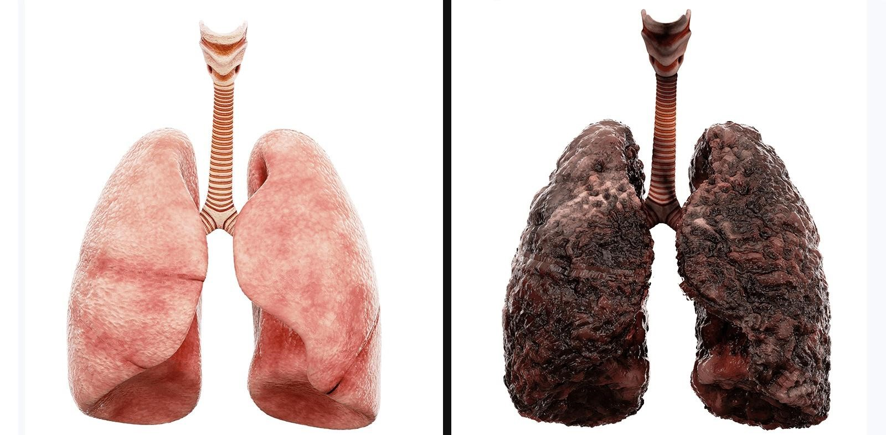
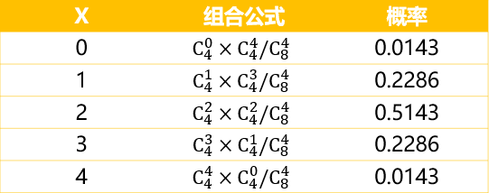
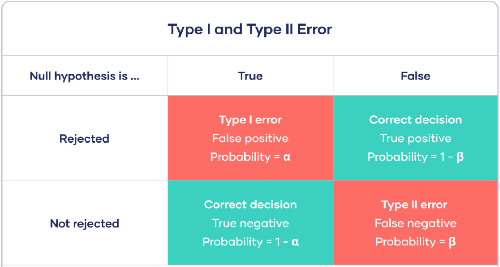
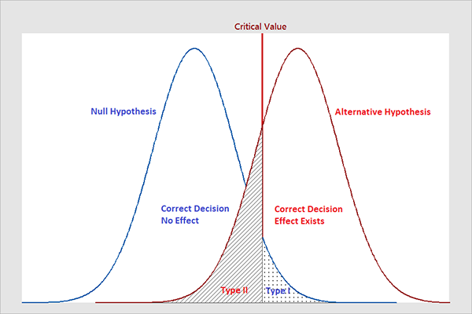
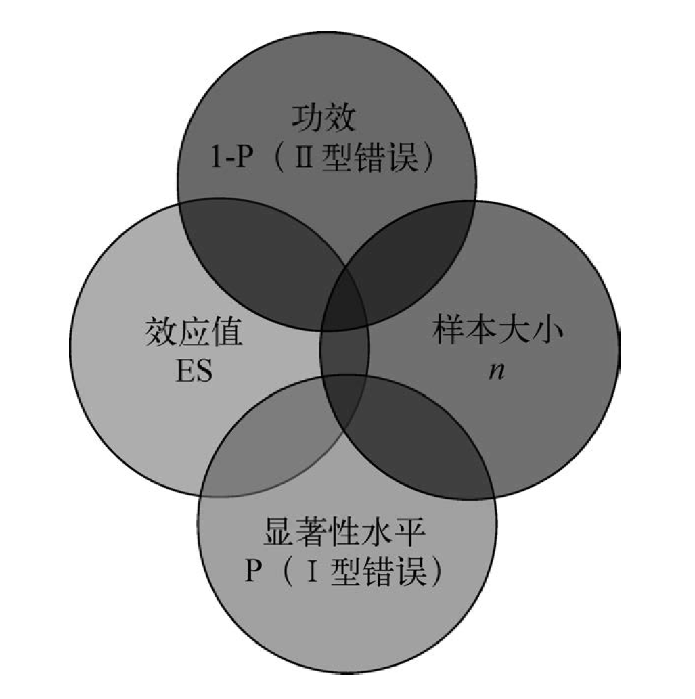
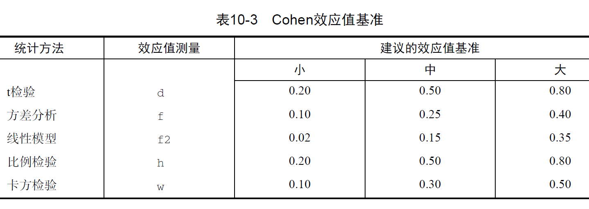
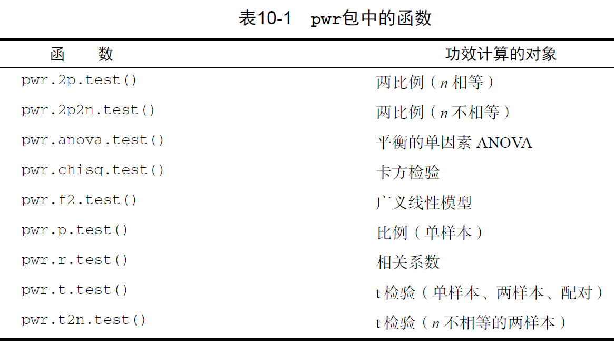

```{r setup, include = FALSE}

knitr::opts_chunk$set(echo = FALSE, warning = FALSE, message = FALSE)
options(digits = 2)

```


## 系统分析方法

- 层次分析法
- 成本效益分析法
- Pareto图法
- 鱼骨图法
- ...


## 定性分析方法

**定性**分析方法：

- 头脑风暴法
- 访谈方法：个人深度访谈、焦点小组访谈
- 个案研究（case study）
- 扎根理论方法

定性分析方法中，**资料饱和**（data saturation）的判断方式：概念（或理论）饱和原则。此时，即可停止资料搜集。


## 定量分析方法：

**定量**分析方法主要包括：

- 数学模型分析：运筹、系统动力学，...
- 相关研究：探寻两个或多个因素之间的自然关系
- 实验研究：通过操纵一些因素来考察它们对其它因素的影响

## 相关研究

相关研究（correlational research）用于探寻两个或多个因素之间的**自然关系**。所谓“自然关系”，是指没有操纵变量。

- 格拉斯哥墓园：财富与健康的关系
- 提高儿童的自尊：自尊与学业成绩
- 暴力节目：观看电视与攻击倾向
- 教育的投资回报：教育年限与收入

## 偏相关分析

**偏相关**（partial correlation）分析：在控制一个或多个其它变量（Z）的情况下，测量两个变量之间相关关系的强度。

**统计控制**：Z通常被称为控制变量或协变量。（注意：与实验控制的差别）。

## 相关分析示例：数据生成

```{r, echo = TRUE}

# 加载包、设置随机数种子
suppressMessages(library(MASS))
set.seed(123)

# 定义均值向量和协方差矩阵
mu <- c(16, 20, 110)
Sigma <- matrix(c(1, 0.3, 0.6,
                  0.3, 1, 0.4,
                  0.6, 0.4, 1), nrow = 3, ncol = 3)

# 生成多元正态分布的随机样本
dat <- mvrnorm(n = 1000, mu = mu, Sigma = Sigma) |> 
    as.data.frame()
names(dat) <- c("X", "Y", "Z")

```

## 相关分析示例：相关分析

```{r, fig.height = 5}

suppressMessages(library(ggplot2))
corXY <- cor.test(dat$X, dat$Y)

print(paste("X与Y的相关系数为：", round(corXY$estimate, digits = 2)))
print(paste("相关性的p值为：", corXY$p.value))

# 绘制X与Y的散点图和拟合线
ggplot(dat, aes(x = X, y = Y)) +
  geom_point() +
  geom_smooth(method = lm, se = FALSE, color = "red") +
  theme_minimal() +
  labs(title = "X与Y的相关性分析", x = "X", y = "Y")

```


## 相关分析示例：偏相关分析

```{r, echo = TRUE}

suppressMessages(library(psych))

# 控制Z下的X与Y的偏相关性
pcor_XY_Z <- partial.r(dat[,c("X","Y","Z")], 1:2, 3)
print(paste("控制Z下，X与Y的偏相关系数为：", 
round(pcor_XY_Z[1, 2], digits = 3)))

```

## 相关分析示例：偏相关分析（续）

```{r, echo = TRUE}

# 残差法
rd.yz <- residuals(lm(Y ~ Z, data = dat))
rd.xz <- residuals(lm(X ~ Z, data = dat))
corXY <- cor.test(rd.yz, rd.xz)
print(paste("X与Y的相关系数为：", 
round(corXY$estimate, digits = 3)))
print(paste("相关性的p值为：", 
round(corXY$p.value, digits = 3)))

```

## 相关分析示例：偏相关分析（续）

```{r, fig.height = 5}

# 绘制X与Y的散点图和拟合线
ggplot(dat, aes(x = rd.xz, y = rd.yz)) +
  geom_point() +
  geom_smooth(method = lm, se = FALSE, color = "red") +
  theme_minimal() +
  labs(title = "X与Y的偏相关性分析（Z)", x = "X|Z", y = "Y|Z")

```

## 实验设计及相关学科

与相关研究对应的是实验研究，其相关学科主要包括：

-   **实验心理学**：由19世纪上半叶的**行为主义**流派所创设、随后得以继续发展的方法论；
-   农业与工业领域的实验设计：在众多影响因素下为确保农业产量或工业产品质量而发展出的方法论。

此外，还有实验经济学、临床试验。大体而言，我们主要参考实验心理学的设计逻辑。**健康信息研究**大多采用实验心理学的范式（e.g., 控烟教育）。

## 控烟教育示例




## 什么是实验设计？

在心理学中，

-   **实验**（experiment）这一术语表示至少**操纵**一个变量来探究因果关系的研究。
-   **实验设计**（experimental design）即设计有控制的条件，人们可以在**控制条件下**实证观察人类或动物的活动、思维或行为。实际上，观察是在**可验证的假设**的指导下进行的，该假设陈述了实验条件及其结果的可能联系。

实验研究中的角色主要包括：

-   **主试**（experimenter）：也称为实验者。
-   **被试**（participants）：也称为实验参与者。
-   **实验助手**（confederate）：在实验中扮演假被试、主试或其他角色。

## 实验研究中的主要变量

-   自变量（independent variable, IV）：被操纵的变量（X）；
-   因变量（dependent variable, DV）：被观测的反应变量（Y）；
-   **被试变量**（subject variable）：如性别、种族、智商等难以控制或操纵的特征或属性，这些属性都是被试本身具有的。因此，被试变量（S）是特殊的自变量；
-   **混杂变量**（confounding variable）：也被称为额外变量（extraneous variable）。研究者难以确认实验结果是由自变量造成的，还是由混杂变量（Z）造成的，抑或是两者共同造成的。

## 实验组 vs 控制组

最简单的实验设计，应当包括如下两组：

-   **实验组**（experimental group）：也称为**处理组**（treatment group），是接受**实验处理**（experimental treatment）的被试组，实验处理也就是研究者对自变量的**操纵**（manipulation）。
-   **控制组**（control group）：也称为**对照组**，除了不接受实验处理外，其它均与实验组一致。

## 实验设计的基本原理

除自变量外，对两组被试的处理是**完全一样**的，因此在因变量上观测到的任何差异百分之百是由自变量的改变引起的。从Rubin因果框架视角而言，实验组和控制组**互为反事实条件**，且各自实现了两个不同的**潜在结果**。两组的差异即是**平均因果效应**。

通过这一过程，研究者可精确地确定一个变量对于另一个变量的效应，并建立行为之间的因果或其他函数关系。

## 实验控制的理念

**实验控制**的理念：

> 可以通过**操纵**或**使之保持恒定**的方式来控制变量，一旦做了控制，就能更容易地揭示行为的决定因素。

因此，实验控制有**两层含义**：

-   研究者**操纵**（manipulate）自变量；
-   其他条件保持不变。

## 如何操纵自变量？

自变量存在两个情形：

-   大部分自变量：研究者**操纵**的变量，也称为**独立变量**；
-   被试变量：研究者无法操纵它，而只能通过选择被试的方法达成目的。

从实践角度来看，许多重要研究问题只能通过使用被试变量加以研究，例如探讨社会经济地位、人格等因素的影响时。

## 操纵检验

**操纵检验**（manipulation check）：用于检验实验设计中的**操纵的有效性**。

研究人员通常在实验中纳入操纵检验，以确保被试如预期那样感知、理解自变量中包含的操纵部分。

例如，在将恐惧诉求理论应用于控烟教育中时，应该检验是否成功操纵了恐惧情绪。

## 被试变量混杂

使用被试变量时，要尤其注意实验控制的第二个原则。

如果我们关注的被试变量（X）与另一被试变量（Z）相关，那么任何实验结果都可能是由那个在**不经意间引入的变量Z**引起的。我们认为测量的是被试变量X的影响，实际上测量的却是被试变量Z的影响。

例如，考虑年龄如何影响患病时，年龄效应与时期效应（如战争、饥荒、经济危机等）。

## 自然康复及安慰剂效应

-   **自然康复**（spontaneous remission）：有些被试在不接受任何实验处理的情况下，其症状能够随时间而自行缓解或消失；
-   **安慰剂效应**（placebo effect）：被试相信自己得到了某种能够提高治愈某些症状的处理，而实际上这一处理不会有任何效果。安慰剂对心因性疾病中尤为有效，在身体疾病治疗中也有效果。

如上两个效应源于如下混杂变量：时间，以及被试认为自己正在接受治疗。在评估治疗效果时，应注意控制如上两个效应。

## Paul演讲恐惧治疗实验

Paul (1966)检验了两种疗法在治疗演讲恐惧上的效果。被试是一所大学里选修了公开演讲课程，且存在严重障碍的67名学生。被试随机分配到四种条件下：

-   第一组15人，接受行为疗法；
-   第二组15人，接受领悟疗法；
-   第三组15人，是安慰剂组，被试服用无害但也无效的药片；
-   第四组22人，不接受任何处理，但需要和其他组一样完成研究者发给他们的问卷。

## Paul演讲恐惧治疗实验（续）

所有被试需要在治疗开始之前和治疗完成之后各做一次演说。因变量就是每个人从第一次到第二次演说时提高的程度，提高的程度由四位临床心理学家评定。这四个人没有参与对被试的处理，也不了解实验分组的情况。结果显示：

-   行为疗法组的所有被试都取得了进步；
-   领悟疗法组、安慰剂组和无处理控制组中分别有60%，73%和32%的被试取得了进步。

## 如何设置控制组？

有时候，研究中需要设置**多个控制组**。药理研究中经常使用**安慰剂控制组**（placebo control group），有时也使用无处理控制组。

重要的是，要牢记一点：除了不接受特定的实验处理外，控制组所接受的其他处理应当与实验组**完全一样**。例如，实验组动物的大脑被切除了一部分；控制组的动物也接受了所有的手术过程，只是大脑还是保持完整的。这就控制了术后休克的影响。

## 实验设计主要范式

主要的实验设计范式包括：

-   被试间设计（between-subject design）
-   被试匹配组设计（matched subjects design）
-   被试内设计（within-subject design）
-   析因设计（factorial design）

析因设计用以处理多个自变量，因而通常与其它范式组合使用。

## 处理组被试的同质性

心理学家特别注意控制由**被试特征**引起的混杂变量。在研究中，不同处理组中的被试可能存在很多会影响实验结果的被试特征。因此，要求所有处理组在这些被试特征上**尽可能相同**。在这一前提下，实验的结果才能够归于自变量的变化。这也是实验控制的第二层含义：**其它条件保持不变**。

所有使用自然组被试或**自愿参加**某种实验处理的被试的研究都要考虑**选择偏误**问题：

> 不同处理下的被试的个体差异是怎样的？


## 被试变量控制

> 被试变量研究的基本问题是...任何观测到的行为差异，都可能是由它们的混杂变量引起的。

因此，研究者应避免选择偏误，设法确保处理组被试的同质性，尤其是被试**自愿参与**的实验。

如果研究者根据**保持被试有关特征基本一致的原则**将被试**分配**（assign）到不同的处理组，就可以避免被试特征差异的额外影响的问题。

## 常用分配机制

因而，重点在于被试的分配机制（assignment mechanism）。主要方法包括：

-   **随机选择**：总体中的每个个体都有相同的机会参与到该研究中，这在实验研究中通常难以实现。
-   **随机分配**（random assignment）：一旦确定了所使用的被试，就可以随机分配被试到各处理组，从而在一定程度上保证不同处理组的被试在相关被试特征上基本一致。参阅被试间设计。

## 常用分配机制（续）

-   **被试匹配**：先就被试在特定任务或测验上的表现评分，再将被试分派给不同的处理组，以保证不同处理组在这些分数上同质。可参阅被试匹配组设计。
-   **被试内控制**：每个被试参加所有的实验处理，这就保证了各处理组在被试变量上的一致。这一设计需要避免顺序效应。可参阅被试内设计。

## 被试间设计

**被试间设计**（between-subject design）也称为**随机化被试设计**（randomized subject design），是指每个被试只接受各个自变量的一个水平的处理。

这一设计通常使用**随机分配**（random assignment）方法，即被试群体中的任何个体都以相同的概率进入每个处理组。研究者普遍使用了这一实验范式。只要样本足够大，样本的代表性足够好，我们就能认为可能影响实验结果的被试变量在实验组与控制组之间是随机均等分布的。

此外，还可以使用一些**区组**（blocks），进而使用区组随机化分配。这尤其适用于需要较长时间才能完成的实验。

## 区组随机化

**区组随机化**（block randomization）是指，每个区组内都包含**所有实验处理**，且实验处理的顺序是随机的。它尤其适用于需要较长时间才能完成的实验。其逻辑类似于分层抽样。

例如，被试在不同的日期进入实验，那么就可以以日期为区组，使同一天到达的被试随机分配到各个处理组。再如，假定研究者知道年龄影响治疗效果，那么就可以按照年龄排序、划分区组，然后在每个区组内随机分配被试到各个处理组。

## 被试匹配组设计

如果研究者认为某个被试变量会对实验结果产生重要影响，那么就可以在这个被试变量上做匹配，这一设计称为**被试匹配组设计**（matched subjects design）或**配对设计**（matched pair design）。

在配对设计中，被试需要接受某种与真实实验中使用的任务高度相关的测试或任务，然后基于前测的结果分配被试到不同的实验处理，从而保证各处理组基于前测分数基本同质。因此，研究者也能够保证处理组被试的同质性。

## 被试内设计

**被试内设计**（within-subject design）也被称为**重复测量设计**（repeated measures design），是指每个被试接受两个或多个实验处理。

与被试间设计相比，被试内设计有如下优势：

-   每个被试都接受多个实验处理，因而需要的被试数量更少；
-   由于每个被试是实验组，同时又是自身的控制组，所以不需要匹配实验组和控制组的被试；
-   从统计角度来看，被试内设计的变异量会更小。

## 被试内设计（续）

被试内设计的主要问题在于：

-   存在顺序效应。因而，如果实验中的某个处理会对其他处理的结果产生影响，但我们的目的并非顺序效应时，被试内设计就不适用；
-   由于被试接收了多个实验处理，这可能让被试意识到实验是关于什么的，从而出现要求特征；
-   一些实验无法使用被试内设计。例如，同一动物被试无法参加集体喂养和隔离喂养两组处理。实际上，被试内设计通常适用于被试需要对不同实验刺激进行多次反应的情况，而这些刺激可以被看作实验的自变量。

## 顺序效应

被试内设计能够确保各处理组的被试特征一致，但各种处理或刺激呈现的顺序会带来新的问题。刺激呈现的顺序不同可能导致实验结果发生显著的变化，因为被试对某个特定刺激所做的判断往往会受到先前判断的影响。这称为**顺序效应**（order effects），即一系列试验任务的结果，往往受这些任务完成顺序的影响。

顺序效应可以使用拉丁方设计或区组随机化加以控制。这些方法确保了各个刺激在所有位置上出现的次数是相同的。

当然，如果研究者关注顺序效应，也可以比较被试在不同顺序位置上的同一刺激的反应。

## 顺序效应（续）

顺序效应主要包括：

-   **练习效应**（practice effect）：当被试对同一或近似材料进行重测时，表现会有所提高的现象。这一效应很容易被误认为是处理效应。例如，被试对某个物体轻重的判断在一定程度上受到对前一物体轻重判断的影响。因此，在辨别任务的实验中，被试会随着判断次数的增加而变得更为精确与熟练；
-   **疲劳效应**（fatigue effect）：被试可能会随着实验的进程感到疲劳或厌倦，因而造成效率的下降，这与练习效应刚好相反。

## 析因设计

行为显然不太可能是由单一因素引起的。**析因设计**（factorial design）是指，在实验中同时操纵两个或更多的自变量。它的优势在于，可以确定不同自变量组合对因变量的影响。

例如，$2 \times 2$或者$2 \times 2 \times 3$等常见的析因设计。

析因设计也与被试间设计、被试内设计组合使用。

## 实验者偏差

**实验者偏差**（experimenter bias）是指实验结果会朝着实验者预期的方向发展的现象。

Rosenthal & Fode (1963)揭示了实验者偏差。他们选择了一组有实验心理学背景的学生，来评定两组大鼠的迷宫成绩。这些学生事先被告知，其中一组大鼠来自于"迷宫达人"大鼠家族，另一组则来自于"迷宫白痴"大鼠家族。然后，学生们做了一个大鼠走迷宫的实验。结果显示，"迷宫达人"组大鼠的表现显著好于"迷宫白痴"组的大鼠。

其实，所有的大鼠都是从同一个标准化样本中随机抽取出来的。主试在观察"聪明"的大鼠走迷宫时，期望它们表现得更好，而这种期望影响了观察的结果。

## 要求特征

**要求特征**（demand characteristics）是指实验本身可能给被试提供了某些线索，使他们能够预判研究者的实验目的，从而试图做出研究者期待的反应或者有意地抑制这些反应。

在使用被试内设计时，由于被试接收了多个处理，这可能会让被试意识到实验是关于什么的，进而做出有偏差的反应以满足或挫败实验者的期待。因此，在使用被试内设计时要认真考虑要求特征的影响，尤其是在社会心理学、认知心理学、消费心理学等研究领域。

## 双盲实验

**双盲实验**（double blind experiment）是指，被试和主试双方都不知道正在实施的（或被试接受的）是哪一种实验处理，以及可能出现哪一种结果。因而，双盲实验可以避免实验者偏差。例如，Paul演讲恐惧治疗实验中，参与评定被试演说表现的临床心理学家没有参与治疗，也不知道哪些被试被安排在哪个实验组。

临床心理学家可能会偏好某种特定的心理治疗方法，如果他们知道哪些被试接受了自己喜欢的疗法，就可能觉得这些被试比其他实验条件下的被试有更多的改善。评定者也可能会假设无处理控制组中的被试不会有提高，从而根据自己的假设评定这些人的表现。

## 被试损耗

**样本损耗**（sample attrition）也称为被试损耗（participant attrition），通常发生在需要被试参加多个阶段的实验或调查的情形下。参加了上一阶段研究的被试，不一定能参加下一阶段。

一旦实验中出现被试损耗，特别是当某种处理比其余处理的被试损耗更严重时，就应当探究缺失的那些被试的特征。主要问题在于，是否存在**特殊子群**。例如，低动机的被试可能会退出某个处理组，但仍保留在其他处理组中。此时就不应认为各处理组在被试变量上保持一致了，最终的研究结果可能是由被试差异而非处理差异造成的。

## 被试损耗（续）

为了避免被试缺失的问题，研究者需要在实验前告知被试这一点，并要求被试在能够参加下一阶段实验的前提下参加实验。此外，通常会在被试完成所有阶段的实验后才给予报酬。

只要研究需要较大的时间跨度，被试损耗就是不可避免的，所以获取所有被试（包括那些中途退出者）的信息非常重要的。

## 被试损耗（续）

必要的信息包括：

-   实验处理前的信息，可以包括被试的智力、动机、调节能力等；
-   被试在退出实验之前的数据；
-   所有被试在处理后的数据。

## 内部及外部效度

在**定量分析**方法中，我们通常关注研究的两个层面：

-   **内部效度**（internal validity）：是指在多大程度上，研究逻辑是合理的且没有混杂变量。换言之，研究给出的自变量（X）对因变量（Y）的效应在多大程度上是可靠的；
-   **外部效度**（external validity）是指在多大程度上，研究发现能够推广应用到研究之外的人、对象、机构或时间。

结果的推广（generalization of results）是所有研究都要面临的问题，它反映了单个研究的局限性。

## 内部及外部效度（续）

内部效度与外部效度**难以兼得**。严格的实验控制通常需在实验中只关注某种特定的行为、选择某个特定的被试群体、采用某种特定的测量方法以及在特定的时间进行测量。这些控制技术同时也产生了外部效度的问题。从总体中随机抽样获得数据，进而做相关研究，则也较好的外部效度，但会产生内部效度问题。

理想情况下，实验研究中实验组和控制组应当从完整的总体中随机抽取，但这通常不现实。因此，一个实验往往会引发其他几个实验，而使科学研究成为持续的过程（**证据累积**）。


## 假设检验

我们旨在探讨总体中解释变量X与结果变量Y之间的关系。那么，原假设（null hypothesis，也称为零假设）是：

$$
H_{0}: \beta = 0.
$$

从总体中随机抽取$n$个样本，进而决定是否拒绝原假设，从而支持备择假设（alternative hypothesis）：

$$
H_{1}: \beta \neq 0.
$$

那么，如何理解假设检验？

## 女士品茶：问题描述

20 世纪20 年代后期，在英国剑桥一个夏日的午后，一群大学教授、他们的太太，还有一些其他客人正围坐在户外的桌旁，享用着下午茶。在品茶过程中，一位女士坚信：

把茶加进奶里，或把奶加进茶里，不同的做法，会使茶的味道品起来不同。

在场的绝大多数人（很多是大学教授）对这位女士的"胡言乱语"嗤之以鼻。然而，其中一位身材矮小、戴着厚眼镜、下巴上蓄着的短尖髯开始变灰的先生却不这么看，他对这个问题很有兴趣，当时他兴奋地说到，“让我们来检验这个命题吧”...


## 女士品茶：实验设计

这位先生(R.A. Fisher)设计了一个随机实验：

一共煮了8杯茶，其中有4杯是先加奶的，而剩下四杯则是先加茶。这8杯茶被装在外观一样的茶杯当中，以随机的顺序被送去给这位女士品尝，她需要在品尝之后分辨出哪些是先加奶的，哪些是先加茶的...实验结束了，她竟然真的判断出每一杯茶的正确制作方式。

## 女士品茶：假设检验

首先建立原假设：

$H_{0}$：这位女士并不具备真实的分辨能力。

和备择假设：

$H_{1}$：这位女士具备真实的分辨能力。

{width="75%"}

## 女士品茶：统计推断

在原假设下，这位女士单次会有0.5的概率猜对。那么，这位女士全凭猜测猜对的概率是0.014。于是，我们必须承认下述两种情况必发生其一：

1. $H_{0}$不成立，即此女士有鉴别力；
2. 概率为0.014的随机事件（一个小概率事件）发生了。

根据小概率原理，小概率事件在一次试验中是几乎不发生的. 所以我们可以认为$H_{0}$不成立，即此女士有鉴别力。

## 两类错误：定义




## 两类错误：权衡

假设连续变量x用以诊断是否患病，那么应该如何确定x的阈值？




## 样本量计算

假设我们准备探讨使用恐惧诉求理论做健康教育，实验组和对照组随后一个月吸烟量的总体均值分别记为$\mu_{e}$和$\mu_{c}$，我们感兴趣的是$\mu_{e} - \mu_{c}$。相应地，我们需要检验原假设：

$$
H_{0}: \mu_{e} - \mu_{c} = 0.
$$

假设使用被试间设计，招募被试之后，将被试随机分配到实验组和对照组，然后测量两组被试的响应——即变量$y$。

然而，我们使用样本来推断总体。那么，我们的研究到底需要多少样本量？

## 如何确定样本量？

如下四个量，只要给定任意三个，就可以推算第四个：

- 样本量（sample size, $n$）：实验设计中每组的被试数量；
- （统计检验的）显著性水平（significance level, $\alpha$）：即$I$型错误的概率。通常取$\alpha = 0.05$。
- 功效（power, 1 - $\beta$）：即1减去$II$型错误的概率。通常取$1 - \beta = 0.8$或$0.9$。
- 效应值（effect size, ES）：在研究假设下效应的量，它依赖于假设检验使用的统计方法。

## 如何确定样本量？（续）


{width="60%"}


## 功效分析

功效分析（power analysis）可以用来判断，在给定显著性水平和功效时，检测到给定效应值时所需的样本量。反过来，它也可以帮助我们在给定显著性水平时，计算在某样本量内能检测到给定效应值的概率。如果概率低得难以接受，修改或者放弃这个实验将是明智的选择。

通常来说，研究目标是维持一个可接受的显著性水平（如$\alpha = 0.05$），尽量使用较少的样本，然后最大化统计检验的功效。也就是说，试图控制两类错误的概率，同时把研究成本控制在合理的范围内。

## Cohen效应值

效应值（ES）通常由经验确定。

{width="80%"}

## 功效分析：使用pwr包

{width="80%"}

## 样本量计算：常见情形

- 被试间实验：此时$d = \frac{\mu_{e} - \mu_{c}}{\sigma}$。经验效应值分别为0.2（小）、0.5（中）和0.8（大）。
- 回归分析：此时$f = \frac{R^{2}}{1 - R^{2}}$。经验效应值分别为0.1（小）、0.25（中）和0.4（大）。$u$和$v$分别为$f$分子分母的自由度，即$k$和$n - k - 1$。

## 样本量计算：被试间实验

```{r, echo = TRUE}

library(pwr)
pwr.t.test(d = 0.8, sig.level = 0.05, power = 0.9,
          type = "two.sample", alternative = "two.sided")

```

## 样本量计算：被试间实验（续）

```{r}

es <- seq(0.2, 0.8, 0.02)
nes <- length(es)
samsize <- NULL
for (i in 1:nes){
  res <- pwr.t.test(d = es[i], sig.level = 0.05, power = 0.9,
          type = "two.sample", alternative = "two.sided")
  samsize[i] <- ceiling(res$n)
}

plot(samsize, es, type = "l", lwd = 2, col = "red",
    ylab = "effect size (ES)", xlab = "sample size",
    main = "t test with power = 0.9 and alpha = 0.05")

```

## 样本量计算：回归分析

```{r, echo = TRUE}

pwr.f2.test(u = 3, f2 = 0.1, sig.level = 0.05, power = 0.9)

```

