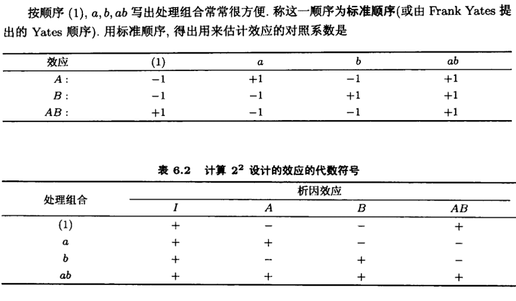
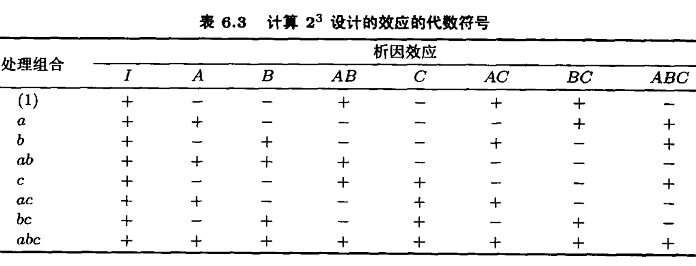
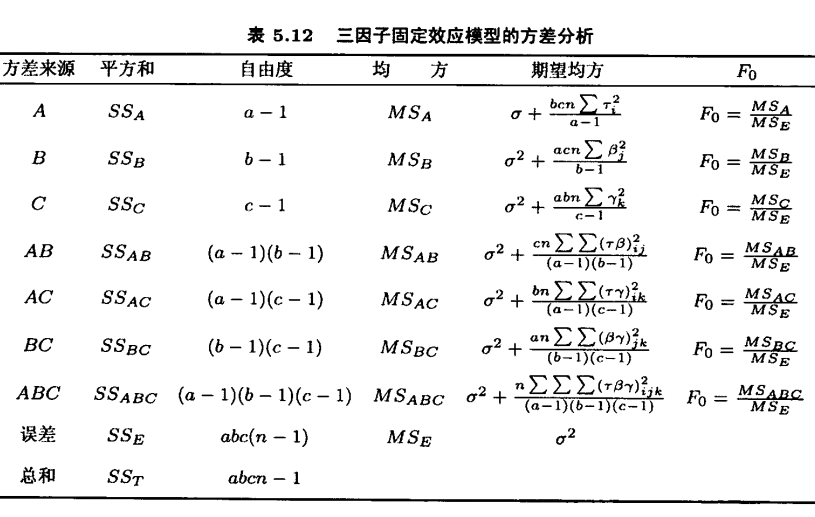

```{r setup, include = FALSE}

knitr::opts_chunk$set(echo = FALSE, warning = FALSE, message = FALSE)
options(digits = 2)

```

# 析因设计

## 析因设计概述

很多实验要研究两个或多个因子的效应。此时，析因设计是最有效的。

\textcolor{red}{析因设计}（factorial design）是指，实验的每一次完全试验或每一次重复中，这些因子水平的所有可能的组合都被研究到。例如，当因子A有a个水平和因子B有b个水平时，则每次重复都包含全体ab个处理组合。析因设计可以估计\textcolor{red}{主效应和所有交互效应}。

## 析因设计的优点

析因设计具备一些独特的优点：

-   它比一次一因子实验效率高。
-   存在交互作用时，为了避免产生令人误解的结论，必须使用析因设计。
-   析因设计容许因子相对于其它各个因子的几个水平来估计其效应，所得结论在实验条件的范围内是有效的。

## $2^{k}$析因设计

析因设计有一些特殊情况，它们广泛应用于研究工作，也是其它一些有重要实践价值的设计的基础。例如：

-   有k个因子，每个因子仅有两个水平。这些水平可以是定量的值，也可以是诸如{高、低}、{有、无}这样定性的水平。其因子组合共有$2^{k}$个，因而称之为$2^{k}$析因设计。

在实验工作早期阶段，可能有很多因子需要研究时，$2^{k}$设计就特别有用。它只需要最少的实验次数就可以研究完全析因设计的k个因子。因而，这些设计广泛地运用于\textcolor{red}{因子筛选实验}（factor screening experiment）。

## $2^{2}$析因设计

在最简单的$2 \times 2 = 2^{2}$析因设计中，我们通常使用小写字母来表示不同的因子水平组合，这一记法通用于$2^{k}$序列。在二水平析因设计中，记号$\{(1), a, b, ab\}$代表那一处理组合取$n$次重复的总和。

{width="50%"}

## $2^{2}$析因设计：因子效应估计

因子的平均效应定义为，该因子的水平变化产生的响应变化在另一因子的水平上取平均值。例如，A在B的低水平上的效应为$[a - (1)]/n$，A在B的高水平上的效应为$[ab - b]/n$。因此，A的主效应为： $$
A = \frac{1}{2n} \{[ab - b] + [a - (1)]\} = \frac{1}{2n} [ab + a - b - (1)].
$$ B的主效应类似。AB的交互效应为： $$
AB = \frac{1}{2n}\{[ab - b] - [a - (1)]\} = \frac{1}{2n}[ab + (1) -a - b].
$$

## $2^{2}$析因设计：对照

由效应估计方程，可以定义A的\textcolor{red}{对照}（contrast）： $$
\text{Contrast}_{A} = ab + a -b - (1).
$$ 因而效应A可以表示为： $$
A = \frac{\text{Contrast}_{A}}{2n}.
$$

按照$\{(1), a, b, ab\}$的顺序写出处理组合，$\{-1, 1, -1, 1\}$就称为对照A的\textcolor{red}{对照系数}。

其余效应的对照以及对照系数可以类似得出。

## $2^{2}$析因设计：代数符号

通常会按照顺序记录这些组合，同时使用如下\textcolor{red}{代数符号}：

{width="75%"}

## $2^{3}$析因设计

在$2 \times 2 \times 2 = 2^{3}$析因设计中，我们类似地使用小写字母来表示不同的因子水平组合。记号$\{(1), a, b, ab, c, ac, bc, abc\}$代表那一处理组合取$n$次重复的总和，由此列出的8次试验方案称之为\textcolor{red}{设计矩阵}（design matrix）。

{width="80%"}

## $2^{3}$析因设计：主效应及交互效应

{width="75%"}

## $2^{3}$析因设计：代数符号

类似地，通常按照顺序记录这些组合，同时使用如下代数符号：

{width="75%"}

$2^{3}$设计的8个处理组合间有7个自由度，3个自由度与A、B、C的主效应有关，4个自由度与交互效应有关。交互效应包括3个二阶交互AB，AC和BC，以及1个三阶交互ABC。

## $2^{3}$析因设计：效应性质

以上表格有几个有趣的性质：

-   除了列I以外，每列加号的个数和减号的个数相等。
-   任意两列符号乘积之和为0，亦即任意两列是正交的。
-   列I与任一列相乘，该列符号不变，即列I是单位元素（identity element）。
-   任意一列与自身相乘，得到单位元素列I，即$A \times A = I$。
-   任意两列相乘，得到表中某一列。例如$A \times B = AB$，$AB \times B = AB^{2} = A$。

## $2^{3}$析因设计：对照

由效应估计方程，可以定义A的对照（contrast）： $$
\text{Contrast}_{A} = a + ab + ac + abc - (1) - b - c - bc.
$$ 因而效应A可以表示为： $$
A = \frac{\text{Contrast}_{A}}{4n}.
$$ 以及A的效应的平方和可以表示为： $$
SS_{A} = \frac{(\text{Contrast}_{A})^{2}}{8n}.
$$

按照$\{(1), a, b, ab, c, ac, bc, abc\}$的顺序写出处理组合，相应的系数就称为对照A的对照系数。其余效应的对照以及对照系数可以类似得出。

## $2^{3}$析因设计：效应估计方法

可以使用方差分析方法估计$2^{3}$析因设计的各个效应及显著性。方差分析表如下且$a = b = c = 2$。

同时，也可以使用线性回归分析方法，同时纳入主效应和交互项。

{width="75%"}

## $2^{k}$析因设计：概述

推广到$2^{k}$析因设计的情形，其统计模型包含$k$个主效应，$k \choose 2$个二因子交互作用，$k \choose 3$个三因子交互作用，...，以及一个$k$因子交互作用，全模型共有$2^{k} - 1$个效应。

例如，$k = 6$时，这一$2^{6}$析因设计的单次完全重复需要做64次试验。在此设计中，共有63个自由度，其中6个与主效应对应，15个与二因子交互作用对应，而其余42个自由度则与三阶及以上的交互作用对应。

## $2^{k}$析因设计：对照

尽管这些效应的计算大多数可以利用计算机进行，但有时手工计算效应估计或效应的平方和也是必要的。对于较大的k值，可以用展开下式右边的方法： $$
\text{Contrast}_{AB...K} = (a \pm 1)(b \pm 1)...(k \pm 1).
$$ 在展开上式时，按初等代数方法计算，而在最后的表达式中，用(1)代替1。小括号中符号的选取方法是：当因子包含在效应中时，取负号；不在时，取正号。

例如，$2^{3}$析因设计中AB的对照是： $$
\text{Contrast}_{AB} = (a-1)(b-1)(c+1) = abc + ab + c + (1) - ac -bc -a -b.
$$

## $2^{k}$析因设计：对照（续）

进一步，在$2^{5}$设计中，ABCD的对照是： $$
\text{Contrast}_{ABCD} = (a-1)(b-1)(c-1)(d-1)(e+1).
$$

一旦计算出效应的对照，就可以根据下式估计效应并计算平方和： $$
AB...K = \frac{1}{2^{(k-1)} \times n}(\text{Contrast}_{AB...K})
$$ 以及 $$
SS_{AB...K} = \frac{1}{2^{k} \times n} (\text{Contrast}_{AB...K})^{2}.
$$

# 分式析因设计

## 分式析因设计：概述

当$2^{k}$析因设计中的因子个数$k$增加时，设计的一次完全重复所需的试验次数$2^{k}$迅速增大，以至于超出大多数实验者拥有的资源。例如，$2^{10} = 1024$。然而，这$2^{k}-1$个自由度之中，仅有$k$个与主效应对应，仅有$k \choose 2$个与二阶交互作用对应，而其余均是三阶及以上的交互作用。

如果实验者可以合理地假定某些高阶交互作用\textcolor{red}{可被忽略}，则关于主效应和低阶交互效应的信息就可以只做完全析因实验的一部分而求得。这一设计方法称为\textcolor{red}{分式析因设计}（fractional factorial designs）。

## 分式析因设计：概述（续）

分式析因设计主要用于\textcolor{red}{因子筛选实验}（factor screening experiment）。因子筛选实验的目的是，在众多因子中识别出效应较大的那些因子。它通常在项目的早期阶段实施，那时，一开始考虑的很多因子有可能对响应只有小的效应或没有效应。因此，需要识别出重要因子，在随后的实验中更深入地探讨。

分式析因设计的成功应用基于\textcolor{red}{3个关键思想}：

-   \textcolor{red}{效应稀疏原理}：当有很多变量时，系统或过程很可能被少量几个主效应和低阶交互效应所主导。
-   \textcolor{red}{投影性质}：分式析因设计可以投影到由显著性因子的子集组成的设计中去。
-   \textcolor{red}{序贯实验}：可以将两个或多个分式析因设计序贯地组合为一个设计，用来估计所感兴趣的因子效应和交互效应。

## $2^{3-1}$分式析因设计

{width="75%"}

## $2^{3-1}$分式析因设计：定义关系

$2^{3-1}$设计由选取ABC列中带加号的处理组合组成。换言之，这一分式析因设计的\textcolor{red}{定义关系}（defining relation）是 $$
I = ABC.
$$ 因为，单位列I全是加号，而我们选取了ABC列中带加号的处理组合。

如此，ABC称为这一特定分式析因设计的\textcolor{red}{生成元}（generator）。$2^{3-1}$分式析因设计有3个自由度，可以用来估计3个主效应。例如， $$
[A] = \frac{1}{2} (a - b - c + abc).
$$

## $2^{3-1}$分式析因设计：别名

同时，二因子交互效应BC的估计为： $$
[BC] = \frac{1}{2} (a - b - c + abc).
$$ 因此，[A] = [BC]。类似地，[B] = [AC]，[C] = [AB]。因此，不可能区分这些效应。当我们估计A, B, C时，实际是在估计A+BC, B+AC, C+AB。具有这一性质的两个或多个效应称为\textcolor{red}{别名}（alias）。

别名可由定义关系$I = ABC$推导而来，即 $$
A = AI = A^{2}BC = BC.
$$

本例中，A和BC互为别名。因而，符号上记为： $$
[A] \rightarrow A + BC; [B] \rightarrow B + AC; [C] \rightarrow C + AB.
$$

## $2^{3-1}$分式析因设计：构造方法

$2^{3-1}$分式析因设计的构造方法是，先写出由完全$2^{2}$析因设计的试验组成的\textcolor{red}{基本设计}（basic design）。然后使用定义关系，获得因子C的设计水平。

{width="75%"}

## $2^{3-1}$分式析因设计：投影性质

$2^{3-1}$分式析因设计，可以投影为3个$2^{2}$完全析因设计。

{width="50%"}

## $2^{5-1}$分式析因设计：案例描述

在一集成电路生产线上用$2^{5-1}$设计来研究5个因子，以改进生产量。5个因子及水平是:

{width="80%"}

拟试验16次，应如何做$2^{5-1}$分式析因设计？别名关系是怎样的？

## $2^{5-1}$分式析因设计：实验设计

类似地，先写出$2^{4}$析因设计的试验组成的基本设计。然后使用定义关系，获得因子E的设计水平。

{width="80%"}

## $2^{5-1}$分式析因设计：效应估计

使用对照，可以方便地估计各个效应及平方和：

{width="80%"}

## $2^{5-1}$分式析因设计：方差分析

根据各个效应和平方和的情况，辅以合理推断，可以忽略一些效应较小的效应，尤其是高阶效应。从而，可以得到如下方差分析表。因而，可以在\textcolor{red}{后续实验}中，在A、B、C三个因子上设置更多的水平，来探讨其效应。

{width="90%"}

<!-- ## 设计分辨度 -->

<!-- 设计分辨度指能够准确估计那些效应。分辨度为$\uppercase\expandafter{\romannumeral3}$ -->

<!-- ## 正交设计 -->

# 离散选择实验

## 经典的现实问题

请思考面临的一些现实决策问题：

-   出差时，选择什么交通工具到天河机场？准备预订什么酒店？
-   应当购买什么商业健康保险？或者还是不要购买？
-   患者去哪一家医院就医？
-   应当接种哪一种HPV疫苗？或者还是暂时不接种HPV疫苗？
-   ...

## 决策与（离散）选择

Hebert Simon认为：

> \textcolor{red}{Decison making} is the heart of administration, and the vocabulary of administrative theory should be derived from the logic and psychology of \textcolor{red}{human choice}. -- By Hebert Simon

或者决策的通行定义：

> A decision is \textcolor{red}{choice} out of \textcolor{red}{several alternatives} (options) made by the decision maker to achieve some objectives in a given situation.

## 手机消费例子

{width="75%"}

## 疫苗接种决策例子

{width="80%"}

-   候选项（alternatives）
-   属性（attributes）

## 有限理性假设

管理即是决策，而决策即是评估少数几个候选项（alternatives），并从中作出选择（choice）。其心理学基础是：

-   决策资源是有限的，决策者是\textcolor{red}{有限理性}的
-   决策资源：时间成本，经济成本，认知资源，信息
-   信息时代的挑战：信息过载导致了注意力（亦即认知资源）稀缺

## Daniel McFadden与离散选择模型

美国计量经济学家Daniel McFadden与James Heckman 共同获得2000年诺贝尔经济学奖。Daniel McFadden的获奖理由是"因为他发展了分析离散选择的理论和方法"（"for his development of theory and methods for analyzing discrete choice"）。

\textcolor{red}{离散选择模型}（discrete choice models, DCM）始于交通领域，后来逐渐扩展到其他个人和家庭层面的决策行为领域。而当纳入价格变量之后，又随后扩展到\textcolor{red}{支付意愿}（willingness to pay, WTP）研究领域。

## 如何决策：效用最大化原理

第$i$个决策者（例如消费者、患者等）面临$J \geq 2$个候选项，仔细评估了这些候选项之后，选择了第$j (1 \leq J \leq J)$个候选项。我们应该如何理解这一决策？

经济学解释：假设第$j (1 \leq J \leq J)$个候选项对于第$i$个决策者而言，效用为$U_{ij}$。那么，决策者所选择的候选项，必定是对他而言效用最大的，即\textcolor{red}{效用最大化原理}： $$
U_{ij} \geq U_{ik}, 1 \leq k \leq J \text{ and } k \neq j.
$$

## 决策者视角 vs 研究者视角

我们需要区分两个视角：

-   决策者视角：总效用$U_{ij}$是已知的。
-   \textcolor{red}{研究者视角}：仅能观测到\textcolor{red}{部分效用}，而无法观测到总效用。

因而，就研究者视角而言，需要将\textcolor{red}{总效用分解}为两部分： $$
U_{ij} = V_{ij} + \epsilon_{ij}.
$$ 其中$V_{ij}$是可以观测到的效用（observed utility），而误差项$\epsilon_{ij}$是不可观测的效用（unobserved utility）。

## 选择概率

由于研究者无法观测到总效用，因而可观测效用最大的候选项，就\textcolor{red}{不一定}是决策者所选择的候选项。因而，需要进一步假定，来处理观测到的选择（observed choice）$j$和可观测部分效用$V_{ij}$的关系。

当误差项$\epsilon_{ij}$服从Gumbel分布（或称广义极值I型分布）时，第$i$个决策者选择第$j$个候选项的\textcolor{red}{概率}为： $$
\text{Prob}(ij) = \frac{\exp(V_{ij})}{\sum_{k=1}^{J} \exp(V_{ik})}.
$$ 这一概率用于后续极大似然估计法中的\textcolor{red}{似然函数构造}。

## 如何评估候选项：效用函数

决策者面临$J \geq 2$个候选项时，是\textcolor{red}{如何评估}这些候选项的？换言之，如何构造效用函数 ？

\textcolor{red}{效用函数}（utility function）是\textcolor{red}{候选项属性}的函数，假定每个候选项有$P$个属性，$X_{jp} (1 \leq p \leq P)$，那么可观测部分效用$V_{ij}$通常建模为属性的线性函数： $$
V_{ij} = \sum_{p=1}^{P} \beta_{ip} \cdot X_{jp}.
$$

## 效用函数计算示例

假定决策者考虑疫苗接种，并且评估两款疫苗的两个属性：保护效力和副作用。疫苗A的保护效力为70%，副作用几乎没有；疫苗B的保护效力为90%，有中等程度的副作用。决策者赋予保护效力和（中等程度）副作用的权系数分别为10和-3，那么： $$
V_{A} = 10 \times 70\% + 0 =7, V_{B} = 10 \times 90\% - 3 = 6.
$$ 因此，决策者接种疫苗A的概率是： $$
\text{Prob}(A) = \frac{\exp(7)}{\exp(7) + \exp(6)} = 0.73.
$$

## 什么是重要的：属性偏好

决策者在评估这些候选项的时候，特定的属性发挥了什么作用？或者说，属性和效用是什么关系？

决策者赋予属性的权系数称为\textcolor{red}{偏好}（preferences），即$\beta_{ip}$。偏好决定了属性如何构成效用。偏好是离散选择实验中需要估计的\textcolor{red}{参数}。

疫苗接种决策中，对潜在副作用更加在意的个体，其副作用的属性偏好也就越大。

## 偏好异质性：汝之蜜糖，彼之砒霜

不同的决策者（例如消费者、患者等），各自看重不同的属性。换言之，决策者对特定属性的偏好通常是\textcolor{red}{异质的}（heterogeneous）。

研究者可以权衡研究目标，对偏好做出进一步假定，通常包括三个方案：

1.  偏好是同质的：$\beta_{ip} = \beta_{p}$，此时即是\textcolor{red}{多项logit模型}。
2.  偏好在给定分组下是同质的：若第$i$个决策者属于第$s (1 \leq s \leq S)$组，则$\beta_{ip} = \beta_{sp}$，此时即是\textcolor{red}{潜类别logit模型}。
3.  偏好是异质的：$\beta_{ip}$取决于个体特征，此时是\textcolor{red}{随机参数logit模型}；可以进一步采用分层logit模型来解释偏好异质性的来源。

## 离散选择实验的微观经济学基础回顾

{width="60%"}

## 离散选择实验设计案例

考虑疫苗接种问题。假定我们纳入四个因子，每个有2个水平：

-   疫苗有效性：70% vs 90%
-   保护期限：6个月 vs 12个月
-   疫苗副作用：局部疼痛 vs 1\~2天内发热
-   价格：300元 vs 500元

请设计离散选择实验。
